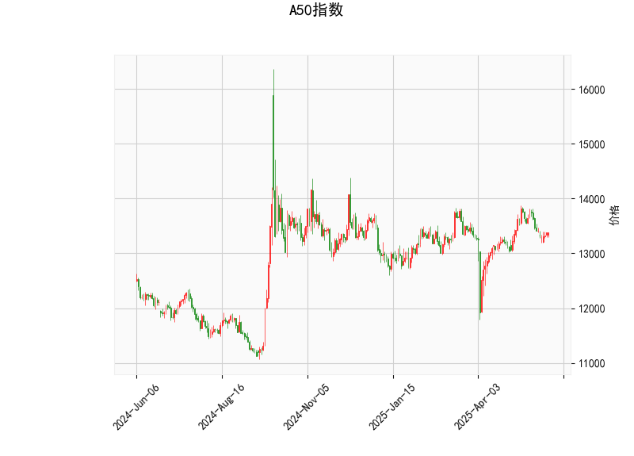

### 一、A50指数技术分析结果解读

#### 1. **当前价与RSI**  
- **当前价**为**13380**，处于布林通道中轨（**13307**）附近，表明短期价格处于中枢平衡位置。  
- **RSI（48.95）**接近中性值50，显示多空力量暂时均衡，但需警惕若RSI跌破45可能触发短期下跌动能。

#### 2. **MACD指标**  
- **MACD线（10.08）**显著低于**信号线（48.00）**，且**MACD柱（-37.93）**负值扩大，表明短期下跌动能占优，存在**技术性回调风险**。  
- 需关注MACD柱是否缩窄或转正，这可能预示下跌动能衰竭。

#### 3. **布林通道**  
- **上轨（13973）**与当前价的差距约**4.4%**，**下轨（12640）**与当前价的差距约**5.5%**，显示价格波动区间较宽。  
- 当前价贴近中轨，若有效跌破中轨（13307），可能向下测试**12640支撑位**；若站稳中轨，则可能向**13973压力位**反弹。

#### 4. **K线形态**  
- **CDLGAPSIDESIDEWHITE**（并列阳线）：通常表示市场犹豫不决，可能进入横盘整理。  
- **CDLSHORTLINE**（短实体线）：反映短期多空争夺激烈，缺乏明确方向。

---

### 二、投资机会与策略建议

#### 1. **短期波段交易**  
- **看涨策略**：若价格站稳中轨（13307）且MACD柱缩窄，可轻仓做多，目标**13973（上轨）**，止损设于中轨下方（如13200）。  
- **看跌策略**：若价格跌破中轨且MACD柱持续扩大，可尝试短空，目标**12640（下轨）**，止损设于中轨上方（如13450）。

#### 2. **套利机会**  
- **布林通道收敛套利**：若布林通道收窄（波动率下降），可布局突破策略。例如，价格突破上轨时做多，跌破下轨时做空，需结合成交量确认有效性。  
- **RSI背离策略**：若价格创新低但RSI未同步新低（底背离），或价格新高但RSI未同步新高（顶背离），可反向操作。

#### 3. **风险提示**  
- **MACD与价格背离**：当前MACD与价格走势的背离（价格震荡、MACD持续走弱）需警惕趋势反转风险。  
- **K线形态失效**：若价格突破中轨后未能站稳，或短实体线后出现大阴/阳线，需及时止损。

---

### 三、总结  
当前A50指数处于震荡中枢，短期缺乏明确方向，但技术面偏空（MACD看跌）。建议以**区间波段交易**为主，关注**布林通道边界**和**MACD动能变化**，同时严格设置止损。若价格突破区间，可顺势布局趋势策略。