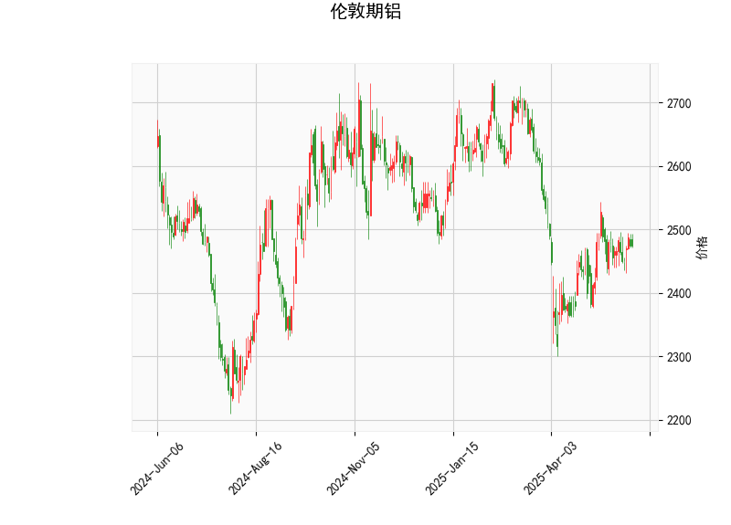

# 伦敦期铝技术分析与投资策略

## 一、技术分析解读

### 1. 价格与布林带
- **当前价2475**位于布林带中轨（2470.95）附近，暗示价格处于短期均衡状态。上轨压力位2646，下轨支撑位2295，当前价格距离上轨空间（+6.9%）显著大于下轨距离（-7.3%），需警惕潜在上行阻力。
- **中轨粘连现象**（当前价≈中轨）可能预示短期方向选择。若站稳中轨上方则向2646上轨运行，反之可能回踩2295支撑。

### 2. MACD指标
- **MACD柱（1.66）连续扩张**：DIFF（4.20）持续上穿DEA（2.53）形成“水上金叉”，显示多头动能增强。
- **MACD背离信号**：当前价尚未突破前高，但MACD柱已创阶段新高，存在潜在底背离可能，需结合量能验证。

### 3. RSI指标
- **52.18中性区域**：未进入超买（>70）或超卖（<30）区间，但已突破50中轴，暗示市场情绪从弱势转向均衡偏多。

### 4. K线形态
- **CDLMATCHINGLOW**：低位并列线形态通常出现在下跌末端，暗示空头力量衰竭。
- **CDLSHORTLINE**：短实体线配合长下影线，显示下方买盘支撑较强。
- **双形态共振**：短期底部特征明显，但需突破前高确认反转有效性。

---

## 二、投资机会与策略建议

### 1. 趋势跟踪策略
- **多头突破**：若价格连续3日站稳中轨（2470）上方，可建立多单，目标上轨2646（约7%空间），止损设于中轨下方1%（2445）。
- **空头防御**：若日线收破中轨且MACD柱转负，可轻仓试空，目标下轨2295（约7.3%空间），止损中轨上方1%（2495）。

### 2. 均值回归策略
- **区间交易**：在2295-2646通道内进行高抛低吸，当价格触及上轨且RSI>60时平多转空，触及下轨且RSI<40时平空转多。
- **波动率套利**：布林带带宽（上轨-下轨=351点）处于扩张初期，可买入跨式期权组合，捕捉潜在波动率放大机会。

### 3. 套利机会
- **期现套利**：关注LME铝现货升贴水变化，若现货升水超过持仓成本，可进行正套（买现货抛期货）。
- **跨期套利**：观察近月合约Back结构（现货溢价）是否持续，若近月价差走强可做多Contango收窄。

---

**风险提示**：需关注中国电解铝社会库存变化（当前约58万吨）、欧洲能源价格波动对冶炼成本的影响，以及LME持仓报告中商业头寸动向。建议仓位控制在30%以内，配合移动止损保护。