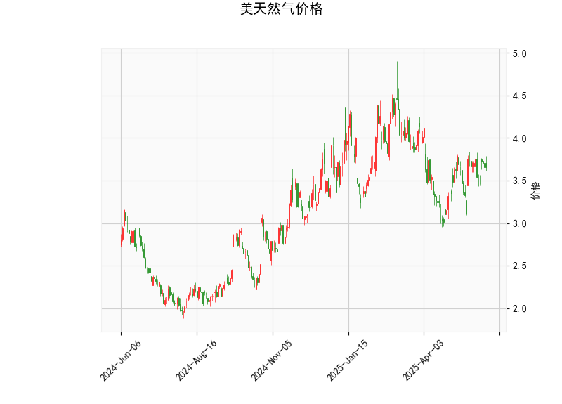

# 美天然气价格技术分析及投资策略

---

## 一、技术分析结果解读

### 1. **价格与布林轨道**
- **当前价（3.66）**略高于布林轨道中轨（3.61），但距离上轨（4.22）仍有较大空间，距离下轨（2.99）较远。**短期价格处于中上轨区间**，若站稳中轨可能进一步向上试探。
- **布林带收窄**：上轨与下轨间距较小，暗示波动率降低，需警惕突破行情。

### 2. **RSI（52.84）**
- 接近中性值50，**多空力量暂时均衡**，未进入超买（>70）或超卖（<30）区间。短期趋势需结合其他指标判断。

### 3. **MACD指标**
- **MACD线（0.036）**上穿**信号线（0.0247）**，柱状图（0.0114）为正值且扩张，显示**短期动能偏多**，但绝对值较小，需关注持续性和成交量配合。

### 4. **K线形态（CDLMATCHINGLOW）**
- 该形态通常出现在下跌趋势末期，由两根阴线组成，第二根K线开盘价和收盘价接近前一根低点，暗示**卖压减弱**，可能预示反弹。需结合价格位置验证：当前价格接近布林中轨，若站稳则增强反转信号。

---

## 二、投资机会与策略建议

### 1. **趋势性机会**
- **看多条件**：若价格站稳布林中轨（3.61）并突破3.75（近期阻力），可轻仓试多，目标看向上轨4.22，止损设于3.55以下。
- **看空条件**：若价格跌破中轨且MACD柱状图转负，可能回踩下轨2.99，但需警惕超跌反弹风险。

### 2. **区间套利策略**
- **布林带区间交易**：
  - **买入点**：价格回落至下轨2.99附近，配合RSI<40或MACD底背离。
  - **卖出点**：价格触及上轨4.22附近，配合RSI>60或MACD顶背离。

### 3. **事件驱动机会**
- **季节性因素**：天然气需求通常在冬季供暖季（11月-次年2月）上升，可提前布局多头头寸。
- **库存数据**：关注EIA周度库存报告，若库存低于预期可能推动价格上涨。

### 4. **风险提示**
- **假突破风险**：布林带收窄后若突破失败，可能快速反向波动，需严格止损。
- **宏观扰动**：地缘冲突（如俄乌局势）、极端天气、美联储政策可能加剧价格波动。

---

**总结**：当前技术面偏震荡，短期MACD金叉和CDLMATCHINGLOW形态提供反弹信号，但需确认价格站稳中轨。建议结合基本面事件（库存、天气）灵活调整仓位，优先采用区间交易策略，严格风控。