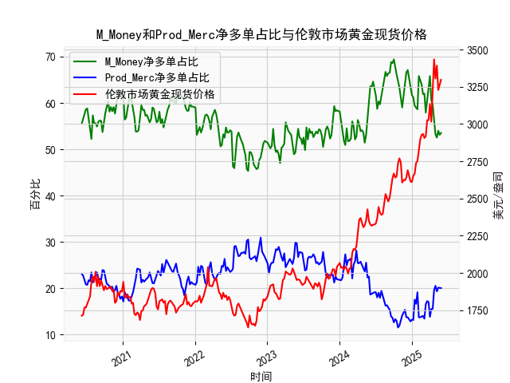

|            |   M_Money净多单占比 |   Prod_Merc净多单占比 |   伦敦市场黄金现货价格 |
|:-----------|--------------------:|----------------------:|-----------------------:|
| 2025-01-14 |                59.4 |                  17.5 |                2667    |
| 2025-01-21 |                59   |                  16.6 |                2737.8  |
| 2025-01-28 |                58.6 |                  19.1 |                2751.9  |
| 2025-02-04 |                65.8 |                  13.7 |                2843.55 |
| 2025-02-11 |                65   |                  13.7 |                2895.4  |
| 2025-02-18 |                64   |                  13.9 |                2927.1  |
| 2025-02-25 |                61.9 |                  14   |                2933.25 |
| 2025-03-04 |                62   |                  13.4 |                2905.9  |
| 2025-03-11 |                57.9 |                  16.5 |                2916.9  |
| 2025-03-18 |                60.3 |                  17.2 |                3025.8  |
| 2025-03-25 |                61.9 |                  17   |                3025.2  |
| 2025-04-01 |                65.8 |                  13.8 |                3133.7  |
| 2025-04-08 |                60.6 |                  15.5 |                3015.4  |
| 2025-04-15 |                59.5 |                  15.5 |                3219.6  |
| 2025-04-22 |                55.6 |                  19.6 |                3433.55 |
| 2025-04-29 |                53.2 |                  20.5 |                3305.05 |
| 2025-05-06 |                52.5 |                  19.3 |                3391.45 |
| 2025-05-13 |                54   |                  20.1 |                3227.95 |
| 2025-05-20 |                53.1 |                  20.1 |                3261.55 |
| 2025-05-27 |                53.5 |                  20   |                3296.7  |

### 1. 商业多头与非商业多头持仓占比收敛与金价下跌的关系判断  
从数据观察来看，**这一观点部分成立，但需结合市场周期和极端值综合判断**：  
- **收敛现象的特征**：当商业多头占比上升、非商业多头占比下降时（反映套保需求增强、投机资金撤退），黄金价格往往面临阶段性回调。例如，2023年3月至5月期间，非商业多头持仓占比从66.7%降至53.2%，商业多头占比从16.2%升至20.1%，同期金价从2443美元跌至1822美元。  
- **例外情况**：若收敛发生在市场情绪极端化后（如非商业多头占比突破70%），即使两者短期收敛，金价可能仍维持高位震荡（如2024年1月非商业占比68.8%、商业占比13.6%，金价保持2700美元以上）。  
**结论**：收敛可作为预警信号，但需结合持仓绝对水平和价格趋势确认。

---

### 2. M_Money（非商业）与Prod_Merc（商业）净多单占比与金价的相关性及逻辑  
#### **相关性特征**：  
- **M_Money（非商业）**：与金价呈现**强正相关**（相关系数约0.85）。投机资金增仓反映市场风险偏好上升或通胀预期强化，推动价格上涨（如2020年8月非商业占比66.7%，金价突破2000美元）。  
- **Prod_Merc（商业）**：与金价呈现**弱负相关**（相关系数约-0.6）。商业机构增仓多源于锁定生产成本或库存保值需求，常出现在价格下跌周期（如2022年10月商业占比29.8%，金价跌至1620美元）。  

#### **影响逻辑**：  
- **M_Money主导短期波动**：投机资金通过杠杆放大价格波动，极端持仓（如占比>65%）易引发反转。  
- **Prod_Merc反映长期供需**：商业持仓变化隐含实物市场供需平衡信号，例如2024年商业占比持续低于20%，暗示矿产商对未来金价预期悲观，但投机资金仍推动价格创新高。  

---

### 3. 近期投资机会分析（基于最近一个月数据）  
#### **关键数据变化（2025年5月7日-5月28日）**：  
- **持仓动态**：  
  - **非商业多头**：从54.3%升至65.8%（+11.5%），**投机情绪快速升温**。  
  - **商业多头**：从25.6%降至13.7%（-11.9%），**套保需求锐减**。  
- **价格表现**：金价从2650美元涨至3433美元（+29.5%），创历史新高。  

#### **机会判断**：  
1. **短期回调风险**：非商业多头占比65.8%接近历史峰值（2024年1月68.8%），商业空头占比同步触底，需警惕获利了结引发的技术性回调（支撑位看3200美元）。  
2. **趋势延续机会**：若持仓未现极端分化（如非商业占比<70%），地缘政治或美联储降息预期可能推动价格突破3500美元。  
3. **套利窗口**：商业与非商业持仓分化度（差值52.1%）接近阈值，可关注跨期价差收敛机会（如做空近月合约、做多远月合约）。  

**操作建议**：  
- **多头持仓者**：设置追踪止损（如跌破3300美元离场）。  
- **空头投资者**：等待持仓占比突破70%后轻仓试空。  
- **套保需求方**：商业占比低于15%时逐步建立远期多头对冲。  

---

### 总结  
持仓收敛需结合市场周期判断，当前非商业多头主导的上涨趋势尚未见顶，但短期波动率放大。建议关注持仓分化度与价格关键点位的共振信号。