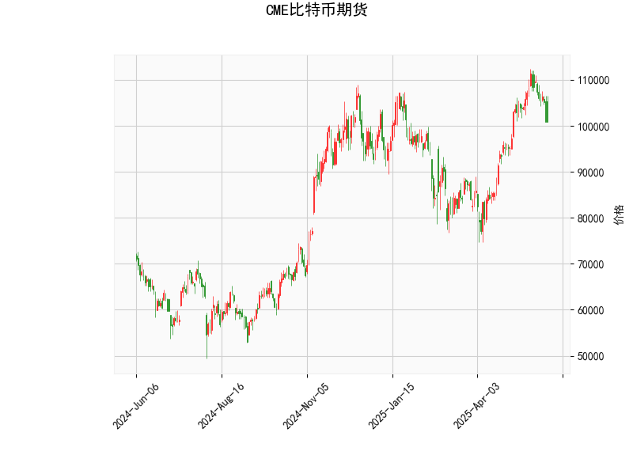

### CME比特币期货技术分析结果解读

#### 1. 核心指标分析
- **当前价（100,880美元）**：  
  价格位于布林通道中轨（94,141.7美元）与上轨（114,209.8美元）之间，略高于中轨，表明短期处于中性偏多区域，但尚未突破上轨压力。

- **RSI（46.78）**：  
  处于中性区间（30-70），既未超买也未超卖，市场缺乏明确方向性信号，需结合其他指标判断动能。

- **MACD指标**：  
  - MACD线（2144.2）低于信号线（3554.5），柱状图（-1410.3）为负值，显示短期动能弱于长期，短期可能延续回调趋势。
  - 当前MACD与信号线间距较大，若柱状图缩窄或转正，可能预示短期反弹机会。

- **布林通道**：  
  - 价格接近中轨，若站稳中轨（94,141.7美元），可能向上测试上轨（114,209.8美元）；若跌破中轨，可能向下试探下轨（74,073.6美元）。
  - 通道宽度（上轨-下轨≈40,000美元）显示市场波动率较高，需警惕短期剧烈波动风险。

- **K线形态**：  
  - **CDLCLOSINGMARUBOZU**（光头光脚阳线）：通常为看涨反转信号，表明买方在收盘时占据主导。
  - **CDLMATCHINGLOW**（匹配低点）：出现在下跌趋势中，预示卖方力量衰竭，可能短期反弹。
  - 两者结合暗示多空博弈激烈，需关注后续K线是否确认反转。

---

#### 2. 近期投资/套利机会与策略

##### **潜在机会**  
1. **趋势跟踪策略**：  
   - **多头机会**：若价格站稳中轨（94,141.7美元）并伴随RSI突破50，可尝试轻仓做多，目标上轨（114,209.8美元），止损设于中轨下方（如93,000美元）。
   - **空头机会**：若价格跌破中轨且MACD柱状图持续扩大负值，可逢高做空，目标下轨（74,073.6美元），止损设于中轨上方（如95,000美元）。

2. **反转策略**：  
   - **看涨反转**：若K线形态（如MATCHINGLOW）确认反弹，且MACD柱状图缩窄或RSI回升至50以上，可布局多单，目标中轨至前高。
   - **看跌反转**：若价格触及上轨后出现长上影线或MACD死叉，可短期做空。

3. **波动率套利**：  
   - 布林通道宽度较大，可结合期权策略（如跨式组合）押注价格突破，或通过期货合约对冲波动风险。

##### **风险提示**  
- MACD死叉与价格接近中轨的矛盾信号需谨慎，建议轻仓试单，避免单边押注。
- 若价格快速突破上轨或下轨，需警惕假突破风险，需结合成交量确认。
- 比特币市场流动性较高但波动剧烈，需严格设置止损并控制仓位。

---

### 总结  
当前技术面呈现多空分歧，短期可能延续震荡。投资者可优先关注布林通道中轨支撑与MACD动能变化，结合K线形态灵活调整策略。套利机会需结合跨期价差或期权波动率，建议在明确趋势信号后右侧交易。