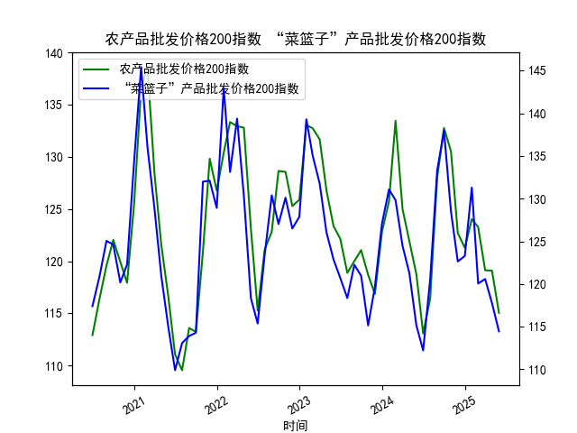

|            |   原油价格 |   大宗商品价格指数BPI |
|:-----------|-----------:|----------------------:|
| 2025-05-08 |    453.99  |                   857 |
| 2025-05-09 |    465.062 |                   856 |
| 2025-05-12 |    474.667 |                   857 |
| 2025-05-13 |    472.072 |                   859 |
| 2025-05-14 |    480.012 |                   864 |
| 2025-05-15 |    460.24  |                   866 |
| 2025-05-16 |    455.311 |                   865 |
| 2025-05-19 |    461.324 |                   863 |
| 2025-05-20 |    464.013 |                   863 |
| 2025-05-21 |    468.667 |                   863 |
| 2025-05-22 |    452.5   |                   863 |
| 2025-05-23 |    451.923 |                   862 |
| 2025-05-26 |    458.243 |                   860 |
| 2025-05-27 |    456.973 |                   860 |
| 2025-05-28 |    451.693 |                   859 |
| 2025-05-29 |    464.196 |                   858 |
| 2025-05-30 |    445.818 |                   856 |
| 2025-06-03 |    459.493 |                   853 |
| 2025-06-04 |    465.267 |                   852 |
| 2025-06-05 |    460.514 |                   851 |

### 1. 原油价格与大宗商品价格指数的相关性及影响逻辑

#### （1）长期正相关性
原油作为大宗商品的核心品种，其价格波动通过以下路径影响整体大宗商品指数：
- **直接权重传导**：原油在商品指数中占比较高，其价格变动直接影响指数数值。
- **产业链成本推动**：原油价格上涨会推高工业品（化工、运输）和农产品（化肥、机械）的生产成本，间接抬升其他大宗商品价格。
- **金融属性联动**：两者均受美元指数、通胀预期、地缘政治等宏观因素驱动，呈现同向波动。

#### （2）短期分化可能性
从近期数据可见（如2025年6月原油价格震荡下行，而同期大宗商品指数同步走弱），二者短期可能因以下因素背离：
- **需求结构性差异**：若原油需求受经济放缓压制，但工业金属受新能源需求支撑，则二者走势分化。
- **政策干预**：原油受OPEC+减产或储备释放政策扰动，而其他商品受行业政策影响。
- **品种替代效应**：高油价可能抑制石油消费，但刺激替代能源（如天然气）相关商品价格上涨。

---

### 2. 近期投资机会分析（聚焦最近1周）

#### （1）原油市场机会
- **超跌反弹信号**：  
  - **今日（2025年6月5日）数据**：原油价格报460.51，较昨日（465.27）下跌1.0%，短期连续回调后逼近关键支撑位（450-455区间）。  
  - **驱动因素**：地缘冲突缓和导致供应担忧缓解，但技术面已进入超卖区域（RSI<30），存在反弹需求。  
  - **策略**：逢低布局多单，止损位450，目标位480-490。

- **裂解价差套利**：  
  - **数据观察**：近期成品油（如汽油）需求季节性上升，而原油价格回调，炼厂利润可能扩大。  
  - **策略**：做多炼厂利润（多汽油/空原油）。

#### （2）大宗商品指数机会
- **整体弱势中的结构性机会**：  
  - **今日数据**：指数报851，较昨日（859）下跌0.9%，创年内新低，但部分品种（如贵金属）逆势走强。  
  - **细分机会**：  
    - **避险资产**：黄金、白银因避险情绪升温表现抗跌，可配置ETF或期货多头。  
    - **农产品分化**：玉米、小麦受极端天气影响供应，价格强于指数，关注相关合约多头。

- **空头对冲机会**：  
  - **逻辑**：若指数跌破850关键支撑位，可能加速下行，可做空指数期货或相关ETF。

#### （3）跨市场联动机会
- **美元反向交易**：  
  - **相关性验证**：近期美元走强压制大宗商品，若美联储释放降息信号，美元回落将利好商品反弹。  
  - **策略**：做空美元指数（DXY）同时做多原油/铜。

---

### 结论
**短期重点**：原油超跌反弹、贵金属避险、农产品天气炒作；**风险提示**：关注OPEC+会议、美联储议息及宏观经济数据。投资者需结合技术面与事件驱动灵活调整仓位。