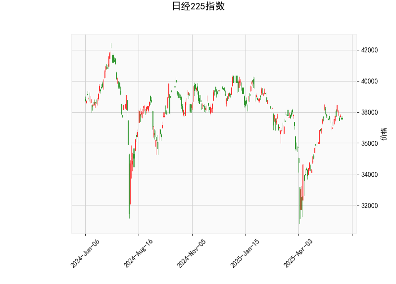

### 日经225指数技术分析结果解读

#### 1. 技术指标分析
- **当前价（37554.49）与布林轨道关系**：
  - **上轨**（39824.34）：当前价低于上轨，距离约6%空间，显示上方存在潜在阻力。
  - **中轨**（36350.88）：当前价高于中轨，处于布林带中上轨之间，表明短期趋势中性偏强。
  - **下轨**（32877.43）：当前价远高于下轨，显示短期内下行空间有限。
  - **结论**：价格处于震荡区间中上部，需关注能否突破上轨或向中轨回落。

- **RSI（54.28）**：
  - 处于50附近的中性区域，未进入超买（>70）或超卖（<30）区间，显示多空力量均衡，短期无明显方向性信号。

- **MACD指标**：
  - **MACD线（371.58）**低于**信号线（445.51）**，形成“死叉”，且**MACD柱（-73.93）**为负值，表明短期动能偏弱，存在回调压力。
  - **结论**：MACD死叉可能预示短期调整，但需结合价格与布林带位置判断回调幅度。

- **K线形态（CDLMATCHINGLOW）**：
  - **匹配低形态**：通常出现在下跌趋势末期，暗示空方力量衰竭，可能为短期底部反转信号。需结合成交量确认有效性。

---

#### 2. 投资/套利机会与策略建议

##### **短期机会**：
1. **震荡区间交易**：
   - **区间上限（上轨附近）**：若价格接近39800附近且未放量突破，可考虑逢高做空，目标中轨（36350），止损设于上轨上方。
   - **区间下限（中轨附近）**：若价格回落至中轨（36350）附近企稳，可尝试做多，目标上轨，止损设于中轨下方。

2. **MACD动能修复策略**：
   - 若MACD柱（负值）开始收窄并形成金叉，可能预示短期反弹，可轻仓介入多单，目标上轨。

3. **K线形态博弈**：
   - 若CDLMATCHINGLOW形态后出现放量阳线确认反转，可尝试短多，目标前高附近（38000-38500），止损设于形态低点下方。

##### **风险提示**：
- **外部事件冲击**：日本央行政策、日元汇率波动（如日元贬值利好出口企业但可能引发资本外流）可能影响指数方向。
- **技术指标矛盾**：MACD死叉与价格站稳中轨的背离需警惕假突破风险，建议结合成交量验证趋势强度。

##### **套利方向**：
- **跨市场套利**：若日经225与美股（如标普500）相关性短期走弱，可关注两者价差回归机会。
- **波动率套利**：布林带收窄后可能伴随波动率扩张，可布局期权策略（如跨式组合）。

---

### 总结
**短期策略**：中性偏谨慎，关注价格在布林带中轨与上轨间的震荡，MACD修复信号及K线形态确认后可择机参与波段交易。  
**中长期观察**：若有效突破上轨且MACD转强，可能打开上行空间；若跌破中轨则需防范深度回调风险。  
**关键点位**：支撑36350（中轨）、阻力39824（上轨）。