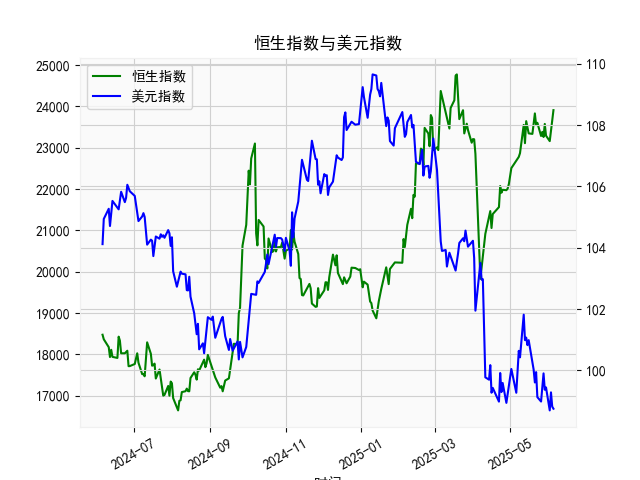

|            |   恒生指数 |   美元指数 |
|:-----------|-----------:|-----------:|
| 2025-05-09 |    22867.7 |   100.422  |
| 2025-05-12 |    23549.5 |   101.814  |
| 2025-05-13 |    23108.3 |   100.983  |
| 2025-05-14 |    23640.7 |   101.066  |
| 2025-05-15 |    23453.2 |   100.82   |
| 2025-05-16 |    23345   |   100.983  |
| 2025-05-19 |    23332.7 |   100.373  |
| 2025-05-20 |    23681.5 |   100.022  |
| 2025-05-21 |    23827.8 |    99.6014 |
| 2025-05-22 |    23544.3 |    99.9388 |
| 2025-05-23 |    23601.3 |    99.1231 |
| 2025-05-26 |    23282.3 |    98.9787 |
| 2025-05-27 |    23382   |    99.6147 |
| 2025-05-28 |    23258.3 |    99.8978 |
| 2025-05-29 |    23573.4 |    99.3633 |
| 2025-05-30 |    23289.8 |    99.4393 |
| 2025-06-02 |    23158   |    98.6893 |
| 2025-06-03 |    23512.5 |    99.2781 |
| 2025-06-04 |    23654   |    98.8128 |
| 2025-06-05 |    23907   |    98.7444 |

### 1. 恒生指数与美元指数的相关性及影响逻辑

#### 相关性
恒生指数与美元指数通常呈现**负相关关系**。从历史数据看，美元走强时，恒生指数往往承压；美元走弱时，恒生指数则倾向于上涨。这一相关性在近年来因全球资本流动和风险偏好变化而更加显著。

#### 影响逻辑
1. **资本流动效应**：
   - **美元升值**：吸引全球资金回流美国市场（尤其是美债和美元资产），导致新兴市场（包括香港）资金外流，恒生指数流动性减少，估值受压。
   - **美元贬值**：推动资金转向风险资产，新兴市场吸引力上升，港股外资流入增加，推动指数上涨。

2. **企业盈利传导**：
   - 恒指成分股中许多企业（如金融、地产、出口贸易）的营收以港元或人民币计价，但负债或成本可能涉及美元。美元走强会加重企业外债压力，侵蚀利润；反之则缓解成本压力。

3. **汇率挂钩机制**：
   - 港元与美元挂钩，美元走强间接推高香港利率（跟随美联储加息），抑制本地消费和借贷需求，拖累经济增长预期。

4. **风险情绪联动**：
   - 美元作为避险资产，其走强常伴随全球风险偏好下降（如地缘冲突、经济衰退预期），导致港股风险溢价上升；反之，美元走弱反映市场乐观情绪，提振港股。

---

### 2. 近期投资机会分析（基于最近一周数据）

#### 数据关键变化
- **人民币贷款增速与存款增速之差**（最新值 **22,849.81**，前值 **23,202.53**）：
  - **今日（最后一日）环比下降约1.5%**，显示贷款需求边际放缓，或反映短期经济活跃度降温。
  - 但近一周整体波动较小，中长期差值仍处于高位，表明金融体系流动性相对充裕。

- **美元指数**（最新值 **98.74**，前值 **98.81**）：
  - **今日小幅下跌0.07%**，延续近一周的震荡下行趋势（一周内从 **103.66** 跌至 **98.74**，跌幅约4.7%），反映美联储降息预期升温及非美货币走强。

#### 潜在投资机会

##### （1）港股反弹窗口（受益于美元走弱）
- **逻辑**：美元指数快速下跌释放资金回流新兴市场信号，恒生指数（尤其是外资偏好板块如科技、消费）或迎来估值修复。
- **关注板块**：
  - **科技股**（腾讯、美团）：外资持仓集中，对美元流动性敏感。
  - **高股息资产**（中资银行、公用事业）：美元走弱提升港股股息吸引力。

##### （2）人民币资产对冲（贷款-存款差收窄）
- **逻辑**：贷款增速放缓可能预示政策宽松预期（如降准），叠加美元贬值，人民币汇率压力缓解，中资美元债（地产、城投）利差或收窄。
- **关注标的**：优质房企短债、境内高收益债ETF。

##### （3）大宗商品相关板块
- **逻辑**：美元走弱提振以美元定价的大宗商品（铜、原油），港股资源股（中海油、紫金矿业）或受益于价格反弹。
- **风险提示**：需同步跟踪全球需求数据（如中国PMI、美国库存）。

##### （4）短期避险策略
- **逻辑**：贷款-存款差单日下滑或引发市场对经济动能的担忧，防御性板块（医药、必需消费）可能相对抗跌。
- **操作建议**：结合技术面超卖信号布局。

---

### 总结
近期核心驱动为**美元趋势性走弱**，建议优先关注港股流动性敏感型资产，同时警惕贷款需求放缓对周期股的短期压力。今日数据变化幅度有限，需结合次日政策信号（如央行公开市场操作）验证方向。