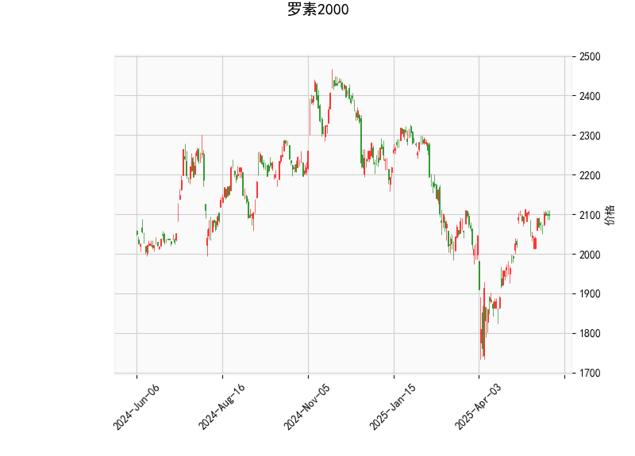

### 罗素2000指数技术分析解读

#### 1. 指标分析
- **当前价与布林轨道**：当前价（2097.35）高于布林带中轨（2005.36），接近但未触及上轨（2191.70），表明短期存在一定上涨动能，但需要警惕上轨阻力。布林带开口较宽，市场波动性较高。
  
- **RSI（59.37）**：接近60的中性偏强区域，显示多空力量均衡，但未进入超买区（>70）。需结合其他指标判断是否持续上行。

- **MACD**：MACD线（24.74）略微低于信号线（24.85），柱状图负值但幅度极小（-0.10），暗示短期可能出现回调或震荡，但中长期趋势尚未明确转向。

- **K线形态**：包含多个反转信号（如十字星、长腿十字线、纺锤线），反映市场犹豫情绪，可能是短期方向选择的征兆，需警惕价格波动风险。

---

#### 2. 投资机会与策略建议

##### **潜在机会**
- **多头策略**：
  - **支撑位买入**：若价格回调至布林带中轨（2005.36）或下轨（1819.02）附近且站稳，配合RSI未跌破50，可视为分批建仓机会。
  - **突破追涨**：若放量突破布林带上轨（2191.70），可能开启加速上涨，但需注意超买风险。

- **空头策略**：
  - **阻力位做空**：若价格接近布林带上轨后回落且MACD死叉确认，可短期做空，目标看向中轨。
  - **反转信号交易**：若K线形态（如十字星）后出现看跌吞没或大阴线，结合RSI拐头向下，可尝试轻仓空单。

##### **套利与风控**
- **波动性套利**：布林带宽度较大，若短期内价格贴近中轨震荡，可通过期权组合（如铁鹰策略）捕捉波动率衰减收益。
- **对冲策略**：多空双向信号并存时，可搭配股指期货与ETF进行对冲，降低方向性风险。
- **止损设置**：多头止损可设在布林带中轨下方（如1990），空头止损设在上轨上方（如2200）。

##### **关键观察点**
- **MACD确认**：若MACD柱状图转正且金叉形成，可强化看涨信号。
- **RSI动向**：若RSI突破60，可能强化短期上行趋势；若跌破50，需警惕回调风险。
- **成交量配合**：价格突破关键位时需放量确认有效性，否则可能为假突破。

---

**总结**：罗素2000指数短期处于震荡偏强状态，但技术面显示多空博弈加剧。建议以区间交易为主，关注布林带上下轨及K线形态的后续确认信号，灵活调整仓位。风险偏好较低的投资者可等待MACD与RSI趋势明朗后再介入。