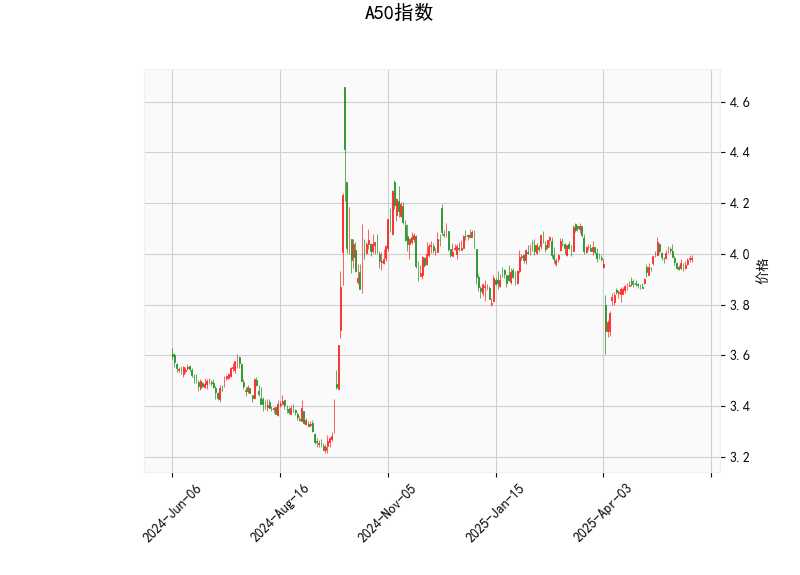

### A50指数技术分析解读

#### 1. 技术指标解析
**(1) RSI（相对强弱指数）：55.48**  
RSI处于50-70的中性偏多区域，显示市场短期未出现超买或超卖，但需警惕若RSI突破70可能触发回调压力。

**(2) MACD指标**  
- **MACD线（0.010） < 信号线（0.012）**：MACD柱状图（-0.0022）为负值，表明短期动能偏弱，存在潜在看跌交叉风险。  
- **当前差值较小**：若MACD线回升突破信号线，可能触发短期反弹。

**(3) 布林带**  
- **当前价（3.984）接近中轨（3.9456）**：价格处于布林带中轨附近，显示市场方向不明。  
- **轨道收窄**：上轨（4.119）与下轨（3.772）间距缩小，暗示波动率降低，可能进入盘整或酝酿突破。

**(4) K线形态**  
- **CDLGAPSIDESIDEWHITE（上下缺口白兵线）**：通常出现在趋势末端，暗示多空争夺激烈，可能预示反转或延续盘整。  
- **CDLSPINNINGTOP（旋转顶）**：短实体+长上下影线，反映市场犹豫不决，需结合其他指标确认方向。

---

#### 2. 潜在机会与策略建议

**（1）短期突破交易机会**  
- **看涨条件**：若价格站稳中轨（3.945）并突破上轨（4.119），且MACD转正，可尝试轻仓做多，目标前高。  
- **看跌条件**：若价格跌破下轨（3.772）且MACD柱扩大负值，可考虑短空，目标位3.75-3.70区域。

**（2）区间震荡策略**  
- **高抛低吸**：在布林带上下轨（4.12-3.77）之间波段操作，止损设于轨道外侧（如突破上轨后回落超1%则止损）。  
- **结合RSI过滤**：RSI接近70时逢高减仓，低于40时关注反弹。

**（3）套利机会（跨品种/跨期）**  
- **股指期货基差套利**：若A50期货与现货价差扩大，可反向操作对冲基差收敛。  
- **波动率策略**：若布林带持续收窄后突然扩张（波动率跳升），可布局跨式期权组合。

---

**风险提示**  
- **假突破风险**：布林带收窄后若突破失败，需严格止损（建议1%-2%浮动空间）。  
- **外部事件冲击**：关注中国宏观经济数据（PMI、社融）及海外市场波动对A50的联动影响。