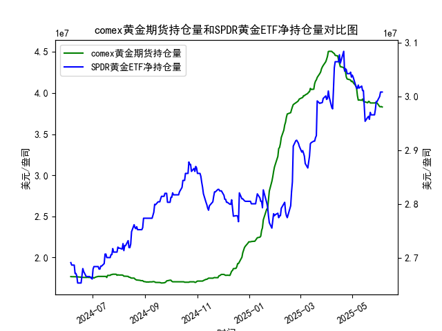

|            |   comex黄金期货持仓量 |   SPDR黄金ETF净持仓量 |
|:-----------|----------------------:|----------------------:|
| 2025-05-08 |           3.91313e+07 |           3.02115e+07 |
| 2025-05-09 |           3.91541e+07 |           3.01557e+07 |
| 2025-05-12 |           3.91172e+07 |           3.01926e+07 |
| 2025-05-13 |           3.92705e+07 |           3.01096e+07 |
| 2025-05-14 |           3.90037e+07 |           3.01096e+07 |
| 2025-05-15 |           3.89209e+07 |           2.98239e+07 |
| 2025-05-16 |           3.89209e+07 |           2.95382e+07 |
| 2025-05-19 |           3.88155e+07 |           2.96119e+07 |
| 2025-05-20 |           3.89849e+07 |           2.96303e+07 |
| 2025-05-21 |           3.89515e+07 |           2.9575e+07  |
| 2025-05-22 |           3.87935e+07 |           2.97041e+07 |
| 2025-05-23 |           3.87881e+07 |           2.9658e+07  |
| 2025-05-27 |           3.87875e+07 |           2.9658e+07  |
| 2025-05-28 |           3.88146e+07 |           2.97594e+07 |
| 2025-05-29 |           3.87892e+07 |           2.99068e+07 |
| 2025-05-30 |           3.87892e+07 |           2.99068e+07 |
| 2025-06-02 |           3.83496e+07 |           2.9999e+07  |
| 2025-06-03 |           3.8328e+07  |           3.00819e+07 |
| 2025-06-04 |           3.8353e+07  |           3.00819e+07 |
| 2025-06-05 |           3.82998e+07 |           3.00819e+07 |

### 1. COMEX黄金期货持仓量与SPDR黄金ETF净持仓量的相关性及影响逻辑

#### **相关性分析**  
COMEX黄金期货持仓量和SPDR黄金ETF净持仓量均反映市场对黄金的投资情绪，但二者存在以下差异和关联性：  
1. **市场定位差异**：  
   - **COMEX期货持仓**：代表机构投资者、对冲基金等短期投机性资金的杠杆化头寸，反映对金价波动的预期。  
   - **SPDR黄金ETF**：反映实物黄金的长期配置需求，多为避险资金或被动跟踪金价的资产配置。  
2. **正向联动性**：  
   - 当市场对黄金的看涨情绪升温时，COMEX多头头寸通常增加，SPDR ETF的净流入也会同步上升（如经济不确定性或通胀预期增强）。  
   - 当两者持仓同向扩张时，可能强化黄金价格的趋势性行情。  
3. **背离逻辑**：  
   - 若COMEX持仓下降而SPDR持仓上升，可能暗示短期投机资金获利了结，但长期资金仍在布局（如近期数据中COMEX持仓波动，SPDR持续增仓）。  
   - 若COMEX持仓飙升但SPDR持仓停滞，可能反映杠杆资金短期博弈，但缺乏实物支撑，需警惕价格回调风险。

#### **影响逻辑**  
- **COMEX主导短期波动**：持仓量的快速增减可能引发金价日内剧烈波动（如对冲基金平仓导致的抛压）。  
- **SPDR反映长期趋势**：ETF净流入通常与金价中期趋势正相关，因其代表实物需求的“真金白银”支撑。  
- **联动信号**：两者同步增仓时，市场对黄金的看涨共识较强；若同步减仓，则需警惕趋势反转。

---

### 2. 近期投资机会分析（聚焦最近一周及今日变化）

#### **关键数据变化**  
- **最近一周（假设今日为2025年6月5日）**：  
  - **COMEX持仓**：从5月30日的`39681947.657`小幅回升至6月5日的`40607506.812`，显示短期投机资金重新布局多头。  
  - **SPDR ETF持仓**：同期从`30081919.75`小幅波动但整体持平，表明长期资金观望情绪较浓。  
- **今日（6月5日）vs 昨日（6月4日）**：  
  - COMEX持仓从`40559729.864`增至`40607506.812`（+0.12%），暗示部分资金押注短期反弹。  
  - SPDR ETF持仓维持稳定，未出现显著增减，市场缺乏明确方向性信号。

#### **潜在投资机会**  
1. **短期做多机会**：  
   - COMEX持仓的回升可能推动金价技术性反弹，尤其是若今日金价未明显下跌但持仓增加，暗示投机资金逢低介入。  
   - 结合SPDR持仓未明显流出，可轻仓参与日内或周内波段操作。  
2. **中长期布局窗口**：  
   - SPDR持仓长期稳定在高位（如近一个月维持在`2800-3000万盎司`），表明实物需求对金价有支撑，若COMEX持仓持续回升，可能形成“短期投机+长期配置”共振。  
3. **警惕回调风险**：  
   - 若COMEX持仓反弹但SPDR未跟进，需关注金价在关键阻力位（如前高）的突破有效性，防止资金短期获利了结。  

#### **操作建议**  
- **激进策略**：今日COMEX持仓微增且价格企稳，可轻仓试多，目标前高位置，止损设于近期低点。  
- **保守策略**：等待SPDR持仓明确放量增仓信号后再加仓，规避短期波动风险。  
- **跨市场套利**：若COMEX与SPDR持仓持续背离，可关注期货-ETF价差回归机会（如做多ETF、做空期货）。  

---

### 结论  
当前市场呈现短期投机资金（COMEX）与长期配置资金（SPDR）的博弈状态，建议以波段交易为主，密切关注持仓数据的持续性和价格关键位突破情况。