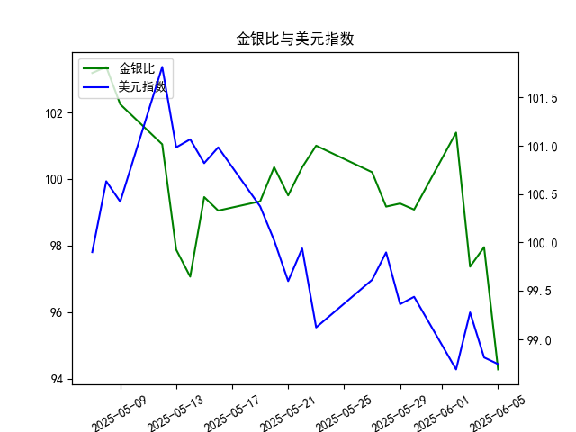

|            |    金价 |   银价 |   美元指数 |   金银比 |
|:-----------|--------:|-------:|-----------:|---------:|
| 2025-05-08 | 3352.3  | 32.43  |   100.633  | 103.37   |
| 2025-05-09 | 3324.55 | 32.515 |   100.422  | 102.247  |
| 2025-05-12 | 3235.4  | 32.02  |   101.814  | 101.043  |
| 2025-05-13 | 3227.95 | 32.98  |   100.983  |  97.876  |
| 2025-05-14 | 3191.95 | 32.885 |   101.066  |  97.064  |
| 2025-05-15 | 3191.05 | 32.085 |   100.82   |  99.4561 |
| 2025-05-16 | 3182.95 | 32.135 |   100.983  |  99.0493 |
| 2025-05-19 | 3230.15 | 32.52  |   100.373  |  99.3281 |
| 2025-05-20 | 3261.55 | 32.5   |   100.022  | 100.355  |
| 2025-05-21 | 3299.65 | 33.16  |    99.6014 |  99.5069 |
| 2025-05-22 | 3284    | 32.725 |    99.9388 | 100.351  |
| 2025-05-23 | 3342.65 | 33.095 |    99.1231 | 101.002  |
| 2025-05-27 | 3296.7  | 32.9   |    99.6147 | 100.204  |
| 2025-05-28 | 3300.85 | 33.285 |    99.8978 |  99.1693 |
| 2025-05-29 | 3312.4  | 33.37  |    99.3633 |  99.2628 |
| 2025-05-30 | 3277.55 | 33.08  |    99.4393 |  99.0795 |
| 2025-06-02 | 3370.85 | 33.245 |    98.6893 | 101.394  |
| 2025-06-03 | 3334.75 | 34.25  |    99.2781 |  97.365  |
| 2025-06-04 | 3364.6  | 34.35  |    98.8128 |  97.9505 |
| 2025-06-05 | 3374.6  | 35.795 |    98.7444 |  94.2757 |

### 1. 金银比与美元指数的相关性及影响逻辑

#### 相关性
金银比（黄金价格/白银价格）与美元指数通常呈现**正相关性**，但具体关系需结合市场环境分析：
- **正向关联场景**：美元走强时，以美元计价的大宗商品（包括黄金和白银）价格承压。若白银因工业属性需求疲软而跌幅大于黄金（避险属性更强），金银比上升。
- **反向关联场景**：当美元因避险情绪走强（如经济衰退预期），黄金可能因避险需求跑赢白银，导致金银比上升；若美元因经济复苏预期走弱，白银的工业需求回升可能推动其涨幅超过黄金，金银比下降。

#### 影响逻辑
- **美元指数对金银比的传导**：
  - **定价机制**：美元强弱直接影响金银的美元标价，美元升值压制金银价格，贬值则提振。
  - **避险属性差异**：黄金避险属性更强，白银兼具工业和金融属性。经济不确定性中，黄金相对白银更抗跌，推高金银比；经济复苏时，白银工业需求回升可能压低金银比。
- **市场情绪与政策**：美联储政策（如加息预期）通过美元指数间接影响金银比。例如，加息预期推高美元，若叠加工业需求疲软，白银跌幅或大于黄金，导致金银比攀升。

---

### 2. 近期投资机会分析（聚焦最近一周及今日变化）

#### 数据观察
- **金银比**：
  - **最近一周**：从5月30日（101.39）快速下降至6月5日（94.28），跌幅达7.1%，反映白银相对黄金走强。
  - **今日（6月5日）**：金银比骤降3.7%（97.95 → 94.28），创近一个月最大单日跌幅。
- **美元指数**：
  - **最近一周**：从5月30日（98.69）小幅反弹至6月2日（99.28），但随后回落至6月5日（98.74），整体偏弱。
  - **今日**：微跌0.07%（98.81 → 98.74），延续弱势震荡。

#### 投资机会
1. **做空金银比（多白银/空黄金）**：
   - **逻辑**：金银比连续下跌且今日加速，表明白银短期动能强劲。若美元维持弱势（利好大宗商品），叠加工业需求预期（如制造业复苏），白银或进一步跑赢黄金。
   - **风险**：需警惕金银比超跌后的技术性反弹，关注美元指数企稳信号。

2. **直接做多白银**：
   - **逻辑**：金银比暴跌反映白银短期强势，且美元疲软提供支撑。若市场延续对经济复苏的乐观预期（利好工业金属），白银或延续反弹。
   - **催化因素**：关注美国制造业PMI、基建政策进展等数据。

3. **对冲美元贬值**：
   - **逻辑**：美元指数持续弱势，黄金和白银均受益，但白银弹性更大。可配置白银ETF或期货，对冲美元进一步走弱风险。

4. **短期波段交易**：
   - **方向**：若美元指数跌破98.5关键支撑，可能加速金银比下行，可顺势追空金银比。
   - **止盈/止损**：金银比反弹至96.0以上或美元指数重回99.0上方时需谨慎。

#### 关键风险提示
- **政策转向**：若美联储释放鹰派信号（如加息预期升温），美元可能反弹，压制金银价格。
- **市场情绪切换**：避险情绪升温可能推高黄金，导致金银比反弹，削弱白银相对收益。