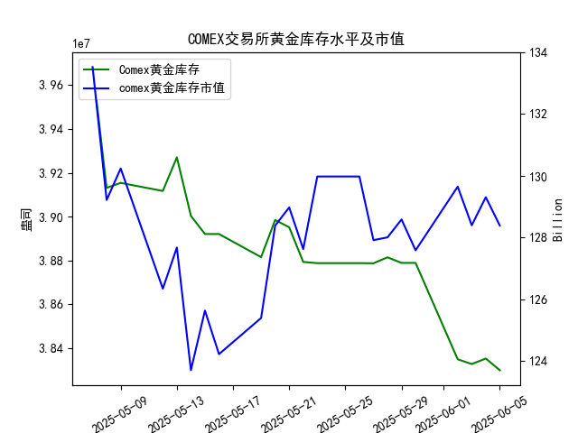

|            |   comex黄金库存量 |   comex黄金库存市值(billion) |   伦敦金现货价 |   上海金交所黄金现货价 |   美元兑人民币汇率 |
|:-----------|------------------:|-----------------------------:|---------------:|-----------------------:|-------------------:|
| 2025-05-09 |       3.91541e+07 |                       3326.3 |        3324.55 |                 785.5  |             7.2095 |
| 2025-05-12 |       3.91172e+07 |                       3230   |        3235.4  |                 759    |             7.2066 |
| 2025-05-13 |       3.92705e+07 |                       3251.4 |        3227.95 |                 763.9  |             7.1991 |
| 2025-05-14 |       3.90037e+07 |                       3171.7 |        3191.95 |                 758.38 |             7.1956 |
| 2025-05-15 |       3.89209e+07 |                       3228.1 |        3191.05 |                 735.86 |             7.1963 |
| 2025-05-16 |       3.89209e+07 |                       3191.8 |        3182.95 |                 746.4  |             7.1938 |
| 2025-05-19 |       3.88155e+07 |                       3230.6 |        3230.15 |                 754.5  |             7.1916 |
| 2025-05-20 |       3.89849e+07 |                       3293.2 |        3261.55 |                 753.49 |             7.1931 |
| 2025-05-21 |       3.89515e+07 |                       3311.4 |        3299.65 |                 773.82 |             7.1937 |
| 2025-05-22 |       3.87935e+07 |                       3290   |        3284    |                 778.36 |             7.1903 |
| 2025-05-23 |       3.87881e+07 |                       3351   |        3342.65 |                 776.4  |             7.1919 |
| 2025-05-26 |       3.87881e+07 |                       3351   |        3342.65 |                 773.94 |             7.1833 |
| 2025-05-27 |       3.87875e+07 |                       3298   |        3296.7  |                 768.75 |             7.1876 |
| 2025-05-28 |       3.88146e+07 |                       3298   |        3300.85 |                 769.67 |             7.1894 |
| 2025-05-29 |       3.87892e+07 |                       3315.1 |        3312.4  |                 763.02 |             7.1907 |
| 2025-05-30 |       3.87892e+07 |                       3289.4 |        3277.55 |                 768.79 |             7.1848 |
| 2025-06-02 |       3.83496e+07 |                       3380.8 |        3370.85 |                 768.79 |             7.1848 |
| 2025-06-03 |       3.8328e+07  |                       3350   |        3334.75 |                 778.5  |             7.1869 |
| 2025-06-04 |       3.8353e+07  |                       3371.5 |        3364.6  |                 779.46 |             7.1886 |
| 2025-06-05 |       3.82998e+07 |                       3352.2 |        3374.6  |                 781.25 |             7.1865 |

## 分析与结论

### 一、COMEX黄金库存与价格相关性验证
从整体趋势（2025年5月7日-6月5日）看，COMEX黄金库存从**3968万盎司**降至**3829万盎司**（降幅3.5%），而伦敦金价从**3392.25**微降至**3374.60**，上海金价从**798.51**降至**781.25**。**库存与价格未呈现显著正相关性**，甚至局部时段（如5月19日-23日库存下降但伦敦金价上涨）呈现负相关性。研究员的观点与数据趋势存在矛盾，可能需结合更长期数据或市场情绪修正。

---

### 二、近期投资机会分析（聚焦最近一周：2025年5月30日-6月5日）

#### 1. **COMEX库存与价格背离信号**
- **库存变化**：6月4日→6月5日库存减少**5.3万盎司**，延续近一周下降趋势（累计降幅4.9%）。
- **价格表现**：
  - **伦敦金价**：6月5日上涨至**3374.60**（较前日+0.3%），突破近一周波动区间。
  - **上海金价**：6月5日升至**781.25**（较前日+0.2%），创近一周新高。
- **机会**：库存加速下降叠加价格反弹，可能反映短期供应趋紧，可关注**多头布局机会**。

#### 2. **跨市场套利窗口**
- **伦敦-上海价差**（按汇率折算）：
  - 6月5日伦敦金价（3374.60美元/盎司）≈ **780.23元/克**（汇率7.1865，1盎司=31.1035克）。
  - 上海金价**781.25元/克**，价差仅**1.02元/克**，套利空间有限。
- **机会**：价差接近无套利区间，需等待汇率波动或市场流动性变化触发机会。

#### 3. **人民币汇率波动影响**
- **汇率变动**：6月4日→6月5日美元兑人民币汇率微跌（7.1886→7.1865），人民币升值压低上海金价涨幅。
- **机会**：若预期人民币短期贬值，可放大上海金价上涨弹性，关注**境内外价差扩大策略**。

#### 4. **关键事件驱动**
- **库存加速下降**：6月2日-5日COMEX库存骤降**49万盎司**，可能反映交割需求或机构囤货行为。
- **价格突破信号**：伦敦金价突破**3370**关键阻力位，技术面偏多。

---

### 三、今日（6月5日）关键变化
- **库存**：单日降幅扩大（-5.3万盎司），创近一周最大降幅。
- **价格**：伦敦与上海金价同步上涨，技术面形成突破。
- **汇率**：人民币升值压制上海金价涨幅，但未逆转上行趋势。

---

### 四、投资建议
1. **短期多头策略**：逢低布局COMEX或伦敦黄金多头，目标看向**3400美元/盎司**（伦敦）及**785元/克**（上海）。
2. **套利监控**：密切跟踪境内外价差及汇率波动，捕捉突发性套利窗口。
3. **风险提示**：库存下降若因交割需求（非供需缺口），可能引发价格回调；人民币汇率短期波动或干扰上海金价。