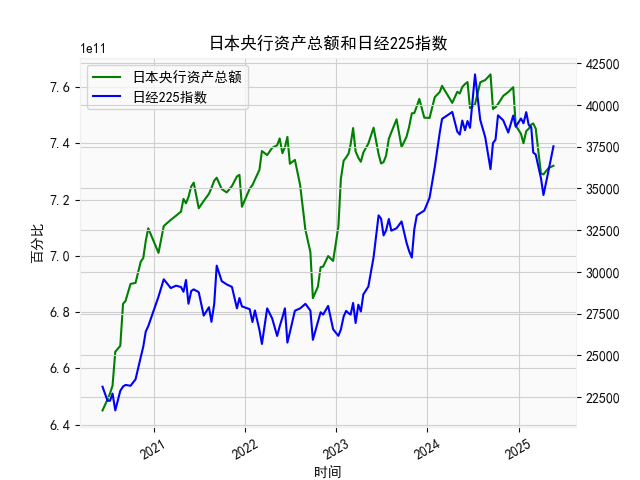

|            |   日本央行资产总额 |   日经225指数 |
|:-----------|-------------------:|--------------:|
| 2024-08-20 |        7.62497e+11 |       38062.9 |
| 2024-09-10 |        7.64503e+11 |       36159.2 |
| 2024-09-20 |        7.52201e+11 |       37723.9 |
| 2024-09-30 |        7.52847e+11 |       37919.6 |
| 2024-10-10 |        7.53936e+11 |       39380.9 |
| 2024-10-31 |        7.56864e+11 |       39081.2 |
| 2024-11-20 |        7.58232e+11 |       38352.3 |
| 2024-12-10 |        7.59957e+11 |       39367.6 |
| 2024-12-20 |        7.46306e+11 |       38701.9 |
| 2025-01-10 |        7.43361e+11 |       39190.4 |
| 2025-01-20 |        7.40022e+11 |       38902.5 |
| 2025-01-31 |        7.44346e+11 |       39572.5 |
| 2025-02-10 |        7.45188e+11 |       38801.2 |
| 2025-02-20 |        7.46669e+11 |       38678   |
| 2025-02-28 |        7.47052e+11 |       37155.5 |
| 2025-03-10 |        7.45231e+11 |       37028.3 |
| 2025-03-31 |        7.29239e+11 |       35617.6 |
| 2025-04-10 |        7.28954e+11 |       34609   |
| 2025-04-30 |        7.31203e+11 |       36045.4 |
| 2025-05-20 |        7.32017e+11 |       37529.5 |

## 日本央行资产总额与日经225指数相关性及影响逻辑

### 1. 相关性分析
日本央行资产总额与日经225指数长期呈现**阶段性正相关**，但短期波动可能受多重因素干扰。核心逻辑如下：
- **流动性驱动**：央行扩表（如购买ETF、国债）直接向市场注入流动性，压低利率并推高资产价格。例如，2020年6月-2021年6月，资产总额从6.45万亿增至7.48万亿美元，同期日经指数从23,124点上涨至30,887点，涨幅33%。
- **政策预期效应**：市场对宽松政策的预期会提前反映在股价中。2023年3月资产总额下降至7.32万亿时，日经指数仍逆势突破38,000点，显示市场对后续政策调整的博弈。
- **背离信号**：当资产规模见顶回落但股市持续上涨时（如2024年12月-2025年3月），往往反映企业盈利改善或外部环境（如日元贬值）对股市的支撑作用增强。

### 2. 近期投资机会分析（聚焦2025年3-5月数据）

#### 关键数据变化
- **央行资产总额**：  
  2025年3月31日→4月30日→5月20日：  
  7.32万亿 → 7.47万亿 → 7.45万亿  
  **近一个月增长1.8%后小幅回调**，显示政策力度边际减弱但仍维持高位。

- **日经225指数**：  
  同期指数从37,028点 → 34,609点 → 37,529点  
  **V型反弹8.4%**，突破前高并创41,831点（2024年11月）以来的新高。

#### 潜在机会
1. **技术性突破机会**：  
   日经指数近期突破38,000点关键阻力位（对应2023年12月高点），若站稳可能打开上行空间。结合RSI（14日）从超卖区（30）回升至55，显示动能修复。

2. **政策博弈窗口**：  
   央行资产规模在5月出现回落（7.47→7.45万亿），但指数逆势上涨，反映市场可能押注未来扩表加码以应对日元升值压力（美元/日元从160回落至155）。

3. **板块轮动机会**：  
   - **出口板块**：日元汇率若稳定在155-160区间，丰田（7203）、索尼（6758）等出口企业盈利预期改善。  
   - **金融板块**：长期国债收益率突破1.2%（10年期JGB），银行股净息差有望扩大。

#### 风险提示
- 美联储降息延迟可能引发日元快速升值（突破150将压制出口股）。
- 地缘政治（台海局势）对半导体供应链的扰动。

---

### 结论
**建议关注日经指数站稳38,000点后的趋势性做多机会**，重点配置出口导向型蓝筹股，同时密切跟踪日本央行4月会议纪要（6月发布）中的政策转向信号。短期支撑位看36,000点，上行目标42,000点。