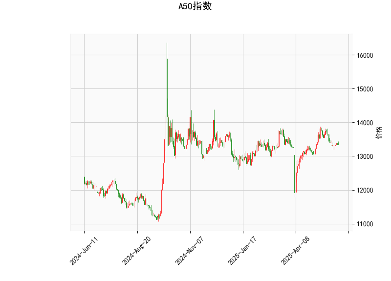

### A50指数技术分析结果解析

#### 1. 对技术分析结果的详细分析
以下是对A50指数当前技术指标的逐项分析，基于提供的实时数据。整体来看，指标显示市场处于相对中性状态，但存在潜在的下行风险。

- **当前价格（13344.0）**：  
  当前价格位于布林带中轨（13300.6）附近，表明指数短期内保持平衡状态。没有明显突破上轨（13960.14）或下轨（12641.06），这通常反映市场缺乏强烈趋势，可能处于整理期。如果价格维持在中轨附近，短期波动可能较小，但需警惕任何突破信号。

- **RSI（47.29）**：  
  RSI是一个衡量超买超卖的动量指标，目前值为47.29，处于中性区域（一般50附近）。这表明市场并未出现过度买入或卖出的情况，投资者情绪相对稳定。如果RSI跌破30，将进入超卖区，可能预示反弹机会；反之，如果升至70以上，则可能面临回调风险。目前的RSI水平支持市场继续横盘整理。

- **MACD指标**：  
  - MACD线（1.65）和信号线（38.27）：MACD线远低于信号线，这是一个典型的看跌信号，暗示短期内卖方力量可能占优。  
  - MACD直方图（-36.63）：直方图为负值，且数值较大，表明动量正在减弱，可能预示价格下行趋势的延续或加剧。如果直方图继续恶化，指数可能进一步测试下轨。总体上，MACD的配置显示市场缺乏上行动能，短期内可能面临修正。

- **布林带（Bollinger Bands）**：  
  - 上轨（13960.14）、中轨（13300.6）和下轨（12641.06）：当前价格紧邻中轨，显示指数处于布林带的中间区域。这通常表示市场波动率较低，可能是一个整理阶段。如果价格向上突破上轨，将是看涨信号；反之，如果跌破下轨，可能触发进一步下跌。布林带的收缩（轨道的距离较窄）暗示短期内市场可能保持震荡。

- **K线形态（CDLMATCHINGLOW）**：  
  这是一个典型的看跌形态，通常出现在价格测试支撑位后，暗示潜在的反转或下行压力。CDLMATCHINGLOW形态表示当前价格可能难以维持在较高水平，投资者应警惕短期回调。如果后续K线确认这一形态，可能会加剧卖盘。

综合分析：A50指数当前处于中性偏弱的态势。RSI的中性水平缓解了极端风险，但MACD的看跌信号和K线形态的负面暗示，表明短期内下行压力较大。市场可能在13300-13960区间内震荡，如果外部因素（如经济数据或地缘事件）介入，可能会加速趋势。

#### 2. 近期可能存在的投资或套利机会及策略判断
基于上述技术分析，以A50指数的当前状态，短期内投资机会主要围绕波动和潜在下行趋势展开。以下是针对近期可能的投资和套利机会的判断，以及相应的策略建议。请注意，投资决策应结合基本面、市场新闻和风险偏好，技术分析仅作为参考。

- **可能存在的投资机会**：  
  - **下行机会**：MACD直方图的负值和CDLMATCHINGLOW形态暗示短期回调风险。如果价格跌破中轨（13300.6），可能向下轨（12641.06）测试，这为做空或卖出策略提供机会。预计如果全球风险情绪恶化（如经济放缓信号），A50指数作为中国市场代表，可能跟随下跌。  
  - **横盘机会**：RSI的中性水平和价格在中轨附近，表明市场可能继续震荡，这适合短期波段交易者通过买卖差价获利。  
  - **套利机会**：A50指数常用于期货或ETF市场，套利可能存在于现货与期货价差（如A50期货和现货指数之间的无风险套利）。如果价格波动加大，跨市场套利（如中港股互联互通机制下的机会）可能出现，但需关注成交量和流动性。目前，MACD的弱势可能导致期货贴水扩大，提供短期套利空间。

- **投资或套利策略建议**：  
  - **看跌策略**：  
    如果价格跌破中轨（13300.6），考虑建立卖出或做空头寸，目标位设在下轨（12641.06）。例如，使用MACD直方图作为触发信号，当直方图进一步负值时入场。风险控制：设置止损在上轨（13960.14）附近，以防范意外反弹。  
  - **波段交易策略**：  
    利用RSI的中性水平进行中性交易：在13300-13960区间内，通过买卖差价捕捉波动。例如，当RSI接近50时买入，待价格接近上轨时卖出。该策略适合风险厌恶者，预计短期内震荡可能持续1-2周。  
  - **套利策略**：  
    关注A50期货与现货的价差，如果MACD信号加剧卖压，期货可能出现更大折扣，进行反向套利（如买现货、卖期货）。在高流动性市场（如港股通），结合K线形态确认后执行，但需监控交易成本和结算风险。  
  - **整体风险管理建议**：  
    短期内避免大额头寸，结合其他指标（如成交量）确认信号。预计如果RSI跌至40以下，机会更明确；反之，如果MACD直方图转正，可能转为看涨。建议结合宏观因素（如中国经济数据）调整策略，保持仓位不超过总资金的30%以控制风险。

总体判断：近期A50指数的投资机会偏向防御性策略，套利机会较有限但可通过波动捕捉。投资者应密切关注后续K线和MACD变化，避免在不确定性高的市场中过度操作。