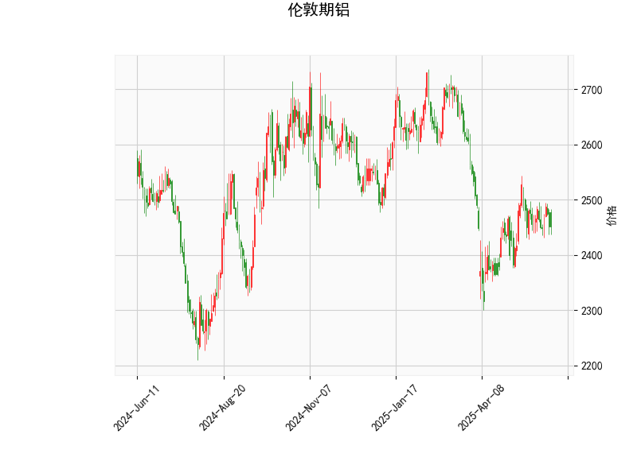

# 伦敦期铝技术分析及投资策略

---

## 一、技术分析结果解读

### 1. **基础指标分析**
- **当前价（2451.5）与布林轨道关系**：  
  当前价格位于布林下轨（2301）和中轨（2466）之间，且低于中轨，表明市场短期偏弱，但尚未触及超卖区域（下轨）。
- **RSI（47.6）**：  
  处于中性区间（50附近），显示多空力量暂时平衡，无显著超买/超卖信号。
- **MACD（1.04）与信号线（1.93）**：  
  MACD线位于信号线下方且柱状图（-0.89）负值扩大，暗示短期下跌动能增强。

### 2. **K线形态信号**
- **CDLMATCHINGLOW（低位匹配线）**：  
  该形态通常出现在下跌趋势末端，反映卖压衰竭后多头试探性入场，可能预示短期反弹机会，需结合其他指标验证。

### 3. **布林轨道形态**
- **波动率**：  
  上轨（2631）与下轨（2301）间距较大，说明市场波动性较高，若价格突破中轨（2466）可能触发趋势性行情。

---

## 二、近期投资机会与策略

### 1. **短期反弹机会（谨慎看多）**
- **触发条件**：  
  - K线确认CDLMATCHINGLOW有效性（如后续收阳线且突破2466中轨）。  
  - RSI回升至50上方并配合MACD柱状图收窄或转正。
- **策略**：  
  - **入场**：价格站稳中轨后轻仓试多，目标上轨（2631）。  
  - **止损**：跌破当前低点（如2400整数关口）离场。

### 2. **区间震荡策略（高抛低吸）**
- **逻辑**：  
  若价格未能突破中轨，可能继续在2300-2466区间震荡，可捕捉波段机会。
- **策略**：  
  - **做空**：靠近中轨（2466）受阻时入场，目标下轨（2301）。  
  - **做多**：接近下轨（2301）且RSI跌至30以下时低吸，目标中轨。  
  - **止损**：突破布林轨道边沿时止损。

### 3. **趋势突破策略（中线布局）**
- **上行突破**：  
  若放量突破中轨并站稳，可能开启上升趋势，目标2631上轨，MACD金叉可加仓。  
- **下行破位**：  
  若跌破2301下轨且MACD加速下行，则趋势转空，目标前低或更低支撑位。

---

## 三、风险提示
- **震荡延续风险**：当前技术面信号矛盾（MACD偏空 vs 形态看反弹），需警惕价格在区间内反复震荡。  
- **波动率风险**：布林带张口较大，若方向性突破后波动可能放大，需严格仓位管理。