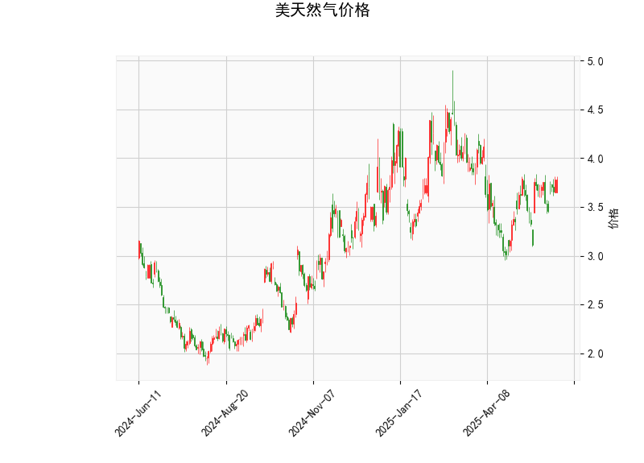

# 美天然气价格技术分析及投资策略

## 一、技术分析结果解读

### 1. 多空动能指标
- **RSI（56.76）**：处于50-70的中性偏多区间，显示当前既未超买也未超卖。但接近60临界值需关注方向选择突破的确认信号。
- **MACD（0.054）>信号线（0.032）**：柱状图出现连续3根阳柱，形成弱势金叉但未突破零轴，表明短期反弹动能尚不稳定。

### 2. 波动率指标
- **布林通道**：
  - 价格（3.785）紧贴中轨（3.608）上方，距离上轨（4.216）空间达11.6%
  - 通道带宽（上轨4.216-下轨3.000=1.216）接近近期均值的15%，显示波动率处于均值水平但未明显收敛

### 3. K线形态
- **CDLBELTHOLD（孕线形态）**：高位十字星接小实体形态，短期可能出现方向性选择
- **CDLLONGLINE（长实体K线）**：前根K线出现超长实体，显示有单边力量介入但需要验证延续性

## 二、投资机会与策略建议

### 1. 突破型交易策略
- **多单机会**：若价格突破布林上轨4.216且RSI突破60：
  - 短期目标4.35（前高平台）
  - 止损设在MACD柱缩量跌破0.02
- **空单机会**：若价格有效跌破中轨3.608：
  - 短期目标下轨2.999
  - 止损设在RSI重回55上方

### 2. 波动率套利策略
- **期权跨式组合**：
  - 同时买入行权价3.80的看涨/看跌期权
  - 适用于布林通道即将变盘的市场预期
  - 平仓触发条件：价格突破4.20或跌破3.60

### 3. 指标背离套利
- **量价背离监控**：
  - 若价格突破前高但MACD未同步新高，形成顶背离时建立对冲头寸
  - 关注RSI超买区域（>70）时的套保机会

### 4. 季节性交易窗口
- **天气市布局**：
  - 当前处于需求淡季尾声，关注库存数据变化
  - 若EIA库存减少超预期，配合技术面突破可建立趋势多单

## 三、关键风险提示
1. **动量陷阱风险**：MACD金叉尚未确认突破零轴，警惕虚假突破
2. **时间价值损耗**：期权策略需控制持仓周期，建议采用次月合约
3. **事件驱动风险**：关注每周四EIA库存报告和飓风预警等突发事件

（注：以上策略需配合严格仓位管理，建议单次交易风险敞口不超过总资金3%）