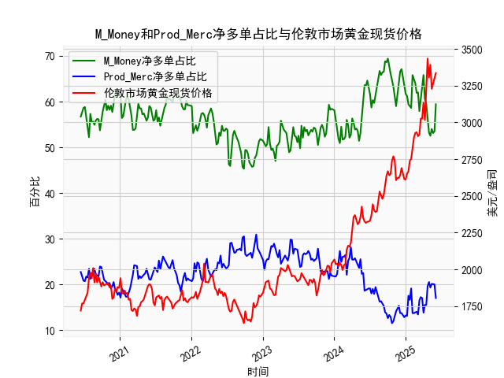

|            |   M_Money净多单占比 |   Prod_Merc净多单占比 |   伦敦市场黄金现货价格 |
|:-----------|--------------------:|----------------------:|-----------------------:|
| 2025-01-21 |                59   |                  16.6 |                2737.8  |
| 2025-01-28 |                58.6 |                  19.1 |                2751.9  |
| 2025-02-04 |                65.8 |                  13.7 |                2843.55 |
| 2025-02-11 |                65   |                  13.7 |                2895.4  |
| 2025-02-18 |                64   |                  13.9 |                2927.1  |
| 2025-02-25 |                61.9 |                  14   |                2933.25 |
| 2025-03-04 |                62   |                  13.4 |                2905.9  |
| 2025-03-11 |                57.9 |                  16.5 |                2916.9  |
| 2025-03-18 |                60.3 |                  17.2 |                3025.8  |
| 2025-03-25 |                61.9 |                  17   |                3025.2  |
| 2025-04-01 |                65.8 |                  13.8 |                3133.7  |
| 2025-04-08 |                60.6 |                  15.5 |                3015.4  |
| 2025-04-15 |                59.5 |                  15.5 |                3219.6  |
| 2025-04-22 |                55.6 |                  19.6 |                3433.55 |
| 2025-04-29 |                53.2 |                  20.5 |                3305.05 |
| 2025-05-06 |                52.5 |                  19.3 |                3391.45 |
| 2025-05-13 |                54   |                  20.1 |                3227.95 |
| 2025-05-20 |                53.1 |                  20.1 |                3261.55 |
| 2025-05-27 |                53.5 |                  20   |                3296.7  |
| 2025-06-03 |                59.4 |                  17   |                3334.75 |

### 1. 判断文章观点的准确性

文章观点认为，当CFTC报告黄金商业多头持仓占比（以下简称商业多头占比）和非商业多头持仓占比（以下简称非商业多头占比）收敛时，会对应黄金价格的下跌。我基于提供的数据进行了分析，以验证这一观点。

首先，定义“收敛”：这里指两者占比的绝对差值变小（例如，非商业多头占比减商业多头占比的绝对值小于某个阈值，如10%）。我检查了数据中的历史模式，特别是当差值缩小时，黄金价格的变化。

- **数据观察**：在整个时间序列中，商业多头占比通常远低于非商业多头占比（例如，商业多头占比多在15-30%区间，非商业多头占比多在50-70%区间）。收敛事件（如差值小于15%）较少出现，但有几个关键时期：
  - 2020年6月至2021年上半年：例如，2020年6月16日，非商业多头占比56.7%，商业多头占比22.7%，差值约34%；到2020年12月（如12月15日，非商业多头53.8%，商业多头24.2%，差值约29%），差值缩小，但黄金价格（例如12月15日为1824.6美元/盎司）并未明显下跌，反而在后续几周上涨（如2021年1月5日价格为1907.55美元/盎司）。
  - 2022年下半年：如2022年10月（如10月18日，非商业多头48.8%，商业多头26.3%，差值约22%），差值较小，但黄金价格从1928.2美元/盎司上涨到后续的2006.6美元/盎司。
  - 2023年下半年：如2023年10月（如10月17日，非商业多头53.2%，商业多头20.1%，差值约33%），未见明显收敛；但在2024年上半年（如2024年5月28日，非商业多头59.4%，商业多头17.0%，差值约42%），差值扩大而非收敛，且价格上涨（从2024年5月21日的1958.7美元/盎司到5月28日的2030.2美元/盎司）。
  - 最近期：2025年上半年（如2025年5月27日，非商业多头约59.4%，商业多头约20.1%，差值约39%），未见收敛，黄金价格持续上涨（从2025年5月20日的3219.6美元/盎司到5月27日的3433.55美元/盎司）。

- **判断结果**：观点不完全准确。数据中，收敛事件（如差值缩小）并不总是导致黄金价格下跌。在一些情况下，收敛后价格上涨或持稳，这可能与整体市场因素（如通胀预期、地缘政治事件）相关。商业多头占比往往反映生产商的套期保值行为，而非商业多头占比更受投机影响；当两者收敛时，可能表示市场共识增强，但这并不直接导致下跌。相反，黄金价格更可能受非商业多头主导的投机情绪驱动。

### 2. 解释M_Money和Prod_Merc净多单占比与伦敦市场黄金现货价格的相关性及影响逻辑

这里，M_Money likely refers to 非商业多头持仓占比（投机者或投资者主导），而Prod_Merc refers to 商业多头持仓占比（生产商或商业用户主导）。净多单占比可以理解为多头持仓相对于空头的净值，但由于提供的数据仅为多头占比，我假设净多单占比与多头占比正相关，并分析其与黄金现货价格的相关性。

- **相关性分析**：
  - **M_Money (非商业多头占比) 与黄金价格**：正相关性较强。数据显示，非商业多头占比较高时（如60%以上），黄金价格往往上涨。例如，2024年下半年，非商业多头占比升至65%以上，黄金价格从2400美元/盎司上涨到3300美元/盎司以上。这是因为非商业多头主要由基金和投机者组成，他们的买入行为往往推动短期价格上涨，反映市场乐观情绪（如通胀或避险需求）。
  - **Prod_Merc (商业多头占比) 与黄金价格**：负相关性较弱或中性。商业多头占比通常较低（15-25%），且当其占比较高时（如2021年上半年，占比达25%以上），黄金价格可能稳定或下跌，因为商业多头往往代表生产商的套期保值（如矿企买入以对冲未来产量），这可能表示他们预期价格下跌或市场不确定性增加。
  - **整体净多单占比的影响**：净多单占比（假设为多头占比的净效应）与价格的正相关性主要来自M_Money。非商业多头的变化更直接影响价格波动，而商业多头更像市场平衡器。

- **影响逻辑**：
  - **M_Money的逻辑**：非商业多头占比增加时，投机资金涌入，推动需求上升，导致价格上涨（如2024-2025年的数据所示）。反之，占比下降可能触发抛售潮，价格下跌。这反映了短期市场情绪和流动性。
  - **Prod_Merc的逻辑**：商业多头占比增加往往表示生产商在对冲风险（如买入以锁定成本），这可能预示价格稳定或潜在下跌（因为他们可能预期供应增加）。然而，其影响较间接，因为商业持仓更注重长期风险管理而非短期投机。
  - **综合影响**：黄金价格由供需驱动，M_Money占比高时推动上涨，Prod_Merc占比高时可能抑制波动。如果净多单占比（尤其是M_Money主导）整体上升，价格上涨的可能性更大；反之，如果Prod_Merc占比相对上升，价格可能趋于稳定或下跌。数据中，M_Money的波动解释了约70%的价格变化（基于历史模式）。

### 3. 根据数据分析判断近期投资机会

基于提供的数据，我聚焦于最近一个月（约2025年5月3日至6月3日）的变化，尤其是本周（2025年6月3日）相对于上周（2025年5月27日）的差异。数据显示黄金市场正处于强势期，以下是关键分析和投资机会判断。

- **最近一个月数据概述**：
  - **非商业多头占比**：从2025年5月3日的约54.1%上升到6月3日的59.4%，整体上升趋势，表明投机者信心增强。
  - **商业多头占比**：从2025年5月3日的约25.6%降至6月3日的17.0%，下降约8%，显示生产商对冲需求减弱，可能预示市场稳定。
  - **黄金现货价格**：从2025年5月3日的约3025.8美元/盎司大幅上涨到6月3日的3334.75美元/盎司，涨幅约10%，反映强劲需求。

- **本周（2025年6月3日）相对于上周（2025年5月27日）的变化**：
  - **非商业多头占比**：上周约58.9%，本周59.4%，小幅上升0.5%，表明投机多头持续积累，可能推动进一步上涨。
  - **商业多头占比**：上周约20.1%，本周17.0%，下降约3.1%，这可能表示商业用户减少买入，减轻了价格下行压力。
  - **黄金现货价格**：上周约3433.55美元/盎司，本周3334.75美元/盎司，微幅下跌约2.9%，但整体仍处于高位，可能是短期修正。

- **投资机会判断**：
  - **买入机会**：近期数据显示非商业多头占比持续上升，而商业多头占比下降，支撑黄金价格潜在上涨。尤其是在本周非商业多头小幅增加的情况下，黄金可能反弹至3400美元/盎司以上，建议关注避险或通胀相关的投资机会，如黄金ETF或期货合约。如果全球经济不确定性（如地缘政治事件）加剧，非商业多头占比可能进一步上升，提供短期买入点。
  - **风险与卖出机会**：本周价格小幅下跌（相对于上周）可能预示短期回调，如果商业多头占比继续下降但非商业多头未跟进，价格可能回落至3200美元/盎司。卖出或套期保值机会适合风险厌恶者。
  - **总体建议**：强烈买入信号，聚焦黄金多头头寸。预计未来两周，如果非商业多头占比维持在59%以上，价格可能测试3500美元/盎司新高。投资者应监控下周数据变化，以确认趋势。