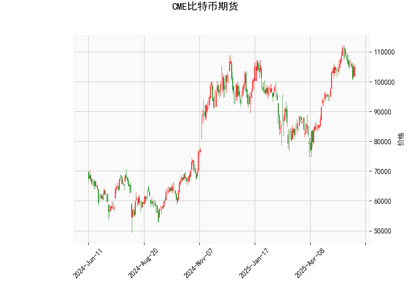

# CME比特币期货技术分析结果解读

## 一、技术指标分析
### 1. **RSI（55.24）**
- 当前RSI位于50中性线上方但低于70超买阈值，显示短期市场存在温和上涨动能但未过热。这一水平可能暗示市场处于**多空博弈阶段**，需结合其他指标判断方向。

### 2. **MACD与信号线（MACD=2283，Signal=3353）**
- MACD线（2283）低于信号线（3353），且柱状图（MACDhist=-1069）持续负值，形成**熊市交叉结构**。这反映**中期动能偏弱**，可能存在回调压力，但需警惕MACD线向信号线收敛的潜在反弹信号。

### 3. **布林轨道（Upper=114813，Middle=94597，Lower=74382）**
- **当前价105,060**介于中轨（94,597）与上轨（114,813）之间，表明价格处于**中性偏强区间**。
- 若价格站稳中轨上方，有望进一步测试上轨；若跌破中轨，可能向下轨回调。**波动率收缩**特征（当前价距离上下轨10%-30%）可能预示突破临近。

### 4. **K线形态**
- 暂无明确反转或趋势延续形态，说明当前价格波动未形成确定性方向信号。

---

## 二、潜在机会与策略建议
### （一）趋势跟踪策略
1. **多头机会（上破驱动）**  
   - **触发条件**：价格突破前高（当前价105,060→上轨114,813），且RSI站稳60以上。  
   - **操作**：回调至110,000附近分批建仓，目标价114,800，止损设于中轨94,500下方。  
   - **逻辑**：突破上轨可能激活空头止损盘，推动加速上涨。

2. **空头机会（回撤风险）**  
   - **触发条件**：MACD柱状图持续扩大负值+价格跌破中轨94,597。  
   - **操作**：价格跌破95,000时轻仓试空，目标价下轨74,300，止损设于中轨上方2%（~96,500）。  
   - **逻辑**：MACD弱势与中轨破位形成共振，短期下行空间较明确。

---

### （二）区间套利策略
1. **布林带均值回归**  
   - **适用场景**：价格在中轨与上轨间震荡且无重大事件驱动。  
   - **操作**：105,000以上分批逢高做空，目标价中轨94,500；94,500附近做多，目标价上轨114,800。  
   - **风险控制**：突破中轨/上轨后止损，仓位配比不超过总资金20%。

2. **MACD背离博弈**  
   - **机会观察**：若价格创出新高但MACD未同步上行，形成顶背离，可反向开空单。反之则反。  
   - **优势**：背离信号对趋势反转预警敏感，适合短线高频交易。

---

## 三、关键风险提示
1. **假突破风险**：布林带上轨（114,813）接近整数关口115,000，可能引发多头获利了结。  
2. **流动性变化**：比特币期货持仓量需同步放大方可确认趋势延续性，否则可能陷入震荡。  
3. **外部事件扰动**：SEC政策、地缘冲突等消息面因素可能打破技术面逻辑，需结合实时新闻监控。

---

**总结**：当前技术面呈**震荡偏弱**格局，建议以**区间交易为主**，关注MACD柱状图拐点与布林带边界突破，严格设置止损防范突发波动。