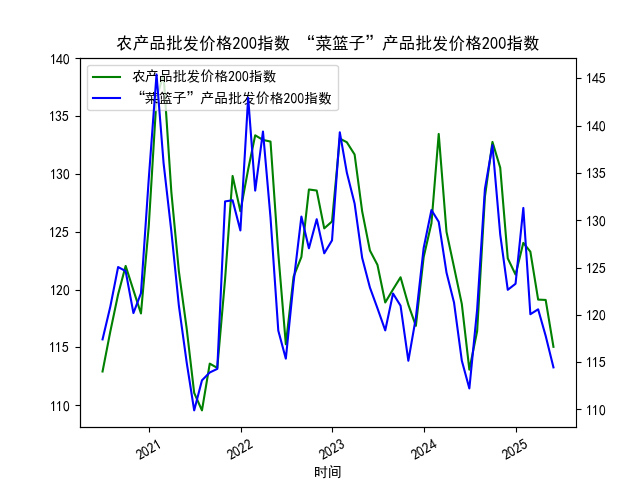

|            |   原油价格 |   大宗商品价格指数BPI |
|:-----------|-----------:|----------------------:|
| 2025-05-09 |    465.062 |                   856 |
| 2025-05-12 |    474.667 |                   857 |
| 2025-05-13 |    472.072 |                   859 |
| 2025-05-14 |    480.012 |                   864 |
| 2025-05-15 |    460.24  |                   866 |
| 2025-05-16 |    455.311 |                   865 |
| 2025-05-19 |    461.324 |                   863 |
| 2025-05-20 |    464.013 |                   863 |
| 2025-05-21 |    468.667 |                   863 |
| 2025-05-22 |    452.5   |                   863 |
| 2025-05-23 |    451.923 |                   862 |
| 2025-05-26 |    458.243 |                   860 |
| 2025-05-27 |    456.973 |                   860 |
| 2025-05-28 |    451.693 |                   859 |
| 2025-05-29 |    464.196 |                   858 |
| 2025-05-30 |    445.818 |                   856 |
| 2025-06-03 |    459.493 |                   853 |
| 2025-06-04 |    465.267 |                   852 |
| 2025-06-05 |    460.514 |                   851 |
| 2025-06-06 |    463.428 |                   851 |

### 1. 原油价格与大宗商品价格指数的相关性及影响逻辑  
原油作为大宗商品市场的“龙头”，其价格波动对整体大宗商品价格指数有显著传导效应：  
- **成本传导**：原油是工业生产和运输的核心能源，价格上涨会推高原材料开采、加工及运输成本，间接推升其他大宗商品（如化工品、有色金属）价格。例如，近期数据中原油从595.9951上涨至602.7986（6月11日-6月12日）时，大宗商品指数同步微升至955。  
- **通胀预期联动**：原油涨价可能引发市场对通胀的担忧，投机资金涌入大宗商品市场避险，带动指数上行；反之，油价下跌则抑制市场情绪。  
- **需求周期共振**：当全球经济复苏预期增强时，原油与工业金属（如铜、铝）需求同步上升，两者价格往往协同上涨；反之衰退预期可能导致同步下跌。例如，2024年7月原油从570升至617附近，大宗商品指数也从890回升至900以上。  

**背离情景**：若原油因供应短缺（如地缘冲突）上涨，而其他商品因需求疲软下跌，可能导致两者短期背离。但长期来看，需求驱动的油价上涨仍会通过成本端传导至其他商品。  

---

### 2. 近期投资机会分析（聚焦最近1周及今日变化）  
#### **关键数据对比**  
- **原油价格**（2025年6月4日-6月6日）：  
  - 6月4日：547.8985  
  - 6月5日：556.546 → **上涨1.58%**  
  - 6月6日：557.696 → **今日微涨0.21%**  
- **大宗商品指数**（同期）：  
  - 6月4日：904  
  - 6月5日：905 → **上涨0.11%**  
  - 6月6日：905 → **今日持平**  

#### **投资机会判断**  
1. **原油短期多头机会**：  
   - **驱动因素**：近期油价连续上行（今日涨幅收窄但维持高位），叠加夏季出行旺季和地缘政治风险（如中东局势），短期供需偏紧。  
   - **策略**：关注原油期货（如布伦特、WTI）或能源股ETF（如XLE），但需警惕6月6日涨势放缓后可能的技术回调。  

2. **化工品套利窗口**：  
   - **逻辑**：油价上涨推升化工品成本（如PTA、聚乙烯），而大宗商品指数企稳显示下游需求韧性。若化工品价格滞后跟涨，可布局相关商品期货。  

3. **大宗商品指数回调风险警示**：  
   - **矛盾点**：今日大宗商品指数未能跟随原油上涨，反映市场对需求持续性的分歧（如中国制造业PMI疲软）。若指数跌破900关键支撑，需警惕工业金属（如铜、铝）的做空机会。  

#### **风险提示**  
- **美联储政策**：若6月议息会议释放鹰派信号，可能压制大宗商品整体表现。  
- **库存数据**：关注EIA原油库存报告，若库存超预期增加将打压油价。