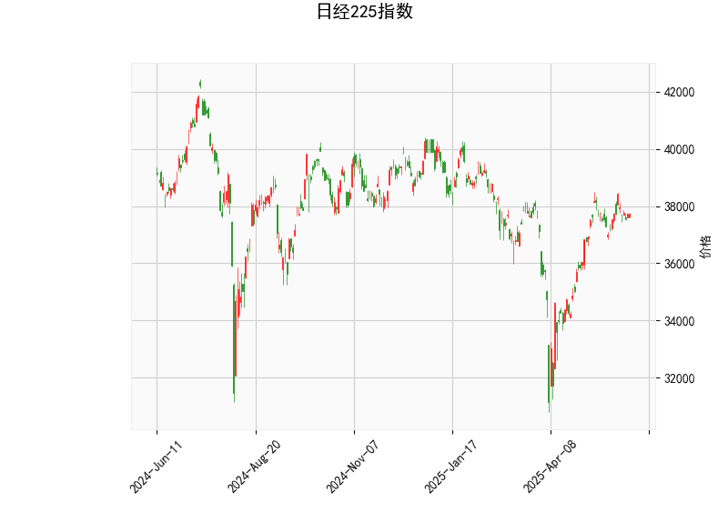

# 日经225指数的技术分析结果分析

## 1. 技术指标分析
以下是对日经225指数当前技术分析结果的详细解读，基于提供的指标数据。日经225指数当前价为37741.61，整体显示出中性偏强的态势，但存在一些潜在的短期风险信号。

### RSI（相对强弱指数）
- **值：56.11**  
  RSI处于50以上，表明指数当前处于轻微强势区域。这暗示买方力量稍占上风，但尚未达到超买水平（通常70以上）。RSI在30-70之间是中性区间，因此短期内指数可能继续维持稳定或小幅上涨，但需警惕任何急剧上升导致的回调风险。

### MACD（移动平均收敛散度）
- **MACD线：367.45**  
- **信号线：432.29**  
- **直方图（Hist）：-64.83**  
  MACD线低于信号线，且直方图为负值，这是一个典型的看跌信号。直方图的负值表示短期卖方力量增强，可能预示着价格回调或逆转。尽管MACD线本身为正，显示整体趋势仍偏向多头，但当前信号线高于MACD线暗示了潜在的动量减弱。投资者应密切关注MACD是否会交叉向上（转为看涨）。

### 布林带（Bollinger Bands）
- **上轨：39847.82**  
- **中轨：36360.56**  
- **下轨：32873.30**  
  当前价37741.61位于中轨和上轨之间，具体高于中轨但未触及上轨。这表明指数处于相对强势的波动范围内，通常暗示价格有向上扩展的空间。然而，接近上轨的水平可能增加波动性，如果价格回落至中轨附近，则可能形成支撑位。布林带的宽度显示出中等波动性，投资者可利用此作为潜在的买卖点。

### K线形态
- **形态：CDLGAPSIDESIDEWHITE 和 CDLSHORTLINE**  
  - **CDLGAPSIDESIDEWHITE**：这是一种跳空向上或向上间隙的白实体蜡烛模式，通常表示多头强势和潜在的上涨趋势。但它也可能伴随过度买入的风险，尤其在高位出现时。  
  - **CDLSHORTLINE**：这暗示短期内价格波动较小，可能是一个窄幅实体蜡烛，反映市场不确定性或盘整状态。结合两者，近期K线形态显示出多头主导但缺乏强烈动能，可能预示短期调整。

总体而言，日经225指数的技术面显示出中性偏强态势，RSI和布林带支持潜在上涨，但MACD和K线形态的看跌信号提醒短期回调风险。市场正处于关键转折点，需要结合基本面（如日本经济数据或全球事件）进行综合评估。

## 2. 近期可能存在的投资或套利机会和策略
基于上述技术分析，日经225指数的近期走势可能存在机会，但需谨慎对待潜在回调。以下是针对投资和套利的判断及策略建议，重点考虑短期（1-3个月）市场动态。

### 可能的机会
- **投资机会**：  
  - **短期多头机会**：当前价高于布林带中轨，且RSI未超买，暗示如果多头动能恢复，指数可能向上测试上轨（39847.82）。这适合于乐观的投资者，尤其如果日本经济数据（如GDP或通胀）向好。  
  - **回调买入机会**：MACD的负直方图和K线形态暗示短期下行风险，如果价格回落至中轨（约36360.56）附近，这可能成为低风险买入点。  
  - **套利机会**：日经225作为期货和期权活跃市场，可通过跨品种套利（如日经225期货与相关股票指数的价差）或期现套利（如期货价格与现货价差）实现。如果全球市场（如美国股指）出现联动，日经225的相对估值（当前价相对布林带位置）可能提供无风险套利空间。

- **潜在风险**：  
  - 如果MACD信号线持续高于MACD线，指数可能下探至下轨（32873.30），导致短期损失。全球事件（如地缘政治紧张或美联储政策）可能放大波动。

### 推荐策略
- **多头策略（适合乐观投资者）**：  
  - **买入并持有**：在当前价位附近买入日经225 ETF或期货，设置止盈位在上轨（39847.82）附近。结合RSI，若其回落至50以下再买入，以降低风险。  
  - **期权策略**：购买看涨期权，押注短期上涨。如果K线形态转为强势，可增加头寸。

- **空头策略（适合谨慎投资者）**：  
  - **卖出或做空**：基于MACD看跌信号，做空期货或买入看跌期权，目标位在中轨（36360.56）。若价格跌破中轨，可加仓。  
  - **波动率套利**：如果布林带收窄（波动性降低），可通过卖出跨式期权（straddle）来捕捉短期波动。

- **套利策略（适合经验丰富者）**：  
  - **跨市场套利**：比较日经225与美国股指（如标普500）的价差。如果日经相对 undervalued（如基于MACD信号），可在日经买入的同时在相关市场卖出，实现无风险收益。  
  - **期现套利**：监控日经225期货与现货价差，如果期货折价，可买入期货并卖出现货锁定收益。  
  - **风险控制**：所有策略均应设置止损位（如价格跌破下轨时退出），并结合技术指标动态调整。建议将仓位控制在总资金的20-30%以内，以应对不确定性。

总之，近期日经225指数的投资机会以短期多头为主，但MACD的警告信号提醒需防范回调。策略应个性化，根据风险偏好和市场新闻调整。建议投资者实时监控指标变化，并结合基本面分析（如日本央行政策）做出决策。