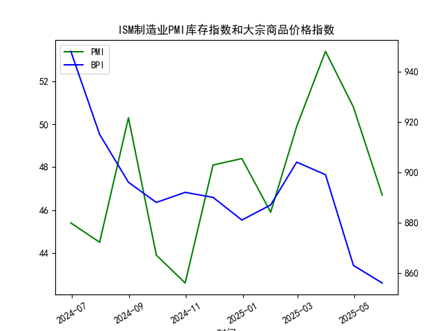

|            |   ISM制造业PMI库存指数 |   大宗商品价格指数BPI |
|:-----------|-----------------------:|----------------------:|
| 2024-06-30 |                   45.4 |                   948 |
| 2024-07-31 |                   44.5 |                   915 |
| 2024-08-31 |                   50.3 |                   896 |
| 2024-09-30 |                   43.9 |                   888 |
| 2024-10-31 |                   42.6 |                   892 |
| 2024-11-30 |                   48.1 |                   890 |
| 2024-12-31 |                   48.4 |                   881 |
| 2025-01-31 |                   45.9 |                   887 |
| 2025-02-28 |                   49.9 |                   904 |
| 2025-03-31 |                   53.4 |                   899 |
| 2025-04-30 |                   50.8 |                   863 |
| 2025-05-31 |                   46.7 |                   856 |

### 1. ISM制造业PMI库存指数与大宗商品价格的相关性判断

**观点验证**：  
“垒库阶段大宗商品价格上涨”的观点在部分历史阶段成立（如2002-2005年、2009-2010年），但**存在局限性**。具体分析如下：  
- **逻辑合理性**：  
  垒库（PMI库存指数>50）通常反映企业对未来需求预期乐观或生产扩张，可能伴随大宗商品需求增加和价格上涨。而去库（PMI<50）可能反映需求收缩或主动削减库存，导致价格下跌。  
- **当前数据的矛盾性**：  
  用户提供的近1年数据显示：  
  - **垒库阶段**（如2024年8月PMI=50.3、2025年3月PMI=53.4）对应的商品价格指数分别为896和899，**未显著上涨**。  
  - **去库阶段**（如2025年5月PMI=46.7）对应商品价格跌至856，显示去库与价格下跌的同步性。  
  表明当前周期中，**库存变化与价格的相关性较弱**。  

**核心原因**：  
- **需求主导性**：若垒库由“生产过剩但需求不足”驱动（如当前全球衰退风险），商品价格可能因供过于求而下跌。  
- **库存周期阶段差异**：历史垒库阶段多为经济复苏初期（如2009年补库伴随刺激政策），而当前可能处于周期尾声（高库存叠加需求疲软）。  

**结论**：  
- **观点部分正确**，但需结合需求背景。当前数据不支持垒库推动价格上涨的单一逻辑。

---

### 2. 近期投资机会分析

**数据限制与假设**：  
用户提供的是月频数据（至2025年5月），无日频或周频数据。假设分析围绕**月度趋势的边际变化**展开：  

**关键观测点**：  
1. **PMI库存指数触底反弹**（2025年5月PMI=46.7 vs. 4月=50.8）：  
   - 连续两月去库（4月→5月PMI下降4.1），若后续企稳，可能预示主动去库接近尾声。  
   - **机会方向**：关注大宗商品超跌反弹（如能源、金属），尤其是价格已连跌至856的品类。  

2. **大宗商品价格下行趋缓**（2025年5月=856 vs. 4月=863）：  
   - 跌幅收窄（-0.8% vs. 4月环比-4.2%），可能反映短期卖压释放。结合库存低位，或存补库预期。  
   - **机会方向**：商品期货空头平仓、周期股估值修复（如原材料板块）。  

**风险提示**：  
- 若经济数据进一步恶化（如PMI跌破45），去库周期或延长，压制商品价格。  

**策略建议**：  
- **短期**：轻仓参与超跌商品反弹，关注库存敏感品种（如铜、原油）。  
- **中长期**：等待PMI库存指数明确触底信号（连续两月回升至50以上）。