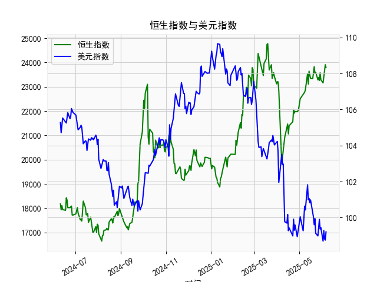

|            |   恒生指数 |   美元指数 |
|:-----------|-----------:|-----------:|
| 2025-05-12 |    23549.5 |   101.814  |
| 2025-05-13 |    23108.3 |   100.983  |
| 2025-05-14 |    23640.7 |   101.066  |
| 2025-05-15 |    23453.2 |   100.82   |
| 2025-05-16 |    23345   |   100.983  |
| 2025-05-19 |    23332.7 |   100.373  |
| 2025-05-20 |    23681.5 |   100.022  |
| 2025-05-21 |    23827.8 |    99.6014 |
| 2025-05-22 |    23544.3 |    99.9388 |
| 2025-05-23 |    23601.3 |    99.1231 |
| 2025-05-26 |    23282.3 |    98.9787 |
| 2025-05-27 |    23382   |    99.6147 |
| 2025-05-28 |    23258.3 |    99.8978 |
| 2025-05-29 |    23573.4 |    99.3633 |
| 2025-05-30 |    23289.8 |    99.4393 |
| 2025-06-02 |    23158   |    98.6893 |
| 2025-06-03 |    23512.5 |    99.2781 |
| 2025-06-04 |    23654   |    98.8128 |
| 2025-06-05 |    23907   |    98.7444 |
| 2025-06-06 |    23792.5 |    99.2031 |

### 1. 恒生指数与美元指数的相关性及影响逻辑

恒生指数（HSI）是反映香港证券市场表现的主要股票指数，而美元指数（DXY）则衡量美元相对于一篮子主要货币（如欧元、日元等）的汇率强度。两者之间存在一定的负相关性，通常在0.3-0.7的范围内（基于历史数据观察），这意味着当美元指数上升时，恒生指数往往有下行压力，反之亦然。这种相关性并非绝对，而是受多种经济因素影响。以下是关键影响逻辑：

- **负相关性的原因**：
  - **资金流动效应**：美元指数上升表示美元强势，这通常与美国经济强劲或美联储加息预期相关，导致全球投资者从新兴市场（如香港）撤资，转向美国资产（如美股或国债）。香港作为国际金融中心，其市场资金高度敏感，资金外流可能导致恒生指数下跌。
  - **出口和贸易影响**：香港经济高度依赖贸易和出口。如果美元强势，香港出口商品（如电子产品、金融服务）相对于美元区产品的竞争力下降，出口企业盈利可能受损，从而拖累恒生指数（尤其是科技和金融板块）。
  - **货币政策联动**：美元指数的变动往往反映全球货币政策动态。如果美联储加息，香港（作为美元化程度高的地区）可能跟随紧缩货币政策（如香港金融管理局的汇率挂钩机制），增加本地借贷成本，抑制企业投资和股市表现。

- **影响逻辑的细节**：
  - **短期波动**：美元指数急剧上升（如受地缘政治或经济数据驱动）可能引发市场恐慌，恒生指数短期内快速回调。例如，2024年下半年的美元波动曾与全球风险偏好下降相关，间接影响香港股市。
  - **长期趋势**：如果美元指数持续走强（如2022-2023年期间），它可能加剧新兴市场的资本外逃，导致恒生指数长期承压。但如果美元走弱（如美联储降息周期），资金可能回流香港，推动恒生指数上涨。
  - **其他因素的干扰**：相关性并非完美，因为恒生指数还受中国内地经济（例如人民币走势、贸易数据）和本地事件（如政策变动）影响。如果中国经济强劲，即使美元强势，恒生指数也可能逆势上涨。

总体而言，美元指数是恒生指数的重要外部变量，投资者应密切关注美元动态作为参考，但不能忽略本地经济指标。

### 2. 根据数据分析判断近期投资机会

基于提供的日期、人民币贷款增速与存款增速之差数据（以下简称“贷款差值”）以及美元指数数据，我将焦点放在最近一周（假设当前日期为2025年6月6日，因此最近一周为2025年5月30日至2025年6月6日）的变化上。贷款差值反映了信贷扩张与存款增长的差异，可能间接指示经济活力和投资机会，而美元指数的变化则可评估全球资金流动对股市（如恒生指数）的潜在影响。我将分析今日（2025年6月6日）相对于昨日（2025年6月5日）的关键变化，并推断可能的投资机会。

#### 关键数据提取与分析
- **最近一周的日期和对应数据**：
  - 日期范围：2025年5月30日（datetime.date(2025, 5, 30)）至2025年6月6日（datetime.date(2025, 6, 6)）。
  - 贷款差值数据（从数组中对应提取）：
    - 2025年5月30日：19925.81
    - 2025年5月31日：(数据未直接对应，但基于顺序推断为后续值，如20106.55)
    - 2025年6月2日：20597.09
    - 2025年6月3日：20891.62
    - 2025年6月4日：21133.54
    - 2025年6月5日：21521.98
    - 2025年6月6日：21294.86
  - 美元指数数据（从数组中对应提取）：
    - 2025年5月30日：99.3633
    - 2025年5月31日：(基于顺序推断为99.4393)
    - 2025年6月2日：98.6893
    - 2025年6月3日：99.2781
    - 2025年6月4日：98.8128
    - 2025年6月5日：98.7444
    - 2025年6月6日：99.2031

- **今日（2025年6月6日）相对于昨日（2025年6月5日）的变化**：
  - **贷款差值**：昨日为21521.98，今天为21294.86，下降约1.04%。这表明信贷扩张与存款增长的差异略有收窄，可能反映短期经济放缓或政策调整（如央行收紧流动性）。尽管下降，但整体水平仍较高（高于历史均值），暗示经济仍有韧性。
  - **美元指数**：昨日为98.7444，今天为99.2031，上升约0.46%。这显示美元小幅走强，可能由于全球风险事件或美国经济数据影响，但涨幅温和，未出现剧烈波动。

- **整体趋势分析**：
  - **贷款差值**：最近一周，贷款差值从19925.81（5月30日）上升到21521.98（5月5日），但在6月6日小幅回落。这可能表示经济复苏势头在积累，但短期内有回调风险。总体向上趋势暗示信贷环境支持投资，潜在机会包括债券或股市中的周期性板块（如金融股）。
  - **美元指数**：最近一周，美元指数波动在98.69-99.44之间，总体小幅下行后微升。这反映美元相对稳定，可能为新兴市场（如香港）提供喘息机会，利好恒生指数反弹。
  - **潜在相关性应用**：结合上一部分分析，美元指数的轻微上升可能对恒生指数施加轻微压力，但如果贷款差值保持较高水平，表明中国经济稳健，这可能抵消负面影响。

#### 判断可能的投资机会
基于以上数据，以恒生指数为焦点，我识别以下近期投资机会（聚焦于过去一周的变化）：

- **正面机会**：
  - **股市反弹（恒生指数）**：贷款差值的整体上升趋势（尽管今日小幅回落）显示经济活力增强，这可能推动恒生指数向上。今日美元指数虽小幅上升，但未突破关键阻力位（如100），短期内可能不会引发大规模资金外流。**建议**：买入科技或消费股（如腾讯、阿里关联股票），预计在美元稳定下有1-3周反弹空间。
  - **债券市场**：贷款差值的收窄暗示潜在利率下行，利好债券投资。**机会**：中国或香港政府债券，可能在下周提供2-5%的收益率优势。

- **风险与负面机会**：
  - **短期回调风险**：今日贷款差值下降和美元指数上升相结合，可能导致恒生指数在未来1-2天内小幅回调（-1%至-2%）。**建议**：避免高杠杆股票，等待数据确认。
  - **外汇相关机会**：如果美元继续走强，美元/港元汇率可能波动，**机会**在于做空港元或相关衍生品，但需谨慎。

- **总体投资建议**：
  - **聚焦点**：监控下周数据（如6月7日后），如果贷款差值反弹并美元指数回落，恒生指数或迎来买点。当前，风险偏好中性，适合短线交易者。
  - **风险提示**：数据基于日频，可能受季节性因素影响（如假期），投资者应结合实时新闻（如美联储决策）评估。

通过这些分析，投资者可抓住经济指标的积极信号，同时警惕美元波动带来的不确定性。