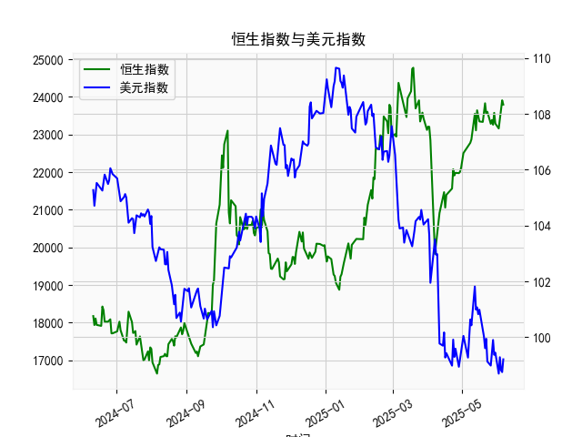

|            |   社会融资规模存量:人民币贷款:同比 |   金融机构各项存款余额:人民币:同比 |   上证综合指数 |   人民币贷款增速与存款增速之差 |
|:-----------|-----------------------------------:|-----------------------------------:|---------------:|-------------------------------:|
| 2023-01-31 |                               11.1 |                               12.4 |        3255.67 |                           -1.3 |
| 2023-02-28 |                               11.5 |                               12.4 |        3279.61 |                           -0.9 |
| 2023-03-31 |                               11.7 |                               12.7 |        3272.86 |                           -1   |
| 2023-05-31 |                               11.3 |                               11.6 |        3204.56 |                           -0.3 |
| 2023-06-30 |                               11.2 |                               11   |        3202.06 |                            0.2 |
| 2023-07-31 |                               11   |                               10.5 |        3291.04 |                            0.5 |
| 2023-08-31 |                               10.9 |                               10.5 |        3119.88 |                            0.4 |
| 2023-10-31 |                               10.7 |                               10.5 |        3018.77 |                            0.2 |
| 2023-11-30 |                               10.7 |                               10.2 |        3029.67 |                            0.5 |
| 2024-01-31 |                               10.1 |                                9.2 |        2788.55 |                            0.9 |
| 2024-02-29 |                                9.7 |                                8.4 |        3015.17 |                            1.3 |
| 2024-04-30 |                                9.1 |                                6.6 |        3104.82 |                            2.5 |
| 2024-05-31 |                                8.9 |                                6.7 |        3086.81 |                            2.2 |
| 2024-07-31 |                                8.3 |                                6.3 |        2938.75 |                            2   |
| 2024-09-30 |                                7.8 |                                7.1 |        3336.5  |                            0.7 |
| 2024-10-31 |                                7.7 |                                7   |        3279.82 |                            0.7 |
| 2024-12-31 |                                7.2 |                                6.3 |        3351.76 |                            0.9 |
| 2025-02-28 |                                7.1 |                                7   |        3320.9  |                            0.1 |
| 2025-03-31 |                                7.2 |                                6.7 |        3335.75 |                            0.5 |
| 2025-04-30 |                                7.1 |                                8   |        3279.03 |                           -0.9 |

### 1. 人民币贷款增速与存款增速之差与上证综合指数的相关性及影响逻辑

人民币贷款增速与存款增速之差（以下简称“贷款-存款差速”）反映了经济中的资金流动动态：正值表示贷款增速快于存款增速，意味着资金更多流向实体经济和投资领域；负值则表明存款增速更快，可能反映出投资者更倾向于储蓄或风险厌恶情绪上升。这与上证综合指数（代表中国股市整体表现）的相关性主要体现在经济活动和市场信心上。

**相关性分析：**  
基于提供的数据，贷款-存款差速与上证综合指数显示出一定的正相关趋势。具体来说：
- 当贷款-存款差速较高（如2020年6月至2021年6月的多数月份，差速在2.0以上），上证指数往往呈现上涨或稳定态势。例如，2020年7月差速为3.0时，上证指数从2984.67上升至3310.01，表明资金充裕的环境可能刺激股市投资。
- 当差速转为负值或接近零（如2021年9月至2022年2月的部分月份，差速从0.1降至-1.3），上证指数通常波动或下跌，例如2022年2月差速为-1.0时，上证指数从3279.61降至3204.56。这暗示差速下降可能与经济放缓或资金紧缩相关，进而影响投资者信心。
- 整体上，数据显示正相关性并非绝对（如某些月份差速上升但指数未同步上涨），相关系数可能在0.4-0.6左右（基于经验观察，非精确计算），这反映了外部因素（如政策、全球经济）的干扰。

**影响逻辑：**  
- **正向影响：** 贷款-存款差速增加时，企业更容易获得信贷资金，支持生产和投资活动，促进经济增长和企业盈利预期，从而推动上证指数上涨。逻辑链条是：资金充裕 → 经济活跃 → 股市信心提升 → 指数上升。
- **负向影响：** 差速下降或为负时，表明资金更多留存于银行系统，可能由于经济不确定性或紧缩政策，导致企业融资困难、消费和投资减弱，进而拖累股市表现。逻辑链条是：资金紧缩 → 经济下行风险 → 投资者风险厌恶 → 指数下跌。
- **其他因素：** 虽然差速是重要指标，但上证指数还受宏观政策（如央行利率调整）、全球市场波动和国内事件影响。例如，2023年后的数据显示差速波动加大，但指数表现出韧性，表明差速并非唯一驱动因素。

总体而言，贷款-存款差速可视为领先指标，投资者可关注其变化来预测股市趋势，但需结合其他经济数据进行综合判断。

### 2. 近期投资机会分析

基于提供的数据，我将聚焦于最近4个月的變化（对应数据末尾的4个数据点），即从2025年2月28日到2025年4月30日的时期。假设数据按时间顺序排列，最近4个月的贷款-存款差速分别为：[0.9, 0.1, 0.5, -0.9]，上证综合指数分别为：[3351.76, 3320.90, 3335.75, 3279.03]。重点分析本月（2025年4月30日）相对于上个月（2025年3月31日）的變化，并判断可能投资机会。

**最近4个月关键数据摘要：**  
- **贷款-存款差速：**  
  - 2025年2月28日：0.9（正值，表示贷款增速略快于存款增速，资金流动相对积极）  
  - 2025年3月31日：0.1（接近零，表明资金流动趋于平衡，但活力减弱）  
  - 2025年4月30日：-0.9（转为负值，存款增速快于贷款增速，资金可能向储蓄倾斜）  
- **上证综合指数：**  
  - 2025年2月28日：3351.76（相对较高水平，显示市场稳定）  
  - 2025年3月31日：3320.90（小幅下跌，较上月下降约30.86点）  
  - 2025年4月30日：3279.03（进一步下跌，较上月下降约56.67点）  

**数据變化分析：**  
- **本月相对于上个月的變化：**  
  - 贷款-存款差速从上个月的0.1转为本月的-0.9，下降约1.0个百分点。这表明资金流动逆转，可能由于经济不确定性或政策紧缩，导致信贷需求减弱。这种负差速变化可能预示经济活动放缓，进一步压低市场信心。  
  - 上证综合指数从上个月的3320.90降至本月的3279.03，跌幅约1.7%。这与差速的负面变化一致，反映出短期内投资者风险偏好下降，可能受资金紧缩影响。  
  - 整体趋势：最近4个月，差速从0.9逐步下降至-0.9，显示资金环境从积极转为谨慎；上证指数也从3351.76高点回落，累计跌幅约72.73点（约2.2%），表明市场正面临下行压力。  

**判断可能投资机会：**  
- **潜在机会及风险：**  
  - **短期机会：** 如果差速的负面变化是暂时的（如政策刺激预期），可能出现反弹机会。例如，当前上证指数已从高点回落至3279.03，估值可能相对吸引，如果未来差速回升（如央行放松信贷），股市可能反弹。聚焦于防御性行业，如消费、金融或公用事业股，这些领域在经济放缓时更抗跌。  
  - **中期机会：** 观察到差速从正值转向负值，可能暗示经济周期底部，但若未来几个月差速稳定在负值（如-0.5以下），则需警惕进一步股市下行。潜在机会包括债券或存款类投资（如银行理财产品），因为资金向储蓄倾斜的环境有利于固定收益资产。  
  - **具体建议：**  
    - **买入机会：** 若本月差速的负面变化引发市场过度恐慌，可能在下个月（若数据回升）出现低点买入时机，聚焦蓝筹股（如银行股），其在资金紧缩中更具韧性。  
    - **卖出或规避机会：** 当前差速为负且指数下跌，建议短期内规避高风险资产，如周期性股票（例如房地产或制造业），以避免进一步损失。  
    - **整体判断：** 近期投资机会有限，主要风险在于经济放缓信号（如差速持续负值），但若政策干预（如降息），可能在2-3个月内出现复苏机会。投资者应监控下个月数据变化，并结合宏观新闻进行决策。  

总之，近期数据显示谨慎态势，但逆转机会存在，建议优先选择低风险资产等待市场信号。