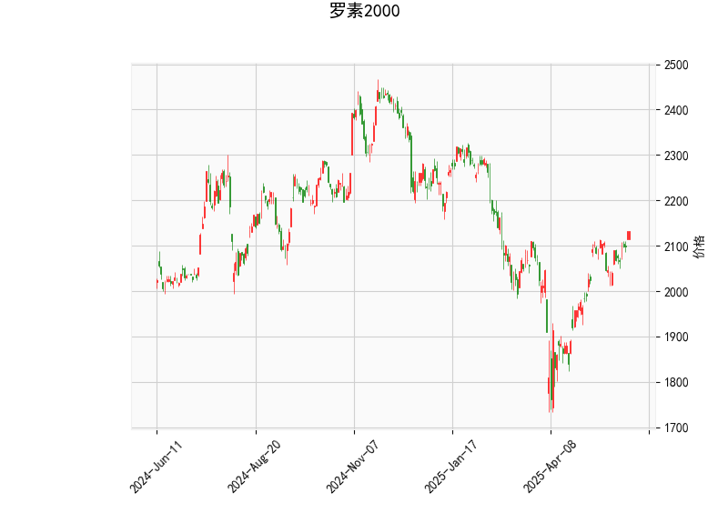

# 罗素2000指数技术分析及策略建议

## 一、技术指标综合分析

### 1. RSI指标（相对强弱指数）
- **当前值64.37**接近超买阈值70，但仍处于中性区间上沿，显示上涨动能占据主导
- 持续高于60可能暗示短期顶部形成风险，需要结合价格位置判断回调可能性

### 2. MACD指标
- **柱状线3.05**呈现向上发散（MACD线29.22 > 信号线26.17）
- 金叉结构确认上涨趋势延续，但需要注意DIFF与DEA的间距是否持续扩大
- 柱状线绝对值偏高需警惕短期获利盘压力

### 3. 布林轨道
- **当前价2132**位于中轨2007与上轨2197之间，距上轨约3%空间
- 中轨斜率向上显示中期趋势偏多，但价格临近上轨可能触发震荡
- 上下轨带宽380点(约18%)，暗示市场波动率处于较高水平

### 4. K线形态组合
- **关键形态解读**：
  - `CDLBELTHOLD`：吞噬形态提示多空争夺激烈
  - `CDLCLOSINGMARUBOZU`：光头光脚阳线显示单边买盘强势
  - `CDLGAPSIDESIDEWHITE`：缺口+实体阳线组合延续看涨信号
  - `CDLLONGLINE`：长实体K线验证方向性突破
  - `CDLMARUBOZU`：无影线实体柱表明趋势延续惯性

---

## 二、潜在机会与策略建议

### 趋势跟踪策略
- **突破交易**：关注价格对布林上轨2197的测试，有效突破后（连续三日收盘在上轨外）可建立趋势多单，目标位看至前高区域2250-2300
- **均线回踩建仓**：若回撤至中轨2007附近企稳，配合MACD维持金叉，可视为加仓机会

### 逆向反转策略
- **超买回调操作**：若RSI突破70后回落，同时出现顶分型K线组合，可在2160-2197区间建立短空头寸，止损设于2200上方

### 波动率套利机会
- **布林带宽套利**：利用当前38%的带宽差异构建期权跨式组合，预计波动率回归时将出现溢价收敛
- **时间价差策略**：当价格接近上轨时卖出近月虚值认购期权，同时买入次月平值认购，利用波动率期限结构获利

---

## 三、风险警示
1. **技术指标分歧**：RSI超买信号与MACD看涨信号冲突，建议降低单边头寸杠杆
2. **事件冲击风险**：6月FOMC会议前需关注波动率指数(VIX)动向，防范流动性突变
3. **形态失效保护**：若价格跌破布林中轨且MACD下穿信号线，应立即启动止损机制

**关键位建议**：多空分水岭看2000整数关口，上方阻力带2170-2200，下方强支撑位于1950周线级别平台。