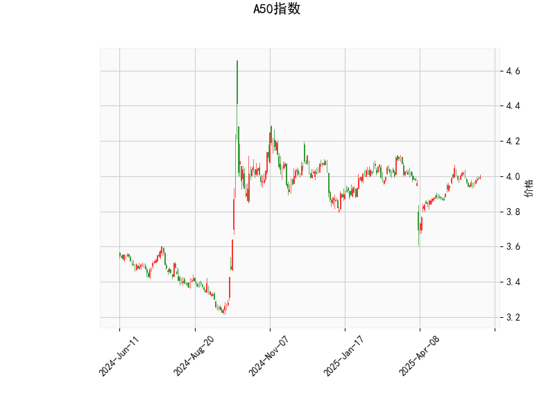

### A50指数的技术分析结果分析

#### 1. 技术指标整体概述
A50指数的当前价格为3.986，显示出市场处于相对稳定的盘整阶段，但结合多个指标，可以看出存在一定的市场不确定性。以下是对关键指标的详细分析：

- **RSI（相对强弱指数）**: 当前RSI值为55.89，这表明市场处于中性偏强势状态。RSI高于50通常表示买入压力大于卖出压力，但尚未达到超买水平（70以上）。这暗示短期内指数可能继续小幅上涨，但缺乏强烈动量。

- **MACD（移动平均收敛散度）**: MACD线值为0.0105，信号线值为0.0119，MACD直方图（Hist）为-0.0014（负值）。MACD线低于信号线，显示出短期看跌信号，这可能预示着价格短期内可能回调或盘整。虽然MACD整体值接近零，表明趋势不明显，但负的Hist值提醒投资者注意潜在的下行风险。

- **布林带（Bollinger Bands）**: 上轨为4.113、中轨为3.944、下轨为3.774。当前价格3.986位于中轨之上但未触及上轨，表明价格处于布林带的中间区域，波动相对温和。这反映市场没有极端超买或超卖情况，适合盘整行情，但如果价格突破上轨，可能引发向上突破；反之，跌破下轨则可能出现向下趋势。

- **K线形态**: 检测到的形态包括CDLDOJI、CDLHIGHWAVE、CDLLONGLEGGEDDOJI、CDLMATCHINGLOW和CDLSPINNINGTOP。这些形态多为中性或反转信号：
  - CDLDOJI、CDLLONGLEGGEDDOJI和CDLSPINNINGTOP表示市场犹豫和不确定性，常出现于趋势转折点，可能预示价格即将反转或继续横盘。
  - CDLHIGHWAVE显示高波动性，暗示市场缺乏方向。
  - CDLMATCHINGLOW则可能表示潜在底部信号，建议关注后续确认。

总体而言，A50指数的技术面显示出中性偏弱的态势。RSI和布林带支持短期稳定，而MACD的负直方图和K线形态的犹豫信号则提示潜在回调风险。市场可能处于盘整期，等待突破方向的确认。

#### 2. 近期可能存在的投资或套利机会和策略判断
基于上述分析，A50指数短期内可能存在盘整或轻微反转机会，但整体不确定性较高。以下是对潜在投资和套利机会的判断，以及相应的策略建议。需要强调的是，市场环境复杂，实际操作应结合宏观经济新闻、全球事件和风险管理。

- **可能存在的投资机会**:
  - **短期买入机会**: K线形态中的CDLMATCHINGLOW暗示潜在底部，如果价格企稳在中轨（3.944）以上，并伴随RSI向上突破60，可能出现反弹机会。当前RSI为55.89，离强势区不远，如果伴随正面消息（如全球股市回暖），指数可能向上测试上轨（4.113）。
  - **短期卖出或避险机会**: MACD直方图负值和K线犹豫形态（如CDLDOJI）表明可能回调。如果价格跌破中轨（3.944）并接近下轨（3.774），这将是一个卖出信号，尤其适合风险厌恶者。
  - **套利机会**: A50指数作为衍生品（如期货或期权）的基准，可能存在与相关资产（如中国A股或全球大盘指数）的价差套利。如果A50价格与关联期货（如A50期货）出现异常偏差（例如，由于套利者情绪导致短期错位），投资者可通过多头/空头对冲进行无风险套利。但当前指标中性，套利窗口可能较小，仅在价格接近布林带边缘时出现。

- **投资策略建议**:
  - **观望与等待策略**: 鉴于市场不确定性，推荐短期观望为主。等待RSI突破60或MACD直方图转为正值，作为买入信号；或价格跌破下轨，作为卖出信号。适合保守投资者，避免盲目操作。
  - **趋势跟踪策略**: 如果价格向上突破上轨（4.113），可考虑轻仓买入，目标设在4.200附近；反之，如果跌破下轨（3.774），则可卖出或转向空头。结合K线形态，需在Doji或Spinning Top后观察确认，以避免假突破。
  - **套利策略**: 对于经验丰富的投资者，可利用A50指数与相关衍生品的价差进行套利。例如，在A50现货价格高于期货时做空期货、多头现货；或使用期权构建价差策略（如牛市价差或熊市价差）。当前MACD负值可能适合熊市套利，但需监控全球市场联动（如美股或A股影响）。
  - **风险管理建议**: 所有策略均应设置止损位，例如在买入时止损设在中轨以下（3.900左右）。分仓操作（例如30%仓位测试），并结合成交量和新闻事件进行动态调整。总体风险中等，适合中长期投资者在回调后布局。

总结：A50指数短期可能维持盘整，投资机会以小幅反弹为主，但回调风险不可忽视。策略应以灵活性和风险控制为核心，建议结合实时数据和专业咨询进行决策。