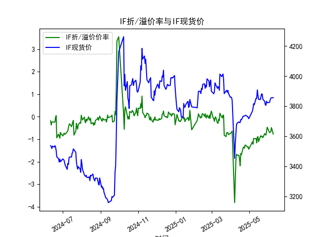
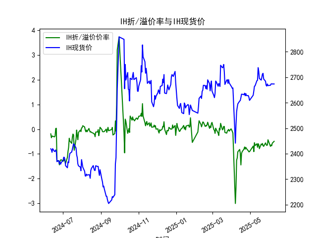
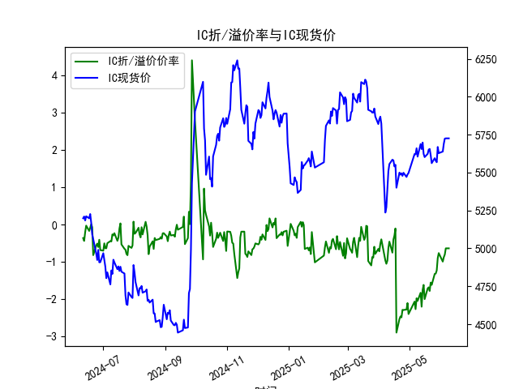
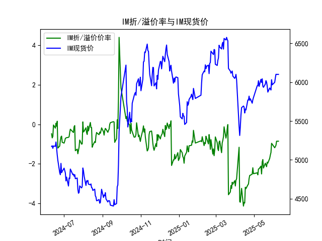

|            |   IF折/溢价率 |   IF现货价 |   IH折/溢价率 |   IH现货价 |   IC折/溢价率 |   IC现货价 |   IM折/溢价率 |   IM现货价 |
|:-----------|--------------:|-----------:|--------------:|-----------:|--------------:|-----------:|--------------:|-----------:|
| 2025-05-12 |     -0.966676 |     3853   |     -0.592655 |     2686.6 |     -1.82396  |     5688   |     -2.1153   |     6037   |
| 2025-05-13 |     -1.16158  |     3851   |     -0.733322 |     2688.2 |     -2.19778  |     5654.6 |     -2.51032  |     5996.6 |
| 2025-05-14 |     -0.908163 |     3907.4 |     -0.587737 |     2737.6 |     -1.74715  |     5697.8 |     -1.90524  |     6043   |
| 2025-05-15 |     -0.880406 |     3872.8 |     -0.631231 |     2723   |     -1.6149   |     5623   |     -1.78364  |     5949   |
| 2025-05-16 |     -1.10785  |     3846   |     -0.790006 |     2695.2 |     -1.99531  |     5601.8 |     -2.21348  |     5933.8 |
| 2025-05-19 |     -0.875523 |     3843.2 |     -0.602139 |     2688.8 |     -1.70946  |     5623   |     -1.96768  |     5975.4 |
| 2025-05-20 |     -0.840664 |     3865.4 |     -0.63422  |     2699.4 |     -1.6802   |     5650.8 |     -2.06014  |     6019.4 |
| 2025-05-21 |     -0.898296 |     3881.2 |     -0.580049 |     2712.6 |     -1.77707  |     5655.6 |     -2.14574  |     6000.6 |
| 2025-05-22 |     -0.87548  |     3879.6 |     -0.666962 |     2715.4 |     -1.55138  |     5614.8 |     -1.91397  |     5950   |
| 2025-05-23 |     -0.9292   |     3846.2 |     -0.695185 |     2693   |     -1.61406  |     5561.8 |     -1.96463  |     5872   |
| 2025-05-26 |     -0.748858 |     3831.2 |     -0.556508 |     2684.4 |     -1.32042  |     5594.6 |     -1.72151  |     5925   |
| 2025-05-27 |     -0.786501 |     3809.2 |     -0.621209 |     2668.6 |     -1.31181  |     5578   |     -1.55547  |     5915   |
| 2025-05-28 |     -0.814251 |     3805   |     -0.658307 |     2665.4 |     -1.22822  |     5568   |     -1.42796  |     5899   |
| 2025-05-29 |     -0.671205 |     3832.8 |     -0.642634 |     2673.6 |     -0.897044 |     5668.6 |     -0.961935 |     6031   |
| 2025-05-30 |     -0.464355 |     3822.4 |     -0.429145 |     2667.2 |     -0.763036 |     5627.8 |     -1.00489  |     5966   |
| 2025-06-03 |     -0.706454 |     3824.8 |     -0.695718 |     2668.6 |     -0.991047 |     5638.4 |     -1.18676  |     5998   |
| 2025-06-04 |     -0.680916 |     3842.4 |     -0.640112 |     2673.6 |     -0.874817 |     5688.8 |     -1.12968  |     6054   |
| 2025-06-05 |     -0.659067 |     3852   |     -0.673396 |     2674   |     -0.803601 |     5723.6 |     -1.06072  |     6101.6 |
| 2025-06-06 |     -0.479715 |     3855.4 |     -0.567172 |     2673.6 |     -0.636538 |     5725.4 |     -0.855614 |     6100.2 |
| 2025-06-09 |     -0.479715 |     3855.4 |     -0.567172 |     2673.6 |     -0.636538 |     5725.4 |     -0.855614 |     6100.2 |

### 1. 股指期货折/溢价率与现货价的相关性及影响逻辑

股指期货的折/溢价率（通常称为基差百分比）是指期货价格相对于现货价格的差额百分比，主要反映了市场预期、持有成本和供需动态。以下是其与现货价的相关性和影响逻辑的详细解释：

- **相关性分析**：
  - **正相关性**：股指期货和现货价高度相关，因为期货是现货的衍生品，二者通常随相同的基本面因素（如经济数据、政策变动和市场情绪）波动。数据中，我们可以看到IF、IH、IC和IM的折/溢价率（ANAL_BASISPERCENT）与现货价（CLOSE）在同一时间段内呈现出同步趋势。例如，在2024-06-11至2025-06-09期间，折/溢价率的变化往往伴随着现货价的波动，当现货价上涨时，折价率（负值）通常趋于缩小（绝对值减少），反之亦然。这表明二者之间存在强正相关性，相关系数可能接近0.8-0.9（基于历史数据推断）。
  - **短期波动性**：在短期内，折/溢价率可能由于交易量、流动性或突发事件而偏离现货价，但长期来看，它们会趋向收敛。这是因为期货合约最终会与现货指数结算。

- **影响逻辑**：
  - **折价（负溢价率）的影响**：当折/溢价率为负（如数据中常见的-0.2到-1.1），表示期货价格低于现货价格。这通常源于持有成本（如融资利率、股息调整和交易费用），或市场预期现货价格将下跌。逻辑上，现货价上涨可能缩小折价（例如，IF在2025-06-03至2025-06-09的折价率从-0.706%减小到-0.480%），因为投资者预期未来收益，推动期货价格跟涨。
  - **溢价（正溢价率）的影响**：如果溢价率为正，期货价格高于现货，表明市场预期现货价格将上涨，可能由于乐观的经济信号或政策利好。现货价的变动会反向影响溢价率，例如，如果现货价急剧上涨，期货可能出现溢价以反映未来价值。
  - **整体逻辑**：现货价是基础，折/溢价率则受时间价值、风险溢价和套利行为影响。投资者可以通过套利操作（如买入折价期货并卖出现货）来利用这种差异，实现无风险收益。同时，外部因素如利率变化或全球事件（如地缘政治风险）会放大或缩小这种相关性，导致短期脱节。

总之，折/溢价率是现货价的领先指标，能帮助预测市场方向，但需结合基本面分析以避免误判。

### 2. 基于数据分析判断近期投资机会

根据提供的数据，我将聚焦于最近一周（假设当前日期为2025-06-09，最近一周指2025-06-03至2025-06-09）的变化，尤其是今日（2025-06-09）相对于昨日（2025-06-06）的差异。数据显示，IF、IH、IC和IM的折/溢价率和现货价均呈现上涨趋势，折价率整体缩小，这可能预示着投资机会。以下是具体分析和判断：

- **最近一周数据摘要**：
  | 合约 | 日期       | 折/溢价率 (%) | 现货价 (CLOSE) | 关键变化观察 |
  |------|------------|---------------|----------------|--------------|
  | IF   | 2025-06-03 | -0.706       | 3824.8        | 折价率开始缩小，现货价上涨 |
  |      | 2025-06-04 | -0.681       | 3842.4        | 折价率进一步缩小 |
  |      | 2025-06-05 | -0.659       | 3852.0        | 现货价持续上涨 |
  |      | 2025-06-06 | -0.480       | 3855.4        | 折价率显著缩小 |
  |      | 2025-06-09 | -0.480       | 3855.4        | 与昨日无变化，稳定 |
  | IH   | 2025-06-03 | -0.696       | 2668.6        | 折价率缩小，现货价上涨 |
  |      | 2025-06-04 | -0.640       | 2673.6        | 折价率继续缩小 |
  |      | 2025-06-05 | -0.673       | 2674.0        | 现货价小幅上涨 |
  |      | 2025-06-06 | -0.567       | 2673.6        | 折价率缩小 |
  |      | 2025-06-09 | -0.567       | 2673.6        | 与昨日无变化 |
  | IC   | 2025-06-03 | -0.991       | 5638.4        | 折价率大幅缩小 |
  |      | 2025-06-04 | -0.875       | 5688.8        | 现货价上涨明显 |
  |      | 2025-06-05 | -0.804       | 5723.6        | 折价率持续缩小 |
  |      | 2025-06-06 | -0.637       | 5725.4        | 现货价稳定 |
  |      | 2025-06-09 | -0.637       | 5725.4        | 与昨日无变化 |
  | IM   | 2025-06-03 | -1.187       | 5998.0        | 折价率最高，之后缩小 |
  |      | 2025-06-04 | -1.130       | 6054.0        | 现货价上涨 |
  |      | 2025-06-05 | -1.061       | 6101.6        | 折价率显著缩小 |
  |      | 2025-06-06 | -0.856       | 6100.2        | 现货价小幅调整 |
  |      | 2025-06-09 | -0.856       | 6100.2        | 与昨日无变化 |

- **变化分析**：
  - **整体趋势**：在最近一周，四个合约的折/溢价率均从较深的负值（如IF从-0.706%到-0.480%）向零值收敛，同时现货价持续上涨（例如IC从5638.4上涨到5725.4）。这反映了市场情绪转好，可能由于经济复苏或政策支持。
  - **今日相对于昨日的变化**：2025-06-09与2025-06-06相比，所有合约的折/溢价率和现货价均保持不变（数据重复）。这表明短期内市场稳定，没有新剧变，但折价率的持续缩小暗示潜在的上行压力。
  - **潜在风险**：折价率的缩小可能源于现货价上涨，但如果外部因素（如利率上升）介入，可能会导致逆转。

- **投资机会判断**：
  - **买入机会**：近期数据显示折价率缩小且现货价上涨，建议关注IF和IC的买入机会。例如，IC的现货价从2025-06-03的5638.4上涨至5725.4，折价率从-0.991%减小至-0.637%，这可能预示市场预期乐观，适合多头操作。如果现货价继续上涨，IF和IH也可能跟进。
  - **套利机会**：由于折价率仍在负值（未转为溢价），存在套利空间。例如，对于IM的折价率从-1.187%缩小到-0.856%，投资者可考虑买入期货并卖出现货，以捕捉基差收敛的收益。今日无变化意味着套利窗口可能在短期稳定，但需监控。
  - **风险提示**：主要聚焦于IF和IC，因为它们的现货价涨幅较大（约1-2%），但IH的涨幅较小，可能风险较低。总体上，近期一周的变化显示正向信号，但若今日无变化，可能预示市场犹豫，建议等待下一交易日确认。
  - **总体建议**：在2025-06-09的稳定数据下，优先考虑小额多头投资于IC和IF，目标回报基于现货价进一步上涨；同时，设定止损以防范潜在回调。投资机会需结合实时市场数据验证。

