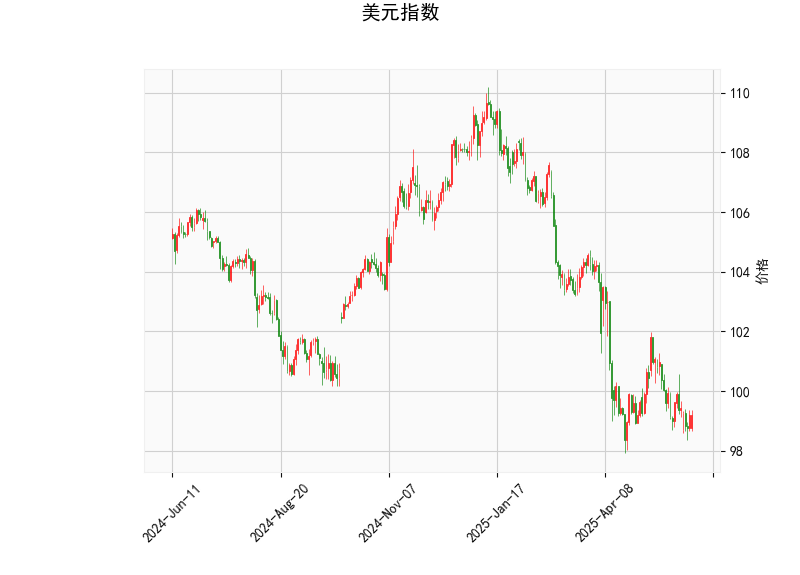

### 1. 美元指数的技术分析结果解读

美元指数当前价位为99.2031，基于提供的指标，我们可以对整体市场趋势进行初步评估。以下是对关键指标的详细分析：

- **RSI（相对强弱指数）**：当前值为43.63，这表明美元指数处于相对超卖状态（RSI低于50通常被视为超卖）。这可能暗示短期内存在反弹潜力，但如果RSI进一步下降至30以下，则可能加剧下行风险。

- **MACD（移动平均收敛散度）**：MACD线为-0.451，信号线为-0.449，MACD直方图为-0.002。这些值均处于负值区域，显示MACD线低于信号线，暗示短期趋势偏向看跌。同时，直方图的负值虽小，但持续负值可能表示下行动量尚未消退。如果MACD线向上穿越信号线，将是一个潜在的买入信号。

- **布林带（Bollinger Bands）**：上轨为104.79，中轨为100.90，下轨为97.00。当前价99.2031接近下轨，这通常被视为超卖信号，可能预示着短期反弹。然而，如果价格持续在下轨附近徘徊或跌破下轨，则可能进一步确认熊市趋势。布林带的收窄或扩张可以观察波动率：当前价位在中轨下方，表明市场波动可能增加。

- **K线形态**：检测到“CDLLONGLINE”形态（长线K线），这是一种强势K线模式，通常表示价格在短期内出现大幅波动，可能预示趋势反转或强势反弹。但需结合其他指标验证，若伴随成交量放大，则反弹概率较高。

总体而言，美元指数当前呈现弱势特征，RSI和布林带显示超卖信号，MACD则强化了看跌倾向。短期内，市场可能面临回调或反弹风险，投资者应关注关键支撑位（如97.00附近）和外部事件（如美联储政策）。如果美元指数跌破下轨，可能会加剧全球资金流向新兴市场；反之，若反弹至中轨以上，则可能维持区间震荡。

### 2. 近期A股和港股可能的投资或套利机会及策略分析

基于美元指数的弱势表现（超卖信号和看跌趋势），这可能利好新兴市场，尤其是中国股市（A股和港股），因为美元走弱往往会推动资金从美元资产流出，转向高增长市场。同时，人民币潜在升值可能提振出口导向型企业。以下是对近期机会的判断和策略建议：

#### 可能的投资机会
- **A股机会**：
  - **周期股和消费股**：美元指数弱势可能刺激全球经济复苏，中国作为出口大国受益。推荐关注周期性行业，如汽车、电子和消费品板块（例如上证指数中的相关权重股）。当前A股估值相对合理（沪深300 PE约12-15倍），若美元继续走弱，A股可能迎来反弹窗口。
  - **科技和新能源股**：受益于中国政策支持和全球供应链重塑，这些板块（如新能源汽车龙头）可能有超额收益。近期A股市场情绪较稳，若美元反弹风险降低，这些股的波动性机会值得关注。

- **港股机会**：
  - **H股和中概股**：港股中许多中国公司（如腾讯、阿里等）的H股相对A股有估值折价（H股平均PE约10-12倍），这为套利提供了基础。美元弱势可能吸引外资流入港股，推高H股价格。
  - **跨境套利潜力**：A股与H股价差扩大时（如当前美元弱势期），投资者可通过“南下”资金（沪深港通）进行套利。例如，如果H股相对A股更便宜，利用汇率优势买入H股后待价差收窄获利。

#### 投资策略建议
- **短期策略**：
  - **买入并持有（Buy and Hold）**：针对A股的超跌股或港股的低估值股，建议在美元指数反弹前布局。控制仓位在50-60%，设置止损（如若美元指数升破中轨，及时减仓）。
  - **套利策略**：利用A股-H股价差进行“同股不同市”套利。例如，买入港股H股（如中国移动H股），同时卖出A股对应股票（若价差>10%），待市场收敛获利。预计在美元弱势延续的2-3个月内，这种机会较频繁。
  
- **中长期策略**：
  - **多元化配置**：结合大盘ETF（如沪深300 ETF或恒生中国企业ETF），以降低单一股票风险。同时，关注宏观事件（如中美贸易谈判），若美元持续弱势，增加对中国股市的暴露。
  - **风险管理**：美元指数若意外反弹（例如美联储加息预期增强），可能导致A股港股回调。建议设置动态止盈（获利5-10%后部分卖出），并结合基本面分析（如公司业绩）避免短期波动。

总体风险提示：尽管美元弱势利好A股港股，但需警惕地缘政治不确定性和国内经济数据（如CPI、GDP）。当前市场机会大于风险，但策略应以防御为主，优先选择流动性强的蓝筹股。投资者可结合实时数据（如RSI反弹信号）动态调整。