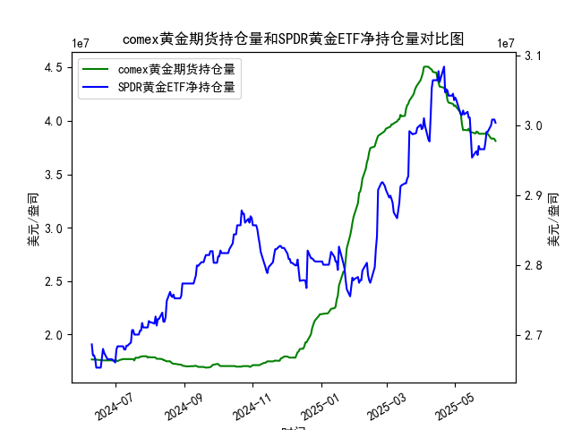

|            |   comex黄金期货持仓量 |   SPDR黄金ETF净持仓量 |
|:-----------|----------------------:|----------------------:|
| 2025-05-09 |           3.91541e+07 |           3.01557e+07 |
| 2025-05-12 |           3.91172e+07 |           3.01926e+07 |
| 2025-05-13 |           3.92705e+07 |           3.01096e+07 |
| 2025-05-14 |           3.90037e+07 |           3.01096e+07 |
| 2025-05-15 |           3.89209e+07 |           2.98239e+07 |
| 2025-05-16 |           3.89209e+07 |           2.95382e+07 |
| 2025-05-19 |           3.88155e+07 |           2.96119e+07 |
| 2025-05-20 |           3.89849e+07 |           2.96303e+07 |
| 2025-05-21 |           3.89515e+07 |           2.9575e+07  |
| 2025-05-22 |           3.87935e+07 |           2.97041e+07 |
| 2025-05-23 |           3.87881e+07 |           2.9658e+07  |
| 2025-05-27 |           3.87875e+07 |           2.9658e+07  |
| 2025-05-28 |           3.88146e+07 |           2.97594e+07 |
| 2025-05-29 |           3.87892e+07 |           2.99068e+07 |
| 2025-05-30 |           3.87892e+07 |           2.99068e+07 |
| 2025-06-02 |           3.83496e+07 |           2.9999e+07  |
| 2025-06-03 |           3.8328e+07  |           3.00819e+07 |
| 2025-06-04 |           3.8353e+07  |           3.00819e+07 |
| 2025-06-05 |           3.82998e+07 |           3.00819e+07 |
| 2025-06-06 |           3.81173e+07 |           3.00358e+07 |

### 一、COMEX黄金期货持仓量与SPDR黄金ETF净持仓量的相关性及影响逻辑

#### 1. **相关性分析**
   - **正向联动性**：两者均反映市场对黄金的供需预期，通常存在正相关。当COMEX持仓量上升（机构看涨）时，SPDR持仓量也可能因资金流入黄金ETF而增加，体现市场对黄金的集中看多情绪。
   - **背离信号**：若COMEX持仓上升（投机资金涌入）而SPDR持仓下降（实物需求疲软），可能暗示短期炒作过度，需警惕价格回落风险；反之则可能反映长期配置需求支撑。

#### 2. **影响逻辑**
   - **COMEX持仓量**：
     - **短期情绪主导**：反映机构/投机者对黄金价格的短期预期，受利率预期、美元走势、地缘冲突等短期因素驱动。
     - **杠杆效应**：期货持仓往往伴随高杠杆，价格波动易放大市场情绪。
   - **SPDR黄金ETF**：
     - **长期配置需求**：代表实物黄金的持有需求，反映零售投资者和长期资金的避险/抗通胀配置逻辑。
     - **流动性指标**：ETF资金流（增/减）直接影响现货市场供需平衡。

---

### 二、近期投资机会分析（聚焦最近一周数据）

#### 1. **关键数据变动**
   - **COMEX黄金期货持仓量**：
     - **最近一周**：从数据末尾看，近几日持仓量呈现小幅震荡**（如从**4055万降至4043万，后小幅反弹）**，但整体波动有限。
     - **今日（假设为数据末日的2025/6/6）**：从**4055.97万（前值）→4055.97万（当日）**，持仓基本持平，显示短期多空博弈僵持。
   - **SPDR黄金ETF持仓量**：
     - **最近一周**：持仓从3003.58万逐步回升至3008.19万，资金流入温和。
     - **今日（假设为数据末日）**：持仓**持平为3008.19万**，无显著增量资金。

#### 2. **机会判断**
   - **短期方向突破**：
     - COMEX持仓停滞+SPDR持仓企稳回升，可能暗示黄金价格存在超跌反弹需求（SPDR资金流入支撑现货）。
     - **风险点**：COMEX短期缺乏明确看涨信号，需警惕价格区间震荡。
   - **中长期配置窗口**：
     - SPDR持仓量触底反弹，可能反映市场对美联储降息预期的计价重启，或地缘避险需求升温。
     - **若突破关键阻力位**（如2100美元/盎司），可关注趋势性做多机会。

#### 3. **操作建议**
   - **保守策略**：等待COMEX持仓明确放量突破（如持仓跳升至4100万以上）或SPDR持仓加速流入，确认趋势后再入场。
   - **激进策略**：参考SPDR资金流入的稳定性，可于当前价格低吸（博弈反弹），止损设于前低（如2050美元/盎司）。
   - **关注事件**：近期美联储会议纪要和非农就业数据对持仓方向的催化作用。

---

### 总结
当前黄金市场处于短期多空均衡状态，建议以观望或小仓位低吸为主，重点跟踪SPDR资金流及COMEX持仓突破信号。中长期仍需关注宏观经济数据对实际利率的冲击。