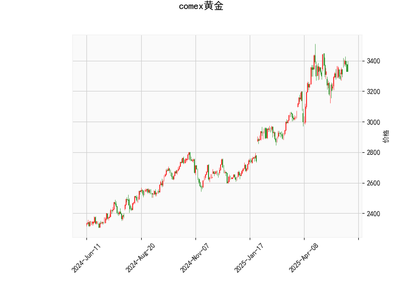

### 1. 对 COMEX 黄金的技术分析结果进行分析

基于提供的技术分析数据，我们可以从多个指标角度对 COMEX 黄金的当前市场状况进行全面评估。以下是对各指标的逐一解读，以及整体市场信号的总结。

- **当前价格（3331.0）**：黄金价格目前位于 3331.0 美元/盎司。这是一个中性位置，与布林带中轨（3243.96）相比略高于中轨，但距离上轨（3494.84）仍有空间。这表明价格处于相对稳定的区间内，没有明显超买或超卖迹象，但可能存在短期波动风险。

- **RSI（52.43）**：相对强弱指数（RSI）值为 52.43，处于中性区域（50 以上表示强势，但远未达到超买水平，如 70 以上）。这反映出黄金市场当前力量均衡，买方和卖方势力相当。没有明显的超买或超卖信号，暗示短期内市场可能继续横盘或小幅波动。

- **MACD 指标**：
  - MACD 线（26.27）与信号线（26.93）的关系显示，MACD 线低于信号线，且直方图（MACD Hist）为负值（-0.66）。这是一种看跌信号，表明短期动量正在减弱，可能预示着价格回调或趋势逆转。如果 MACD 线继续向下交叉信号线，将强化卖出信号。
  - 整体而言，MACD 的负直方图表示卖方力量开始占优，但幅度较小（-0.66），所以这可能只是短期调整而非重大反转。

- **布林带指标**：
  - 上轨（3494.84）、中轨（3243.96）和下轨（2993.08）显示，当前价格（3331.0）位于中轨之上，但未触及上轨。这暗示价格处于相对强势的区间内，市场可能有上行潜力，但如果价格回落至中轨以下，则可能进入盘整或下跌阶段。布林带的宽度（上轨与下轨之差）显示波动性适中，没有剧烈扩张，表明市场情绪稳定。

- **K 线形态**：
  - **CDLCLOSINGMARUBOZU**：这是一种强势K线形态，通常表示一根大阳线或大阴线，显示买方（或卖方）控制了市场。该形态出现表明近期黄金可能有强势上涨或下跌的迹象，但需结合其他指标验证。
  - **CDLMATCHINGLOW**：这表示两根K线的收盘价相同，常见于支撑位附近，可能预示潜在的反转或盘整。如果价格在此水平获得支撑，可能会引发反弹；反之，如果跌破，将增加下行风险。

**整体市场信号总结**：
黄金市场的当前状况呈现出混合信号。RSI 和布林带显示中性到轻微强势，K线形态（如 CDLCLOSINGMARUBOZU）暗示潜在强势，但 MACD 的负直方图和 MACD 线低于信号线发出看跌警告。总体上，黄金可能处于短期回调风险中，但尚未出现强烈趋势。投资者应关注价格是否跌破布林带中轨（3243.96），这可能触发更明显的下行。

### 2. 分析判断近期可能存在的投资或套利机会和策略

基于上述分析，COMEX 黄金的近期机会主要围绕短期波动和潜在回调展开。黄金作为避险资产，其价格受全球经济、地缘政治和美元走势影响，但从技术角度，我们可以识别出以下投资或套利机会。策略需结合风险管理，并建议在实际操作前参考基本面因素。

#### 可能的投资机会
- **短期回调机会**：MACD 的看跌信号和价格接近布林带上轨表明，黄金可能面临技术性回调。如果价格回落至中轨（3243.96）附近，这将是一个潜在的买入机会，尤其如果 K线形态（如 CDLMATCHINGLOW）提供支撑。预计回调幅度在 5-10%，即价格可能测试 3200-3250 美元区间。
- **强势反弹机会**：如果 RSI 保持在 50 以上且 K线形态（如 CDLCLOSINGMARUBOZU）持续出现，黄金可能向上测试上轨（3494.84）。这适合多头投资者，在当前价位布局看涨头寸。
- **套利机会**：黄金期货或期权市场可能存在跨期或跨品种套利。例如，如果 COMEX 黄金现货价格与期货价格间出现价差（当前价 3331.0 可能低于期货合约），投资者可通过买入现货/卖出期货的策略锁定收益。但需注意，MACD 的负信号可能导致价差扩大，增加风险。

#### 推荐投资策略
- **看跌策略（短期空头）**：
  - **时机**：如果 MACD 直方图继续恶化（例如，Hist 降至 -1 以下）或价格跌破中轨（3243.96），考虑做空黄金期货或买入看跌期权。
  - **具体操作**：设定止损在上轨（3494.84）附近，目标位在下轨（2993.08）或 3200 美元。风险控制：头寸规模不超过总资金的 5%。
  - **优势**：MACD 信号提供技术支撑，适合波动性较高的市场。
  - **风险**：如果全球事件（如地缘冲突）推动黄金避险需求，价格可能反弹。

- **看涨策略（中期多头）**：
  - **时机**：等待价格在 CDLMATCHINGLOW 水平获得支撑（例如，测试 3250 美元后反弹），或 RSI 升至 60 以上时入场。
  - **具体操作**：买入黄金现货或期货，结合布林带作为止损位（如止损设在中轨以下）。目标位在上轨（3494.84）附近。
  - **优势**：RSI 和 K线形态提供潜在支撑，适合预期经济不确定性的投资者。
  - **风险**：MACD 的负信号可能导致假突破，需密切监控。

- **套利策略（中性操作）**：
  - **跨市场套利**：利用 COMEX 黄金与上海黄金交易所或其他市场的价差。例如，如果 COMEX 价格低于亚洲市场，买入 COMEX 黄金期货并卖出亚洲合约锁定收益。当前的技术中性（RSI 52.43）适合这种低风险策略。
  - **期权套利**：构建牛市价差期权（买入看涨期权，卖出更高行权价的看涨期权），以较低成本押注小幅上涨。预计成本在 1-2% 范围内。
  - **优势**：减少方向性风险，适合技术指标不确定的时期。
  - **风险**：交易成本较高，且需实时监控价差变化。

#### 总体建议
近期黄金投资应以短期操作为主，优先关注 MACD 和布林带的交叉信号作为进出场依据。风险管理至关重要：始终设置止损（如 2-5% 波动），并结合基本面（如美联储政策或全球经济数据）验证技术信号。总体而言，机会大于风险，但市场可能维持震荡，建议保守投资者观望，活跃投资者可小仓位试探。