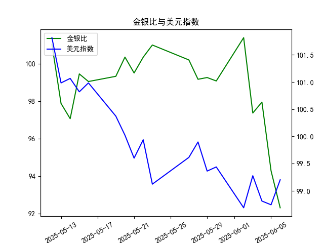

|            |    金价 |   银价 |   美元指数 |   金银比 |
|:-----------|--------:|-------:|-----------:|---------:|
| 2025-05-12 | 3235.4  | 32.02  |   101.814  | 101.043  |
| 2025-05-13 | 3227.95 | 32.98  |   100.983  |  97.876  |
| 2025-05-14 | 3191.95 | 32.885 |   101.066  |  97.064  |
| 2025-05-15 | 3191.05 | 32.085 |   100.82   |  99.4561 |
| 2025-05-16 | 3182.95 | 32.135 |   100.983  |  99.0493 |
| 2025-05-19 | 3230.15 | 32.52  |   100.373  |  99.3281 |
| 2025-05-20 | 3261.55 | 32.5   |   100.022  | 100.355  |
| 2025-05-21 | 3299.65 | 33.16  |    99.6014 |  99.5069 |
| 2025-05-22 | 3284    | 32.725 |    99.9388 | 100.351  |
| 2025-05-23 | 3342.65 | 33.095 |    99.1231 | 101.002  |
| 2025-05-27 | 3296.7  | 32.9   |    99.6147 | 100.204  |
| 2025-05-28 | 3300.85 | 33.285 |    99.8978 |  99.1693 |
| 2025-05-29 | 3312.4  | 33.37  |    99.3633 |  99.2628 |
| 2025-05-30 | 3277.55 | 33.08  |    99.4393 |  99.0795 |
| 2025-06-02 | 3370.85 | 33.245 |    98.6893 | 101.394  |
| 2025-06-03 | 3334.75 | 34.25  |    99.2781 |  97.365  |
| 2025-06-04 | 3364.6  | 34.35  |    98.8128 |  97.9505 |
| 2025-06-05 | 3374.6  | 35.795 |    98.7444 |  94.2757 |
| 2025-06-06 | 3339.9  | 36.185 |    99.2031 |  92.3007 |

### 1. 金银比与美元指数的相关性及影响逻辑

**相关性**：  
金银比（黄金价格/白银价格）与美元指数通常呈现**负相关性**，但这一关系并不绝对，受市场情绪和结构性因素影响较大。历史数据显示：
- **美元走强**时，黄金（避险属性）可能相对抗跌，而白银（工业属性占比超50%）需求受抑制，导致金银比**被动走阔**；
- **美元走弱**时，白银因工业需求弹性及投机属性，涨幅可能超过黄金，推动金银比**收窄**。

**影响逻辑**：  
1. **美元定价机制**：大宗商品以美元计价，美元走强直接压制金银的美元标价（反之亦然）。
2. **避险属性差异**：黄金避险需求强于白银，当风险事件（如经济衰退）叠加美元走强时，金银比可能因黄金更抗跌而**上升**。
3. **通胀预期传导**：美元弱势常伴随通胀预期升温，白银因工业需求（如光伏、电子）快速响应，导致金银比**收窄更快**。

---

### 2. 近期投资机会分析（聚焦最近一周及今日变化）

#### **关键数据变化**：
- **金银比**：近一周（5月30日-6月6日）从101.39急跌至92.30（**跌幅超9%**），今日（6月6日）单日降幅达2.15点（昨日94.27→今日92.30）。
- **美元指数**：近一周窄幅震荡于98.68-99.43区间，今日微升0.46点（昨日98.74→今日99.20）。

#### **投资机会判断**：
1. **白银短期多头机会**：  
   - **逻辑**：金银比创近1月新低（92.3），今日加速下跌，表明白银价格跑赢黄金。美元指数未显著走弱（今日甚至微升），但白银独立上涨，可能反映**工业需求预期改善**（如新能源政策刺激）或投机资金涌入。
   - **策略**：短线可关注白银期货或ETF的多头机会，止损参考金银比反弹至95以上。

2. **黄金/白银套利机会**：  
   - **逻辑**：金银比已跌破100关键心理关口，短期偏离均值（历史中位数约60-80），存在均值回归可能。但当前趋势强劲，需等待右侧信号。
   - **策略**：激进者可轻仓做多金银比（买黄金/空白银），目标反弹至97-98区间，止损设于90下方。

3. **美元指数关联对冲窗口**：  
   - **逻辑**：若美元指数短期内突破99.5阻力（今日接近该水平），可能压制贵金属整体表现，但白银或因工业逻辑出现分化。
   - **策略**：多白银、空黄金组合可对冲美元进一步走强的系统性风险。

#### **风险提示**：  
- **情绪过热风险**：金银比跌幅过快，需警惕获利回吐引发的技术性反弹。
- **宏观数据扰动**：6月4日美国非农就业数据临近，可能加剧波动，建议控制仓位。