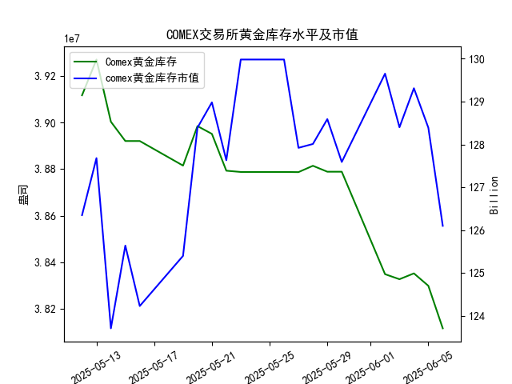

|            |   comex黄金库存量 |   comex黄金库存市值(billion) |   伦敦金现货价 |   上海金交所黄金现货价 |   美元兑人民币汇率 |
|:-----------|------------------:|-----------------------------:|---------------:|-----------------------:|-------------------:|
| 2025-05-12 |       3.91172e+07 |                       3230   |        3235.4  |                 759    |             7.2066 |
| 2025-05-13 |       3.92705e+07 |                       3251.4 |        3227.95 |                 763.9  |             7.1991 |
| 2025-05-14 |       3.90037e+07 |                       3171.7 |        3191.95 |                 758.38 |             7.1956 |
| 2025-05-15 |       3.89209e+07 |                       3228.1 |        3191.05 |                 735.86 |             7.1963 |
| 2025-05-16 |       3.89209e+07 |                       3191.8 |        3182.95 |                 746.4  |             7.1938 |
| 2025-05-19 |       3.88155e+07 |                       3230.6 |        3230.15 |                 754.5  |             7.1916 |
| 2025-05-20 |       3.89849e+07 |                       3293.2 |        3261.55 |                 753.49 |             7.1931 |
| 2025-05-21 |       3.89515e+07 |                       3311.4 |        3299.65 |                 773.82 |             7.1937 |
| 2025-05-22 |       3.87935e+07 |                       3290   |        3284    |                 778.36 |             7.1903 |
| 2025-05-23 |       3.87881e+07 |                       3351   |        3342.65 |                 776.4  |             7.1919 |
| 2025-05-26 |       3.87881e+07 |                       3351   |        3342.65 |                 773.94 |             7.1833 |
| 2025-05-27 |       3.87875e+07 |                       3298   |        3296.7  |                 768.75 |             7.1876 |
| 2025-05-28 |       3.88146e+07 |                       3298   |        3300.85 |                 769.67 |             7.1894 |
| 2025-05-29 |       3.87892e+07 |                       3315.1 |        3312.4  |                 763.02 |             7.1907 |
| 2025-05-30 |       3.87892e+07 |                       3289.4 |        3277.55 |                 768.79 |             7.1848 |
| 2025-06-02 |       3.83496e+07 |                       3380.8 |        3370.85 |                 768.79 |             7.1848 |
| 2025-06-03 |       3.8328e+07  |                       3350   |        3334.75 |                 778.5  |             7.1869 |
| 2025-06-04 |       3.8353e+07  |                       3371.5 |        3364.6  |                 779.46 |             7.1886 |
| 2025-06-05 |       3.82998e+07 |                       3352.2 |        3374.6  |                 781.25 |             7.1865 |
| 2025-06-06 |       3.81173e+07 |                       3308.2 |        3339.9  |                 779.88 |             7.1845 |

## 近期黄金市场投资机会分析

### 一、COMEX库存与价格的近期矛盾点
1. **库存持续下降，但金价短期承压**：
   - 最近一周（6.2-6.6）COMEX黄金库存从3834万盎司降至3811万盎司（-23万），但伦敦金价从3370美元下跌至3339美元，上海金价从768元微跌至779元。**库存与价格短期呈现反向波动，与研究员的“正相关”结论矛盾**，需警惕市场其他因素（如美元指数、避险情绪）的干扰。

2. **今日关键变化**：
   - **库存降速加快**：6月6日库存单日下降18万盎司，创近一周最大降幅。
   - **价格反应消极**：伦敦金价单日下跌34.7美元（-1.03%），上海金价微跌0.17%。这种背离可能提供“预期差”交易机会——若未来库存下降趋势持续，价格有望修复性反弹。

---

### 二、跨市场套利机会显现
1. **上海与伦敦市场价差拉大**：
   - **6月6日溢价测算**：  
     - 伦敦金价（3339.9美元）按汇率7.1845折合人民币约**772.12元/克**  
     - 上海金价（779.88元）存在**+7.76元/克溢价**（扣除交易成本后仍有空间）  
   - **操作逻辑**：可通过“买入伦敦金现货+卖出上海金现货”锁定价差收益。

2. **动态跟踪机会**：
   - 最近一周溢价从1.95元（6.5）扩大至7.76元（6.6），若趋势延续，套利窗口可能持续存在。

---

### 三、短期交易信号与风控
1. **多头策略（谨慎适用）**：
   - **伦敦金逢低布局**：库存下降的长期利多逻辑未破坏，短期回调后关注支撑位（如3300美元关口）的企稳信号。
   - **上海金趋势跟踪**：人民币汇率稳定（7.18附近）+国内需求韧性，价格仍维持上升通道。

2. **风险提示**：
   - **美联储政策扰动**：若6月非农/CPI数据超预期，可能强化加息预期，压制金价。
   - **库存下降持续性存疑**：需确认交易所库存是否反映真实供需，或存在仓单转移扰动。

---

### 四、总结建议
1. **优先跨市场套利**：利用当前显著价差进行对冲交易，风险收益比相对较高。
2. **趋势交易等待验证**：观望COMEX库存与价格背离的修复信号，确认正相关性恢复后再介入单边多头。
3. **紧盯今日后续数据**：关注夜间美联储官员讲话及COMEX持仓报告，若库存下降得到需求端数据（如ETF增持）配合，反弹概率将显著提升。