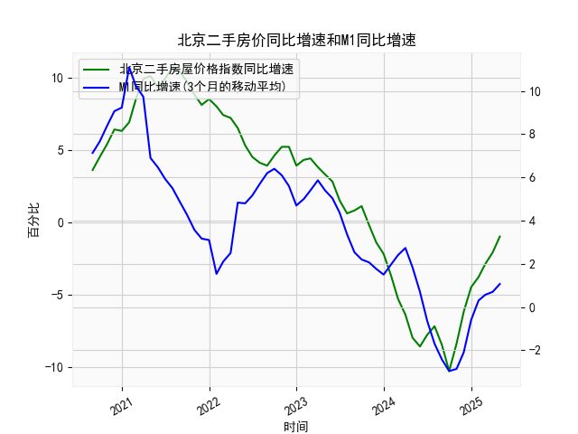

|            |   北京二手房屋价格指数同比增速 |   M1同比增速 |   M1同比增速(3个月的移动平均) |
|:-----------|-------------------------------:|-------------:|------------------------------:|
| 2023-09-30 |                            1.1 |          2.1 |                      2.2      |
| 2023-10-31 |                           -0.2 |          1.9 |                      2.06667  |
| 2023-11-30 |                           -1.4 |          1.3 |                      1.76667  |
| 2023-12-31 |                           -2.2 |          1.3 |                      1.5      |
| 2024-01-31 |                           -3.7 |          3.3 |                      1.96667  |
| 2024-02-29 |                           -5.3 |          2.6 |                      2.4      |
| 2024-03-31 |                           -6.4 |          2.3 |                      2.73333  |
| 2024-04-30 |                           -8   |          0.6 |                      1.83333  |
| 2024-05-31 |                           -8.6 |         -0.8 |                      0.7      |
| 2024-06-30 |                           -7.8 |         -1.7 |                     -0.633333 |
| 2024-07-31 |                           -7.2 |         -2.6 |                     -1.7      |
| 2024-08-31 |                           -8.5 |         -3   |                     -2.43333  |
| 2024-09-30 |                          -10.3 |         -3.3 |                     -2.96667  |
| 2024-10-31 |                           -8.4 |         -2.3 |                     -2.86667  |
| 2024-11-30 |                           -6.2 |         -0.7 |                     -2.1      |
| 2024-12-31 |                           -4.5 |          1.2 |                     -0.6      |
| 2025-01-31 |                           -3.8 |          0.4 |                      0.3      |
| 2025-02-28 |                           -2.9 |          0.1 |                      0.566667 |
| 2025-03-31 |                           -2.1 |          1.6 |                      0.7      |
| 2025-04-30 |                           -1   |          1.5 |                      1.06667  |

### 1. 北京二手房价同比增速与M1增速的相关性及影响逻辑

**相关性表现**：  
北京二手房价同比增速与M1同比增速呈现一定的**正相关性**。从数据看：  
- **扩张阶段（2020年8月至2021年中期）**：M1增速从7.1%攀升至11.1%，同期房价增速从3.6%升至10.7%。货币宽松推动流动性充裕，刺激购房需求。  
- **紧缩阶段（2021年中至2023年）**：M1增速回落至负区间（最低-2.97%），房价增速同步转负（最低-10.3%），反映资金收紧对房市的压制。  
- **近期（2024年12月至2025年4月）**：M1增速从-0.6%反弹至1.07%，房价跌幅从-3.8%收窄至-1.0%，流动性改善带动市场预期修复。  

**影响逻辑**：  
- **流动性传导**：M1增长提升市场流动性，降低融资成本，刺激购房意愿和企业开发投资，直接推高房价。  
- **政策联动**：M1增速常受货币政策（如降准、降息）影响，政策宽松周期中房贷利率下降，进一步强化房价上涨动力。  
- **预期效应**：M1扩张释放经济复苏信号，增强购房者对未来收入的乐观预期，促进市场需求释放。

---

### 2. 近期投资机会分析（聚焦最近4个月）

#### 数据变化特征（2025年1月至4月）：  
| 指标            | 1月   | 2月    | 3月    | 4月（本月） | 趋势     |
|-----------------|-------|--------|--------|------------|----------|
| 二手房价同比增速 | -2.9% | -2.1% | -1.0% | -1.0%     | **跌幅持续收窄**（近4个月改善2.8个百分点） |
| M1同比增速       | 0.3%  | 0.57%  | 0.7%   | 1.07%      | **加速回升**（近4个月提升1.4个百分点） |

#### 潜在投资机会：  
1. **房地产板块拐点布局**  
   - **核心逻辑**：二手房价跌幅连续4个月收窄，叠加M1增速回升，反映市场流动性改善和购房需求触底反弹。  
   - **机会方向**：  
     - **优质房企**：现金流稳健的头部房企（如保利、万科）有望受益于政策宽松及市场回暖。  
     - **地产服务链**：房产中介、家装建材（如东方雨虹）需求预期提升。  

2. **金融板块预期修复**  
   - **核心逻辑**：M1增速回升至1.07%（近4个月新高），预示银行存贷业务需求回升，不良率压力缓解。  
   - **机会方向**：  
     - **商业银行**：净息差触底反弹叠加信贷扩张预期，关注零售业务占比高的银行（如招商银行）。  

3. **消费复苏联动机会**  
   - **核心逻辑**：房价企稳改善居民财富预期，M1增长提振消费信心，推动可选消费（家电、汽车）回暖。  
   - **机会方向**：  
     - **家电龙头**：二手房交易回暖带动家电换新需求（如美的集团）。  

4. **短期流动性敏感资产**  
   - **核心逻辑**：M1增速加速回升显示短期流动性宽松，利好小盘成长股及高beta板块（如科技、新能源）。  

#### 本月关键信号（4月数据）：  
- **房价跌幅收窄停滞（-1.0%持平于3月）**：可能反映政策效果进入平台期，需关注后续政策加码（如限购松绑）。  
- **M1增速跳升（0.7%→1.07%）**：指向流动性进一步宽松，短期市场风险偏好或提升，适合配置弹性标的（如券商、科技ETF）。  

---

### 总结  
近期M1与房价增速的同步改善提示房地产及相关产业链的布局窗口，需结合政策动态（如“保交楼”资金落地、存量房贷利率调整）把握结构性机会，同时关注流动性敏感资产的短期弹性。