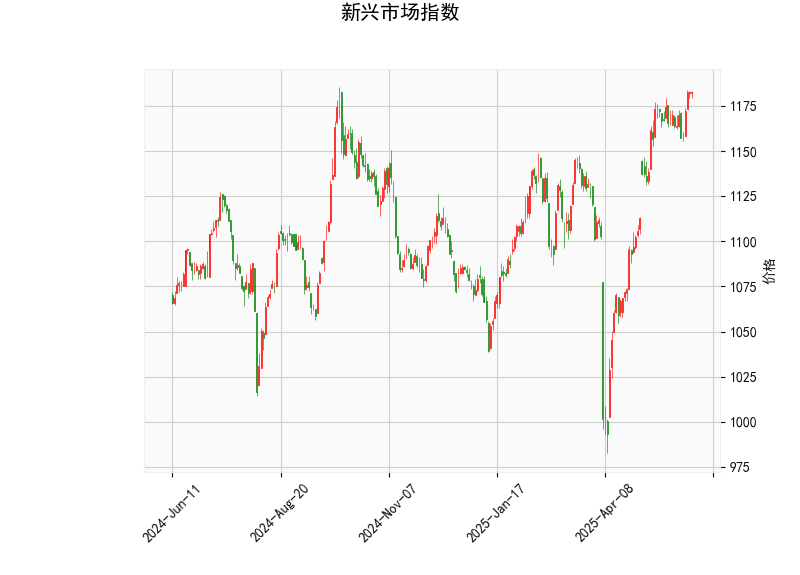

### 新兴市场指数的技术分析结果分析

#### 1. 对技术指标的整体评估
新兴市场指数的当前价格为1182.93，这反映了近期市场波动中的一个相对稳定点位。以下是对关键技术指标的详细分析：

- **RSI（Relative Strength Index，相对强弱指数）**：RSI值为66.46，这表明市场处于轻微超买状态。通常，RSI超过70被视为超买信号，暗示可能的回调风险。然而，66.46仍处于中性偏上区域，表明短期内多头力量较强，但如果持续上升，可能引发卖压。
  
- **MACD（Moving Average Convergence Divergence，移动平均收敛散度）**：MACD线值为15.06，信号线值为16.01，MACD直方图（Hist）为-0.95。这显示MACD线已跌破信号线，形成一个看跌信号（称为“死亡交叉”）。这暗示短期动量可能转向负面，尽管MACD整体水平仍为正值，表明上行趋势尚未完全逆转。投资者应关注直方图的持续性，如果负值扩大，可能会确认进一步的下行风险。

- **布林带（Bollinger Bands）**：上轨为1220.81，中轨为1122.18，下轨为1023.55。当前价格1182.93位于中轨上方但接近上轨，表明价格处于相对高位。这种位置通常暗示市场波动性增加，可能出现向中轨或下轨的回调。如果价格突破上轨（1220.81），可能延续上行趋势；反之，若回落，可能测试中轨支撑。

- **K线形态**：检测到的形态包括CDLDOJI、CDLDRAGONFLYDOJI、CDLHANGINGMAN、CDLLONGLEGGEDDOJI和CDLTAKURI。这些形态多为犹豫型或潜在反转信号：
  - CDLDOJI和CDLLONGLEGGEDDOJI表示市场不确定性，买卖力量均衡，可能预示反转或横盘。
  - CDLDRAGONFLYDOJI和CDLTAKURI通常暗示看涨反弹，但需结合其他指标确认。
  - CDLHANGINGMAN可能表示看跌压力，尤其在高位出现。
  整体来看，这些形态反映了市场缺乏明确方向，短期内可能出现整理或小幅回调。

综合而言，技术指标显示新兴市场指数处于相对强势但脆弱的位置。RSI的超买信号与MACD的看跌交叉相结合，暗示潜在回调风险，而布林带和K线形态则强化了市场不确定性。如果无重大外部事件（如经济数据或地缘政治因素），指数可能进入横盘整理阶段。

#### 2. 近期可能存在的投资或套利机会和策略判断
基于上述分析，新兴市场指数短期内可能面临回调，但也存在反弹机会。以下是对潜在投资或套利机会的判断及策略建议：

- **可能的机会**：
  - **回调机会**：RSI超买和MACD看跌信号表明，指数可能从当前高位回落至中轨（1122.18）附近，这为逢低买入提供机会。K线形态的犹豫特征也支持短期修正，而不是大幅崩盘。
  - **套利潜力**：在新兴市场（如中国、印度或巴西等成分股较重的指数），跨市场套利机会可能存在。例如，如果新兴市场指数与发达市场（如美股）或特定商品（如大宗商品）相关性增强，可以通过统计套利（如指数期货与现货价差）捕捉异常波动。但需注意，当前不确定性可能放大套利风险。
  - **反弹机会**：若K线形态（如Dragonfly Doji）得到确认，且价格守住中轨支撑，短期反弹可能发生，尤其在全球风险偏好上升时。

- **投资策略建议**：
  - **保守策略**：观望为主，避免追高。建议设置止损在布林带上轨（1220.81）附近，等待MACD直方图转正后再入场。适合风险厌恶的投资者，通过持有现金或低波动资产（如债券）规避短期风险。
  - **积极策略**： 
    - **做空或卖出**：如果RSI继续上升至70以上，可考虑短期做空指数期货或相关ETF（如EEM），目标位在中轨（1122.18）。结合K线形态的潜在反转信号，设定止盈止损以控制风险。
    - **逢低买入**：在价格回落至中轨附近时，买入指数基金或相关股票，目标反弹至上轨（1220.81）。这可结合RSI回落到50以下作为进场信号。
  - **套利策略**： 
    - **指数间套利**：如果新兴市场指数与特定新兴经济体（如A股或巴西Bovespa）价差扩大，可通过多头/空头组合（如多新兴指数、空相关单一市场）进行套利。需监控全球流动性变化，确保价差收敛。
    - **期权策略**：购买看跌期权（Put Option）作为对冲，成本较低。若预期回调，可在价格回落时滚动期权头寸。
    
总体风险提示：新兴市场易受全球经济、地缘政治和货币政策影响（如美联储加息）。建议结合基本面分析（如经济增长数据）验证技术信号，并控制仓位不超过总资产的30%。如果市场不确定性加剧，优先选择流动性强的工具进行操作。