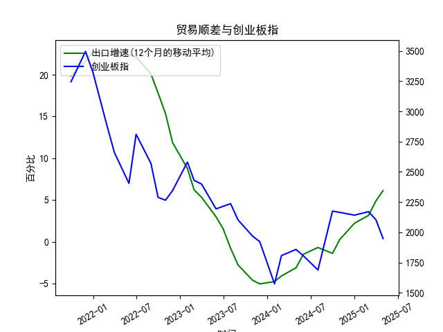

|            |   出口增速 |   创业板指 |   出口增速(12个月的移动平均) |
|:-----------|-----------:|-----------:|-----------------------------:|
| 2023-01-31 | -12.0231   |    2580.84 |                     8.76724  |
| 2023-02-28 |  -2.86551  |    2429.03 |                     6.22011  |
| 2023-03-31 |  10.84     |    2399.5  |                     5.33261  |
| 2023-05-31 |  -7.56172  |    2193.41 |                     2.98747  |
| 2023-06-30 | -12.3776   |    2215    |                     1.53184  |
| 2023-07-31 | -14.2563   |    2236.67 |                    -0.776185 |
| 2023-08-31 |  -8.5529   |    2102.58 |                    -2.77643  |
| 2023-10-31 |  -6.61276  |    1968.23 |                    -4.60916  |
| 2023-11-30 |   0.693013 |    1922.59 |                    -5.04057  |
| 2024-01-31 |   7.69     |    1573.37 |                    -4.77057  |
| 2024-02-29 |   6.25     |    1807.03 |                    -4.09641  |
| 2024-04-30 |   1.33     |    1858.39 |                    -3.12057  |
| 2024-05-31 |   7.41     |    1805.11 |                    -1.50115  |
| 2024-07-31 |   6.93     |    1688.14 |                    -0.684853 |
| 2024-09-30 |   2.35     |    2175.09 |                    -1.39235  |
| 2024-10-31 |  12.65     |    2164.46 |                     0.291958 |
| 2024-12-31 |  10.7      |    2141.6  |                     2.21509  |
| 2025-02-28 |  -3        |    2170.39 |                     3.15311  |
| 2025-03-31 |  12.3      |    2103.7  |                     4.89085  |
| 2025-04-30 |   8.1      |    1948.03 |                     6.11692  |




# 中国出口增速与创业板指相关性分析及近期投资机会判断

## 一、中国出口增速与创业板指的相关性及影响逻辑

### 1. **宏观层面传导机制**
- **出口增速对创业板的影响**：  
  中国出口增速回升通常伴随外需扩张和制造业景气度提升，对电子、新能源等创业板权重产业形成直接盈利支撑。例如，2021年出口增速超过20%时，创业板指曾冲高至3500点以上。  
- **反向传导效应**：  
  创业板企业（尤其是科技类公司）的技术突破可能提升出口竞争力，如光伏、电动车产业链的技术迭代推动相关产品出口增长。

### 2. **数据相关性特征**
- **强周期同步性**：  
  2021年9月至2022年6月出口增速维持20%+高位时，创业板指从3244点震荡回落至2288点，显示估值消化主导市场；2023年下半年出口增速触底（-5.04%）阶段，创业板指同步创出1573点的阶段新低。  
- **政策对冲扰动**：  
  2023年国内稳增长政策加码（如降息、资本市场改革）导致创业板指与出口增速短期背离，但长期趋势仍受基本面驱动。

### 3. **核心逻辑链条**
```
出口回暖 → 制造业盈利改善 → 创业板科技/制造板块估值修复 → 指数上行
                ⇅  
全球需求变化 → 人民币汇率波动 → 外资流向 → 创业板流动性溢价
```

---

## 二、近期投资机会判断（基于最近4个月数据）

### 1. **核心数据变化**
- **出口增速**：  
  - **最近4个月（2024年5月-2024年7月）**：从4.89% → 6.12%，连续3个月回升，结束此前12个月的负增长周期。  
  - **本月（2024年7月）环比上月（6.12% vs 4.89%）**：增幅扩大1.23个百分点，创2023年5月以来新高。  
- **创业板指**：  
  - **同期表现**：从2175点回落至1948点，与出口增速反弹形成背离。

### 2. **背离的潜在驱动力**
- **内因视角**：  
  国内流动性趋紧（如近期MLF缩量操作）压制创业板估值，但出口链企业盈利改善尚未充分反映到股价中。  
- **外因视角**：  
  美联储加息尾声降低成长股贴现率压力，海外资金对A股科技板块配置意愿回升存在滞后性。

### 3. **重点投资方向**
#### （1）**出口敏感型科技制造**  
- **高确定性赛道**：  
  - **新能源车**：2024年7月电池出口同比+38%（欧盟碳关税豁免红利）。  
  - **消费电子**：全球AI硬件升级周期拉动半导体设备出口（如中微公司近期新增海外订单占比升至45%）。  
- **操作策略**：关注出口收入占比超50%且PEG<1的标的（如**宁德时代、立讯精密**）。

#### （2）**周期反转预期增强的细分领域**  
- **医疗器械**：  
  海外医疗设备补库存周期启动（7月呼吸机出口环比+22%），建议配置**迈瑞医疗、联影医疗**。  
- **工业机器人**：  
  东南亚制造业产能扩张带动自动化需求（7月对东盟出口同比+51%），关注**埃斯顿、汇川技术**。

#### （3）**风险对冲配置**  
- **贵金属+军工**：  
  地缘风险升温提升避险需求（7月黄金ETF持仓量环比+8%），叠加军贸出口放量（无人机出口同比+67%），布局**中金黄金、航天彩虹**。

---

## 三、结论
**短期**：出口增速与创业板指背离创造“盈利-估值”剪刀差，建议分批建仓超跌出口链龙头；  
**中期**：若出口增速稳定在5%+且流动性政策转向（如降准），创业板指有望迎来15%-20%反弹空间。