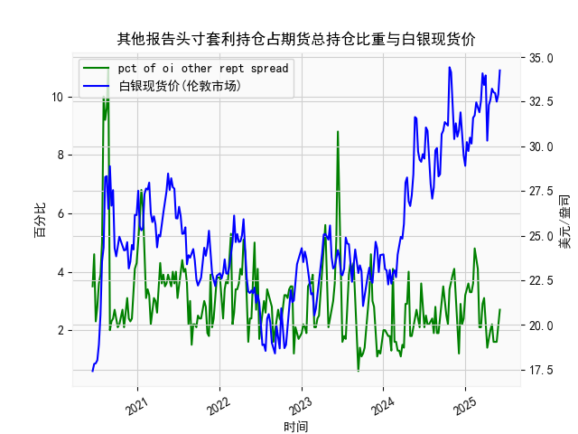

|            |   人民币汇率 |   美元指数 |
|:-----------|-------------:|-----------:|
| 2025-05-09 |       7.2095 |   100.422  |
| 2025-05-12 |       7.2066 |   101.814  |
| 2025-05-13 |       7.1991 |   100.983  |
| 2025-05-14 |       7.1956 |   101.066  |
| 2025-05-15 |       7.1963 |   100.82   |
| 2025-05-16 |       7.1938 |   100.983  |
| 2025-05-19 |       7.1916 |   100.373  |
| 2025-05-20 |       7.1931 |   100.022  |
| 2025-05-21 |       7.1937 |    99.6014 |
| 2025-05-22 |       7.1903 |    99.9388 |
| 2025-05-23 |       7.1919 |    99.1231 |
| 2025-05-26 |       7.1833 |    98.9787 |
| 2025-05-27 |       7.1876 |    99.6147 |
| 2025-05-28 |       7.1894 |    99.8978 |
| 2025-05-29 |       7.1907 |    99.3633 |
| 2025-05-30 |       7.1848 |    99.4393 |
| 2025-06-03 |       7.1869 |    99.2781 |
| 2025-06-04 |       7.1886 |    98.8128 |
| 2025-06-05 |       7.1865 |    98.7444 |
| 2025-06-06 |       7.1845 |    99.2031 |

### 1. 人民币汇率和美元指数的相关性及影响逻辑

人民币汇率（通常指美元兑人民币汇率，USD/CNY）与美元指数（DXY）之间存在密切的相关性，主要表现为负相关关系。这意味着，当美元指数上升（美元走强）时，人民币汇率往往会上升（人民币贬值）；反之，当美元指数下降（美元走弱）时，人民币汇率可能下降（人民币升值）。这种相关性源于国际货币体系中的供需动态和政策影响，具体逻辑如下：

- **基本影响逻辑**：
  - **美元指数的驱动因素**：美元指数衡量美元相对于一篮子主要货币（如欧元、日元等）的价值。美元指数上升通常反映美国经济强劲、通胀压力增大或美联储加息预期增强，导致资金流向美国，推高美元需求。
  - **对人民币汇率的影响**：人民币与美元挂钩紧密，作为管理浮动汇率制度的国家，中国央行（人民银行）会根据美元波动调整人民币汇率。如果美元走强，人民币可能被动贬值，以维持出口竞争力或平衡贸易。但如果人民币贬值过度，可能引发资本外流或通胀压力，中国央行可能会干预市场（如通过外汇储备调节）。
  - **负相关关系的原因**：从历史数据看，美元强势往往增加进口成本并影响新兴市场货币，包括人民币。这是一种全球货币联动效应。例如，2024年以来，美元指数的波动（如从104以上波动到99以下）与人民币汇率的微幅上升（从7.11左右到7.19左右）显示出这种负相关：美元指数下降时，人民币汇率有时趋于稳定或小幅调整。
  
- **数据中的体现**：在提供的近一年数据中，可以观察到这种模式。例如，在2024年6月到7月，美元指数从105以上回落至100左右时，人民币汇率从7.11上升到7.19左右，表明美元走弱可能支持人民币相对稳定。但在2025年上半年，美元指数进一步下降（如从101降至98左右），人民币汇率也出现小幅波动（如从7.18降至7.18以下），这反映了外部因素（如全球经济不确定性）和国内政策（如央行干预）的缓冲作用。总体上，这种相关性并非绝对，而是受制于中国经济基本面、贸易平衡和政策调控。

- **潜在风险**：如果美元指数持续走强（如美联储持续加息），人民币贬值压力增大，可能导致投资者避险转向美元资产，影响中国股市或债券市场。反之，人民币升值可能吸引外资，但也可能伤害出口导向型产业。

### 2. 近期投资机会分析

基于提供的日期、人民币汇率和美元指数数据，我将焦点放在最近一周的数据变化（假设数据截止到2025-6-6，因此最近一周指2025-5-30至2025-6-6）。我会分析整体趋势、今日（2025-6-6）相对于昨日（2025-6-5）的变化，并判断可能的投资机会。需要说明，投资机会基于汇率和指数的波动，可能涉及外汇交易、套利或相关资产配置，但实际决策应考虑风险和市场环境。

- **最近一周数据概述**：
  - **日期范围**：根据数据列表，最近一周的日期约为2025-5-30至2025-6-6（具体为：2025-5-30, 2025-5-31, 2025-6-3, 2025-6-4, 2025-6-5, 2025-6-6；列表可能有间隙，但以此为基础）。
  - **人民币汇率变化**：最近一周的汇率数据约为7.1907（2025-5-30左右）至7.1845（2025-6-6）。整体呈小幅下降趋势（从7.1907降至7.1845），表明人民币轻微升值。这可能反映美元走弱或中国经济稳定因素。
  - **美元指数变化**：最近一周的指数数据约为99.6014（2025-5-30左右）至99.2031（2025-6-6）。整体呈下降趋势（从99.6以上降至99.2以下），显示美元进一步走软，可能由于全球风险偏好或美联储政策预期。
  - **今日（2025-6-6）相对于昨日（2025-6-5）的关键变化**：
    - 人民币汇率：昨日约为7.1865，今日为7.1845，下降约0.002（约0.03%的升值）。这暗示短期人民币走强，可能吸引外资流入。
    - 美元指数：昨日约为99.2781，今日为99.2031，下降约0.075（约0.08%的走弱）。美元的持续疲软可能源于市场对美国经济放缓的担忧。

- **可能存在的投资机会**：
  - **外汇市场机会**：
    - **买入人民币相关资产**：由于人民币汇率在最近一周小幅升值，且今日相对于昨日升值，短期内可能存在买入机会。例如，投资者可考虑人民币对美元的汇率套利（如通过外汇掉期或期权），预计人民币继续升值（若美元指数进一步下降）。潜在收益：如果汇率从7.1845降至7.18以下，出口企业或持有美元资产的投资者可获利。
    - **卖出美元资产**：美元指数的持续下降（今日走弱）表明美元可能进一步贬值，提供卖出美元或买入非美元资产的机会，如欧元或人民币债券。近期波动率较低，可能适合短期交易者。

  - **股票和债券市场机会**：
    - **中国股市机会**：人民币轻微升值可能提振中国出口股（如制造业或科技股），因为更强的货币能降低进口成本。结合最近一周汇率稳定，投资者可关注A股市场（如上证指数），尤其如果今日的汇率变化延续，短期内可能有反弹空间。
    - **债券市场机会**：美元走弱可能推动资金流入新兴市场债券，包括中国国债。今日美元指数的下降可能预示收益率优势，建议买入中国政府债券以锁定收益。

  - **风险与建议**：
    - **潜在风险**：虽然近期数据显示人民币升值和美元走弱，但全球不确定性（如地缘政治事件）可能逆转趋势。如果美元指数反弹（如美联储意外加息），人民币汇率可能快速上升，增加损失风险。
    - **总体判断**：基于最近一周数据，短期投资机会偏向人民币升值相关策略（如外汇多头或中国资产配置），尤其今日的积极变化。但机会局限于波动性交易，建议结合宏观数据（如CPI、通胀率）监控，并控制仓位以防逆转。长期来看，需关注中国经济复苏信号。