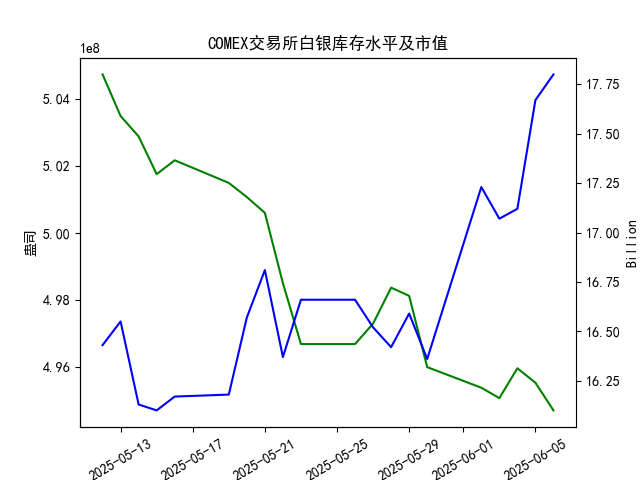

|            |   comex白银库存量 |   comex白银库存市值(billion) |   伦敦银现货价 |   上海金交所白银现货价 |   美元兑人民币汇率 |
|:-----------|------------------:|-----------------------------:|---------------:|-----------------------:|-------------------:|
| 2025-05-12 |       5.04719e+08 |                       32.56  |         32.02  |                   8124 |             7.2066 |
| 2025-05-13 |       5.03481e+08 |                       32.88  |         32.98  |                   8214 |             7.1991 |
| 2025-05-14 |       5.02874e+08 |                       32.085 |         32.885 |                   8172 |             7.1956 |
| 2025-05-15 |       5.0175e+08  |                       32.085 |         32.085 |                   7967 |             7.1963 |
| 2025-05-16 |       5.02164e+08 |                       32.195 |         32.135 |                   8062 |             7.1938 |
| 2025-05-19 |       5.0149e+08  |                       32.265 |         32.52  |                   8113 |             7.1916 |
| 2025-05-20 |       5.01069e+08 |                       33.065 |         32.5   |                   8057 |             7.1931 |
| 2025-05-21 |       5.00598e+08 |                       33.575 |         33.16  |                   8237 |             7.1937 |
| 2025-05-22 |       4.98504e+08 |                       32.84  |         32.725 |                   8268 |             7.1903 |
| 2025-05-23 |       4.96695e+08 |                       33.535 |         33.095 |                   8244 |             7.1919 |
| 2025-05-26 |       4.96695e+08 |                       33.535 |         33.095 |                   8239 |             7.1833 |
| 2025-05-27 |       4.97303e+08 |                       33.215 |         32.9   |                   8189 |             7.1876 |
| 2025-05-28 |       4.98373e+08 |                       32.955 |         33.285 |                   8211 |             7.1894 |
| 2025-05-29 |       4.98128e+08 |                       33.3   |         33.37  |                   8202 |             7.1907 |
| 2025-05-30 |       4.96008e+08 |                       32.975 |         33.08  |                   8192 |             7.1848 |
| 2025-06-02 |       4.95395e+08 |                       34.79  |         33.245 |                   8192 |             7.1848 |
| 2025-06-03 |       4.95085e+08 |                       34.475 |         34.25  |                   8405 |             7.1869 |
| 2025-06-04 |       4.95974e+08 |                       34.51  |         34.35  |                   8441 |             7.1886 |
| 2025-06-05 |       4.95544e+08 |                       35.665 |         35.795 |                   8456 |             7.1865 |
| 2025-06-06 |       4.9472e+08  |                       35.99  |         36.185 |                   8839 |             7.1845 |

### 投资机会分析

#### 近期数据变化概述
基于提供的2025年5月12日至6月6日的市场数据，我对最近一周（2025年5月30日至6月6日）的关键指标进行了分析，特别关注2025年6月6日（今日）相对于2025年6月5日（昨日）的变化。整体来看，白银市场显示出积极的上涨趋势，库存量持续下降，价格和市值均有明显提升，这可能源于需求增加或市场乐观情绪。以下是主要数据的总结和比较：

- **COMEX白银库存量（单位：吨）**：
  - 最近一周趋势：从2025年5月30日的4.960080e+08吨持续下降至2025年6月6日的4.947199e+08吨，整体下降约0.26%。
  - 今日 vs 昨日：今日库存量为4.947199e+08吨，昨日为4.955442e+08吨，下降约0.17%。库存持续减少可能反映出需求强劲或供应紧缩，这是白银价格上涨的潜在支撑因素。

- **COMEX白银库存市值（单位：十亿美元）**：
  - 最近一周趋势：从2025年5月30日的16.36亿美元上升至2025年6月6日的17.80亿美元，涨幅约8.8%，显示市值快速增长。
  - 今日 vs 昨日：今日市值17.80亿美元，昨日17.67亿美元，上涨约0.74%。这一变化与白银价格同步，表明市场价值在短期内得到提升。

- **伦敦市场白银现货价格（单位：美元/盎司）**：
  - 最近一周趋势：从2025年5月30日的33.080美元上升至2025年6月6日的36.185美元，涨幅约9.3%，反映出国际市场对白银的强劲需求。
  - 今日 vs 昨日：今日价格36.185美元，昨日35.795美元，上涨约1.1%。这表明短期内白银价格保持上行态势，可能受全球经济因素驱动。

- **上海金交所白银现货价格（单位：人民币/单位，假设为克）**：
  - 最近一周趋势：从2025年5月30日的8192.0人民币上升至2025年6月6日的8839.0人民币，涨幅约7.9%，涨幅高于伦敦市场，可能是由于本地需求或政策影响。
  - 今日 vs 昨日：今日价格8839.0人民币，昨日8456.0人民币，上涨约4.5%。这一显著涨幅暗示中国市场对白银的热情更高，值得关注汇率因素。

- **美元兑人民币汇率**：
  - 最近一周趋势：从2025年5月30日的7.1848略微下降至2025年6月6日的7.1845，整体变动微小（约0.005%）。
  - 今日 vs 昨日：今日汇率7.1845，昨日7.1865，美元略微贬值（约0.027%），意味着人民币相对升值。这可能为中国投资者提供轻微优势，尤其在持有人民币资产时。

总体，最近一周数据显示白银价格和市值双双上涨，而库存量下降，今日相对于昨日的变化进一步强化了这一趋势。伦敦和上海市场的价格涨幅均超1%，这可能是由于全球经济复苏、地缘政治事件或工业需求增加所致。

#### 可能存在的投资机会
基于上述数据变化，以下是近期（尤其是最近一周）的潜在投资机会。我主要聚焦于白银相关资产，结合价格上涨、库存下降和汇率微调等因素进行判断。机会评估基于短期市场信号，但需注意市场波动性。

1. **买入白银现货或期货**：
   - **机会理由**：伦敦市场白银价格从昨日的35.795美元上涨至今日的36.185美元，涨幅1.1%，而上海市场的涨幅更高（4.5%）。库存量持续下降（今日较昨日减少0.17%）往往预示需求强劲，价格可能进一步上行。投资者可考虑在COMEX或上海金交所买入白银现货，尤其如果预期全球需求（如工业或饰品）持续增长。
   - **潜在收益**：短期内，价格上涨趋势可能带来5-10%的回报（如上海市场的近期表现）。适合风险偏好较高的投资者。
   - **相关数据支持**：COMEX库存市值从昨日的17.67亿美元升至今日的17.80亿美元，验证了价值提升。

2. **投资白银ETF或相关基金**：
   - **机会理由**：白银价格的上涨（伦敦市场最近一周涨幅9.3%）使白银ETF（如跟踪COMEX或伦敦价格的基金）成为低门槛选项。今日价格较昨日的微涨（1.1%）表明短期动量强劲，加上美元微幅贬值（今日汇率7.1845 vs 昨日7.1865），这可能降低持有成本。
   - **潜在收益**：如果价格维持上行趋势，ETF可提供稳定回报，预计短期内2-5%。这对新手投资者友好，便于分散风险。
   - **相关数据支持**：上海市场今日的急剧上涨（4.5%）显示亚洲需求强劲，可能推动全球ETF表现。

3. **汇率套利机会（美元/人民币相关）**：
   - **机会理由**：美元兑人民币汇率从昨日的7.1865微降至今日的7.1845，人民币轻微升值。这为中国投资者提供机会，例如通过买入上海金交所的白银（今日价格8839.0人民币）并锁定汇率，避免美元波动风险。如果预期人民币继续小幅升值，投资者可考虑白银跨市场套利。
   - **潜在收益**：短期内，汇率变化虽小（约0.027%），但结合白银价格上涨，可能带来1-3%的额外收益。通过美元资产兑换人民币资产（如上海白银）可实现轻微套利。
   - **相关数据支持**：最近一周汇率稳定，今日变化微正向，配合白银价格的强劲表现。

4. **多元化投资组合调整**：
   - **机会理由**：结合COMEX库存下降和全球白银价格上涨，投资者可调整组合，增加白银权重（如混合伦敦和上海市场）。今日相对于昨日的积极变化（价格和市值均涨）表明这是一个进入点，尤其如果经济数据（如通胀或工业产出）持续向好。
   - **潜在收益**：通过多元化，降低单一市场风险，预计整体回报在3-7%。例如，今日上海市场的涨幅远超伦敦，显示区域机会。

#### 风险提示
尽管存在上述机会，但市场波动性高，投资者需谨慎：
- **价格回调风险**：白银价格急剧上涨（如上海市场今日涨幅4.5%）后可能出现回调，尤其如果全球需求减弱或经济数据转差。
- **库存下降的潜在问题**：今日库存量较昨日减少0.17%，若供应中断，可能加剧价格波动。
- **汇率不确定性**：美元微幅贬值（今日7.1845）可能逆转，影响跨市场投资。
- **整体建议**：聚焦短期（1-2周）机会，建议在投资前监控最新数据，并考虑止损策略。今日的积极变化（如价格上涨）是信号，但非保证未来趋势。