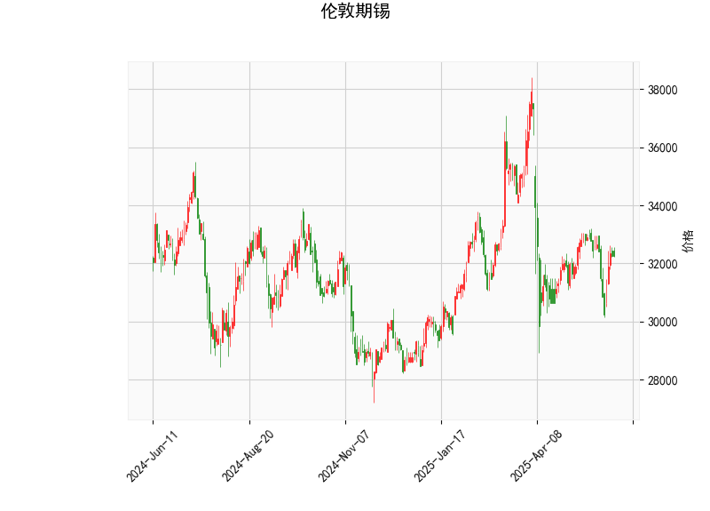

### 伦敦期锡技术分析解读

#### 1. 关键指标分析
**当前价**（32255）与布林带中轨（32779）：
- 当前价格位于布林带中轨（32779）下方，且靠近下轨（28930）。这表明市场处于**弱势区间**，但距离下轨支撑仍有一定空间，需警惕进一步下行风险。

**RSI（51.26）**：
- RSI处于中性区间（50附近），无明确超买或超卖信号。近期价格可能以震荡为主，但需结合其他指标判断方向性突破的可能性。

**MACD**：
- MACD线（-123.48）与信号线（-153.37）均为负值，但**柱状图值（29.89）**转正，显示空头动能减弱。MACD快线向信号线收敛，短期可能形成**底背离**，存在反弹机会。

**K线形态**：
- **CDLMATCHINGLOW**和**CDLSHORTLINE**均属看涨反转形态：
  - **CDLMATCHINGLOW**：两日收盘价相近且位于低位，暗示空头无力延续下跌。
  - **CDLSHORTLINE**：短实体小K线，显示市场犹豫，可能为趋势反转前兆。

---

#### 2. 潜在机会与策略建议

##### 机会方向
- **短期反弹机会**：MACD底背离信号 + K线看涨形态 + 布林带下轨支撑，价格可能测试中轨（32779）甚至上轨（36629）。
- **趋势延续风险**：若价格跌破下轨（28930），可能触发技术性抛售。

##### 具体策略
1. **多头策略**（保守型）：
   - **入场条件**：价格站稳中轨（32779）或MACD形成金叉。
   - **目标**：上轨（36629），对应潜在涨幅约13.5%。
   - **止损**：下轨下方2%（约28350）或前低支撑。

2. **套利策略**（跨期价差）：
   - 关注近远月合约价差变化。若技术面显示短期支撑有效，可做多近月合约、做空远月合约，捕捉价差收敛机会。

3. **事件驱动对冲**：
   - 结合供需端事件（如东南亚锡矿政策、新能源需求预期），在价格反弹至中轨时布局空单对冲基本面利空风险。

##### 风险提示
- MACD绝对值仍处负值区，需警惕反弹失败后加速下跌。
- 布林带开口缩窄，价格波动率下降，突破前需验证成交量的配合。