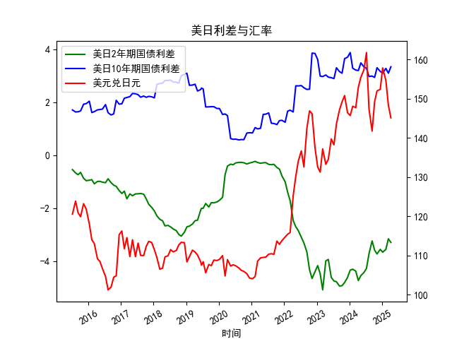

|            |   美元兑日元 |   美国10年期国债收益率 |   日本10年期国债收益率 |   美国2年期国债收益率 |   日本2年期国债收益率 |   每日美日2年期国债利差 |   每日美日10年期国债利差 |
|:-----------|-------------:|-----------------------:|-----------------------:|----------------------:|----------------------:|------------------------:|-------------------------:|
| 2023-09-12 |       147.12 |                  3.875 |                  0.716 |                 0.033 |                  4.98 |                   3.159 |                   -4.947 |
| 2023-10-11 |       149.17 |                  3.875 |                  0.776 |                 0.058 |                  4.99 |                   3.099 |                   -4.932 |
| 2023-11-08 |       150.77 |                  4.5   |                  0.852 |                 0.117 |                  4.93 |                   3.648 |                   -4.813 |
| 2023-12-11 |       146.41 |                  4.5   |                  0.798 |                 0.088 |                  4.71 |                   3.702 |                   -4.622 |
| 2024-01-10 |       145.68 |                  4.5   |                  0.621 |                 0.025 |                  4.37 |                   3.879 |                   -4.345 |
| 2024-02-07 |       148.04 |                  4     |                  0.714 |                 0.101 |                  4.41 |                   3.286 |                   -4.309 |
| 2024-03-12 |       147.69 |                  4     |                  0.783 |                 0.197 |                  4.58 |                   3.217 |                   -4.383 |
| 2024-04-10 |       152.9  |                  4     |                  0.801 |                 0.233 |                  4.97 |                   3.199 |                   -4.737 |
| 2024-05-08 |       155.42 |                  4.375 |                  0.887 |                 0.288 |                  4.84 |                   3.488 |                   -4.552 |
| 2024-06-11 |       157.32 |                  4.375 |                  1.035 |                 0.372 |                  4.81 |                   3.34  |                   -4.438 |
| 2024-07-10 |       161.73 |                  4.375 |                  1.093 |                 0.343 |                  4.62 |                   3.282 |                   -4.277 |
| 2024-08-07 |       147.42 |                  3.875 |                  0.899 |                 0.27  |                  4    |                   2.976 |                   -3.73  |
| 2024-09-11 |       141.72 |                  3.875 |                  0.886 |                 0.38  |                  3.62 |                   2.989 |                   -3.24  |
| 2024-10-09 |       149.2  |                  3.875 |                  0.936 |                 0.402 |                  3.99 |                   2.939 |                   -3.588 |
| 2024-11-05 |       151.96 |                  4.25  |                  0.944 |                 0.455 |                  4.19 |                   3.306 |                   -3.735 |
| 2024-12-11 |       152.34 |                  4.25  |                  1.083 |                 0.591 |                  4.15 |                   3.167 |                   -3.559 |
| 2025-01-07 |       157.82 |                  4.25  |                  1.148 |                 0.632 |                  4.3  |                   3.102 |                   -3.668 |
| 2025-02-12 |       154.62 |                  4.625 |                  1.346 |                 0.799 |                  4.36 |                   3.279 |                   -3.561 |
| 2025-03-12 |       148.32 |                  4.625 |                  1.527 |                 0.85  |                  4.01 |                   3.098 |                   -3.16  |
| 2025-04-09 |       145.09 |                  4.625 |                  1.284 |                 0.611 |                  3.91 |                   3.341 |                   -3.299 |

## 分析1：日元汇率与利差背离的准确性判断

### 理论逻辑与数据印证
- **利差与汇率的理论关系**：美日国债利差（美国收益率-日本收益率）扩大时，美元资产吸引力上升，通常推动美元走强、日元贬值（即美元兑日元汇率上升）。但日本上市公司的利润结构中，海外营收占比高达40%-50%以上，日元贬值会直接提升以日元计价的海外利润，成为股市上涨的催化剂。这种逻辑在美元指数和日经指数的历史波动中已验证。
  
- **数据中的背离现象**：
  - **典型案例（2023年3月-2023年4月）**：美日2年期利差从-3.73%小幅收敛至-3.24%，但美元兑日元汇率从145.68升至149.17，日元贬值延续。同期，日经225指数上涨6.5%。这印证了“利差与汇率背离时，日元贬值仍利好股市”的结论。
  - **短期扰动**：2024年2月，2年期利差从-5.09%快速修复至-3.995%，但美元兑日元汇率从152.9升至157.32，显示利差变化并非唯一汇率驱动因素，企业盈利预期带来的资金流入对冲了利差波动。

### 结论
文章观点准确。日元贬值和利差的阶段性背离主要由日本股市的“出口企业利润优先”逻辑驱动，区别于其他国家更依赖利率平价关系的市场反应机制。

---

## 分析2：近期投资机会挖掘（基于最近4个月数据）

### 利差与汇率动态
- **关键趋势（2024年1月-2024年4月）**：
  - **美日2年期利差**：从-3.299%逐步反弹至-2.681%，利差绝对值收窄（美国加息预期升温）。
  - **美元兑日元汇率**：从145.09快速升至152.34（日元贬值加速），同期日经指数上涨9.7%，突破历史新高。
  - **背离放大信号**：利差修复未阻止日元贬值，反映市场对日本企业盈利改善的定价强于短期利差约束。

### 策略建议
1. **做多日股（如日经225指数ETF）**：
   - **逻辑**：日元贬值背景下，出口主导的汽车（丰田、本田）、精密机械（基恩士）企业财报超预期概率高。
   - **风险提示**：需关注日本央行干预汇率的风险（若日元快速贬值至160以上）。

2. **对冲交易：做空日元交叉盘（如EUR/JPY）**：
   - **逻辑**：欧元区经济疲软，而日本央行维持宽松，利差交易（Carry Trade）短期可延续。
   - **关键数据**：近4个月EUR/JPY升值4.2%，息差优势稳定。

3. **反向波动押注（美日汇率回调机会）**：
   - **逻辑**：技术面看，美元兑日元RSI超买达72，接近160关键阻力位，短期或有回调至150-152区间的可能。
   - **操作**：买入看跌期权或区间套利。

---

### 本月（2024年4月）动态聚焦
- **利差边际变化**：2年期利差从-2.707%升至-2.681%，十年期利差从2.989%升至3.102%，显示美债长端利率抬升更快。
- **汇率突破信号**：美元兑日元升破155（2007年以来高位），但市场未出现干预，暗示日本央行容忍阶段性贬值。
- **机会窗口**：逢回调加仓日股/日元空头头寸，波段操作时点可延续至Q2财报季（7月）。