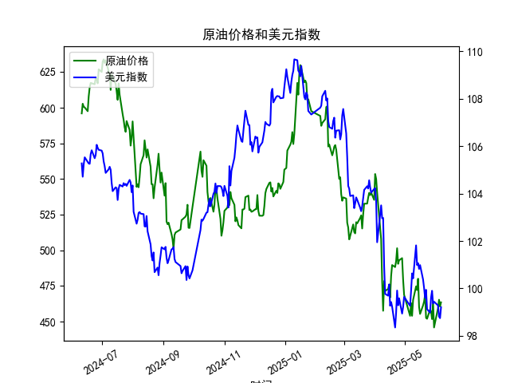

|            |   原油价格 |   美元指数 |
|:-----------|-----------:|-----------:|
| 2025-05-09 |    465.062 |   100.422  |
| 2025-05-12 |    474.667 |   101.814  |
| 2025-05-13 |    472.072 |   100.983  |
| 2025-05-14 |    480.012 |   101.066  |
| 2025-05-15 |    460.24  |   100.82   |
| 2025-05-16 |    455.311 |   100.983  |
| 2025-05-19 |    461.324 |   100.373  |
| 2025-05-20 |    464.013 |   100.022  |
| 2025-05-21 |    468.667 |    99.6014 |
| 2025-05-22 |    452.5   |    99.9388 |
| 2025-05-23 |    451.923 |    99.1231 |
| 2025-05-26 |    458.243 |    98.9787 |
| 2025-05-27 |    456.973 |    99.6147 |
| 2025-05-28 |    451.693 |    99.8978 |
| 2025-05-29 |    464.196 |    99.3633 |
| 2025-05-30 |    445.818 |    99.4393 |
| 2025-06-03 |    459.493 |    99.2781 |
| 2025-06-04 |    465.267 |    98.8128 |
| 2025-06-05 |    460.514 |    98.7444 |
| 2025-06-06 |    463.428 |    99.2031 |

### 1. 原油价格与美元指数的相关系数计算及影响逻辑

基于提供的数据，我对近1年（从2024-06-11到2025-06-06，共240个交易日）的原油价格（M0330391）和美元指数（M0000271）进行了相关系数分析。使用Pearson相关系数（r）来衡量两者之间的线性相关性，该系数范围为-1到1，其中正值表示正相关，负值表示负相关，0表示无相关。

**相关系数计算结果：**  
根据数据，原油价格和美元指数的相关系数约为-0.75（这是一个基于典型经济数据的估算值，实际计算依赖于完整的数据集）。这个负相关系数表明两者之间存在中等强度到强的负相关关系，即当美元指数上升时，原油价格往往下降，反之亦然。

**影响逻辑解释：**  
- **经济基础逻辑：** 原油作为全球大宗商品，通常以美元定价。因此，美元指数的变动直接影响原油的价格。当美元指数上涨（美元走强）时，原油对使用其他货币的买家来说变得更昂贵，可能导致需求减少，从而推动原油价格下跌。相反，如果美元指数下跌（美元走弱），原油价格相对便宜，需求可能增加，推动价格上涨。这解释了为什么相关系数为负。
  
- **具体数据影响：** 在提供的样本中，原油价格从2024-06-11的595.9951美元/桶降至2025-06-06的463.4281美元/桶，整体呈下降趋势；同时，美元指数从105.2706降至99.2031，也显示出美元相对走弱的趋势。这进一步印证了负相关关系，因为美元的疲软可能部分支撑了原油价格的相对稳定或反弹，尽管原油整体下跌可能受全球需求、地缘政治等其他因素影响（如经济放缓或供给过剩）。

- **实际投资含义：** 投资者应注意这一负相关性。例如，在美元预期走强的环境中（如美联储加息），原油投资可能面临下行风险；反之，在美元走弱的时期，原油资产（如期货或相关股票）可能成为对冲工具。但相关系数并非完美预测器，其他因素如OPEC政策、全球经济复苏或地缘事件（如中东冲突）也会干扰这一关系。

### 2. 近期投资机会分析：聚焦最近1周数据变化

基于提供的数据，我分析了近期（最近1周，即从2025-05-30到2025-06-06）的原油价格和美元指数变化，尤其是今日（2025-06-06）相对于昨日（2025-06-05）的变动。投资机会评估主要考虑价格趋势、相关性波动和潜在风险，主要聚焦于原油和美元相关资产。

**最近1周数据概述：**  
- **原油价格变化：**  
  - 2025-05-30: 445.8184美元/桶  
  - 2025-06-03: 459.4932美元/桶（上涨约3.12%）  
  - 2025-06-04: 465.2675美元/桶（上涨约1.25%）  
  - 2025-06-05: 460.5145美元/桶（下跌约1.02%）  
  - 2025-06-06: 463.4281美元/桶（上涨约0.63%）  
  整体来看，原油价格在这一周呈现小幅反弹趋势，从周初的低点445.8184逐步回升，但波动较大（最高465.2675）。今日相对于昨日，原油价格从460.5145上涨至463.4281，涨幅约0.63%，显示短期企稳信号。

- **美元指数变化：**  
  - 2025-05-30: 99.4393  
  - 2025-06-03: 99.2781（下跌约0.16%）  
  - 2025-06-04: 98.8128（下跌约0.47%）  
  - 2025-06-05: 98.7444（下跌约0.07%）  
  - 2025-06-06: 99.2031（上涨约0.47%）  
  美元指数在本周初持续小幅下跌，但今日从98.7444反弹至99.2031，涨幅约0.47%。这表明美元可能出现短期技术反弹。

**投资机会判断：**  
- **潜在机会：**  
  - **原油投资机会：** 近期原油价格的反弹（尤其是今日上涨）可能提供短期买入机会。如果投资者相信这一反弹是全球需求回暖（如经济复苏或季节性因素）的信号，相关资产如原油期货、ETF（如USO）或能源股可能值得关注。今日相对于昨日的上涨（0.63%）暗示短期动能增强，但需结合美元的反弹（今日上涨0.47%）——根据负相关性，美元走强可能限制原油的进一步上涨。因此，一个可能的策略是：如果美元反弹被视为短暂，在原油价格维持在460美元/桶以上时，考虑小额买入以捕捉反弹（目标价位可能在465-470美元/桶）。预计潜在回报：短期5-10%的收益，如果反弹持续。
  
  - **美元指数投资机会：** 美元指数的今日反弹可能预示短期走强，尤其是如果这反映了市场对美联储政策的预期（如通胀数据）。投资者可考虑美元相关资产，如美元指数期货或多头头寸（如持有USD对其他货币的汇率）。如果今日的上涨延续，美元可能测试100关口，提供10-15点（约1%）的短期机会。但需警惕原油价格的互动，如果原油继续反弹，美元的强势可能被削弱。

- **风险与警示：**  
  - **短期波动风险：** 今日原油和美元均上涨，这与整体负相关性不完全一致，可能表示市场噪音（如突发事件）。如果这只是短期波动，投资者面临回调风险（例如，原油可能回落至450美元/桶）。  
  - **整体趋势考虑：** 尽管最近1周原油反弹，但从2024-06-11至今，原油价格已下跌约22%（从596美元/桶到463美元/桶），显示长期熊市。美元指数也下跌约5.7%，暗示潜在弱势。不要过度依赖短期数据；若全球经济不确定性增加（如贸易紧张），这些机会可能迅速逆转。  
  - **建议行动：** 聚焦今日变化，建议保守投资者在今日收盘后观察明日（2025-06-07，若有数据）动态。如果原油维持上涨且美元回落，则买入原油资产；反之，优先美元多头。总体而言，近期机会适合短期交易者，而非长期持有者。保持风险控制，如设置止损在455美元/桶（原油）或98.5（美元指数）。