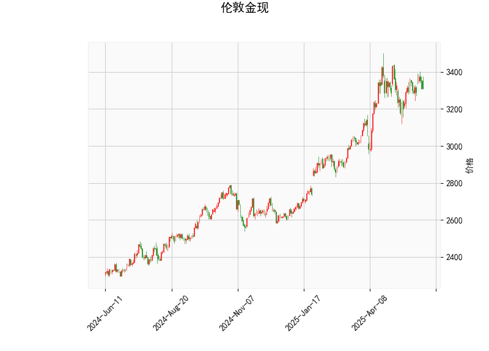

### 伦敦金现的技术分析结果解读

#### 1. 对技术指标的详细分析
基于提供的伦敦金现（现货黄金）技术分析数据，我们可以从多个指标入手，评估当前市场的态势。以下是对各指标的逐一解读：

- **当前价格（Current Price）**: 价格为3309.47美元/盎司。这是一个相对稳定的水平，位于近期交易区间的中部，表明市场可能处于盘整阶段，但尚未出现极端波动。

- **RSI（Relative Strength Index，相对强弱指数）**: 值约为51.73。这表明市场处于中性状态（RSI在30-70区间内为中性）。RSI略高于50，暗示短期内买方力量稍占上风，但尚未进入超买区域（高于70）。如果RSI继续上升，可能预示价格反弹；反之，若跌破50，则可能转为弱势。

- **MACD（Moving Average Convergence Divergence，移动平均收敛散度）**: MACD线值为22.75，信号线为25.56，柱状图（MACD Hist）为-2.82（负值）。MACD线低于信号线，显示出看跌信号，这通常表示短期卖方主导市场，可能有修正或下行风险。柱状图的负值进一步确认了这一趋势，但幅度较小（-2.82），建议观察是否出现金叉（MACD线向上穿越信号线），这可能逆转为看涨。

- **Bollinger Bands（布林带）**: 上轨为3482.80，中轨为3230.43，下轨为2978.06。目前价格（3309.47）位于中轨和上轨之间，距离上轨仍有空间。这反映市场波动性适中，没有极端超买（价格接近上轨）或超卖（价格接近下轨）。如果价格向上突破上轨，可能触发强势上涨；反之，若跌破中轨，则可能测试下轨支撑。

- **K线形态（Candlestick Patterns）**: 检测到两个形态——CDLCLOSINGMARUBOZU（收盘十字星）和CDLMATCHINGLOW（匹配低点）。
  - CDLCLOSINGMARUBOZU表示一根实体较长的蜡烛线，通常预示强势趋势（可能看涨或看跌），但需结合其他指标确认方向。
  - CDLMATCHINGLOW暗示价格触及先前低点，形成潜在支撑位，这可能表示市场底部信号或反转机会。如果价格在此水平企稳，买方可能介入；否则，可能继续下探。

总体而言，当前市场呈现中性偏弱特征。RSI显示轻微强势，但MACD的负直方图和K线形态的潜在支撑位表明短期内可能存在下行压力。价格在中Bollinger Band附近，增加了市场的不确定性，投资者需警惕波动。

#### 2. 近期可能存在的投资或套利机会和策略
基于上述分析，我们可以判断伦敦金现的潜在机会。黄金市场受全球经济、地缘政治和利率影响较大，因此策略应结合风险管理。以下是针对近期可能的投资和套利机会的分析及建议：

- **可能的机会**:
  - **短期下行机会**: MACD的负直方图和K线形态（如CDLMATCHINGLOW）暗示潜在修正。如果价格跌破中Bollinger Band（3230.43），可能向下轨（2978.06）测试，这为做空或卖出提供机会。
  - **反弹机会**: RSI在51.73附近，接近中性上沿，如果出现买盘推动（如金叉信号），价格可能向上测试上Bollinger Band（3482.80），适合逢低买入。
  - **套利机会**: 黄金现货与期货价差可能存在套利空间，尤其在波动性增加时（如地缘事件）。此外，如果市场波动率上升，期权策略（如卖出看涨期权）可用于捕捉波动性溢价。
  - **整体风险**: 当前中性市场可能导致区间震荡，适合短期交易者，但长期投资者需关注外部因素（如美联储政策或通胀数据）。

- **推荐策略**:
  - **看跌策略**: 如果MACD柱状图继续恶化或价格跌破中轨，考虑做空现货黄金。止损设在中轨上方（例如3350），目标价位为下轨附近（2980）。这适合短期交易，风险控制在1-2%的仓位。
  - **看涨策略**: 等待RSI突破60并出现K线反转信号（如CDLCLOSINGMARUBOZU向上），然后在支撑位（如3300）买入。目标为上轨（3482），止盈设在上轨下方，止损在中轨下方。这可结合趋势跟踪工具，如移动平均线。
  - **套利策略**: 利用现货与期货价差进行无风险套利，例如在现货价格低于期货时买入现货并卖出期货（或反之）。对于波动性套利，可采用铁蝶式期权策略：在中轨附近卖出跨式期权，捕捉价格在区间内震荡的收益。需监控交易成本和流动性。
  - **风险管理建议**: 无论采用何策略，都应设置严格的止损（如基于Bollinger Bands），并结合基本面分析（如黄金ETF流入或美元走势）。建议新手从模拟交易开始，控制仓位不超过总资金的5-10%。

总之，近期伦敦金现市场可能处于震荡阶段，投资者可关注MACD和Bollinger Bands的交叉信号作为入场点。策略应灵活调整，以适应潜在的全球事件影响。