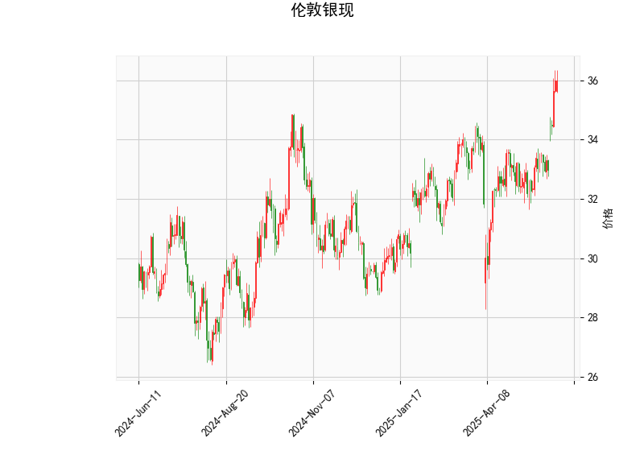

### 1. 伦敦银现技术分析结果解析

#### **价格与布林轨道**  
- **当前价**为35.9782，**布林上轨**为35.3461，下轨为30.7879，中轨33.0670。  
- **价格突破上轨**：当前价显著高于布林上轨，表明白银短期处于**超买状态**，需警惕回调风险。但若价格持续站稳上轨，可能暗示强势上涨趋势的延续。  
- **布林带宽**：上下轨间距约4.56，显示价格波动性较大，后续需关注价格是否回归中轨或形成新的震荡区间。

#### **RSI指标**  
- **RSI值为71.39**，明显高于70的超买阈值。历史上RSI突破70后，白银价格常出现短期调整或横盘整理，需结合其他指标判断是否进入趋势强化阶段。

#### **MACD指标**  
- **MACD线（0.713）> 信号线（0.391）**，MACD柱状图（0.322）为正值且扩张，显示多头动能增强，短期上涨趋势可能延续。  
- **潜在风险**：若MACD柱状图增速放缓或缩量，可能预示趋势动能减弱。

#### **K线形态**  
- **CDLGAPSIDESIDEWHITE**：即“向上跳空并列阳线”，通常出现在上升趋势中，表明多方占据主导，短期可能延续涨势，但若跳空缺口未回补且价格横盘，则需警惕反转信号。

---

### 2. 近期投资/套利机会与策略建议

#### **短期交易机会**  
1. **超买回调策略**：  
   - **看空信号**：当前价格突破布林上轨+RSI超买，可轻仓试空，止损设于36.20（近期高点上方），目标看向布林中轨33.06附近（约2.9%潜在跌幅）。  
   - **风险**：若MACD柱状图持续放大，可能触发逼空行情，需严格止损。  

2. **趋势延续策略**：  
   - **看多信号**：若价格站稳布林上轨且MACD柱状图继续扩张，可追多，目标看向前高36.20，止损35.34（布林上轨下方）。  

#### **中长线策略**  
- **跨期套利**：若期货市场近月合约贴水（Backwardation），可考虑“买近抛远”套利，但需结合库存和利率环境分析。  
- **跨品种对冲**：白银与黄金（或铜）比值若偏离历史均值，可做多低估品种、做空高估品种，需监控宏观经济数据和避险情绪。

#### **风险提示**  
- **宏观扰动**：美联储利率决策、地缘冲突或美元指数波动可能打破技术信号逻辑。  
- **仓位管理**：当前高RSI和布林突破需轻仓操作，避免单边重仓押注。

---

### 总结  
短期技术面**偏多但超买**，建议回调至中轨附近逢低做多，或等待趋势确认后右侧追涨；套利需结合跨市场价差结构。交易中需优先控制杠杆，同步关注美国通胀数据和央行政策动向。