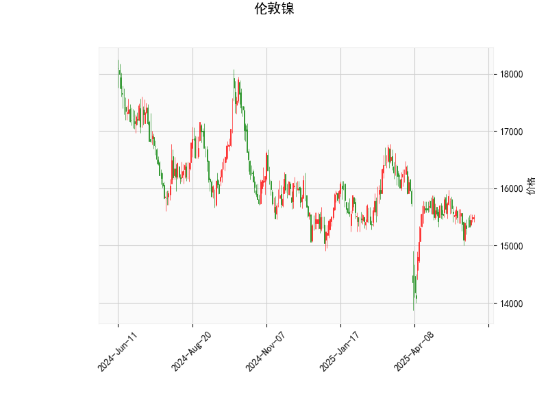

### 伦敦镍技术分析结果解析

#### 1. 对技术分析结果的详细分析
以下是对提供的伦敦镍技术指标的逐项分析，基于当前价格和各项指标的数值，旨在揭示市场可能的趋势和信号。

- **当前价格（Current Price）**: 15490.0  
  当前价格位于布林带的中轨（15601.07）附近，略低于中轨。这表明市场处于相对中性的位置，价格可能在短期内维持盘整。如果价格继续向上逼近中轨，可能出现反弹信号；反之，如果跌破下轨（14664.52），则可能进入超卖区域。

- **RSI（Relative Strength Index）**: 49.50  
  RSI值接近50的中性水平（30-70为中性区），显示市场目前没有明显的超买或超卖状况。这暗示短期内价格可能保持稳定，但如果RSI跌破30，将表示超卖（潜在买入机会），或如果升至70以上，则为超买（潜在卖出信号）。当前RSI的微弱中性状态反映了市场缺乏强烈动量，可能处于犹豫期。

- **MACD（Moving Average Convergence Divergence）**:  
  - MACD线：-50.94  
  - MACD信号线：-54.13  
  - MACD柱状图（Hist）：3.19（正值）  
  MACD线高于信号线（-50.94 > -54.13），且柱状图为正值，这是一个轻微的看涨信号，表明短期动量可能开始转向向上。然而，MACD整体处于负值区域，显示市场尚未完全摆脱下行压力。如果MACD线继续向上交叉信号线，将强化买入信号；反之，如果柱状图转为负值，可能确认下行趋势。

- **布林带（Bollinger Bands）**:  
  - 上轨（Upper Band）：16537.63  
  - 中轨（Middle Band）：15601.07  
  - 下轨（Lower Band）：14664.52  
  当前价格（15490.0）位于中轨和下轨之间，表明市场处于窄幅波动或盘整阶段。布林带的宽度相对适中，显示波动性不高。如果价格向上突破中轨，可能测试上轨并引发上涨；如果下破下轨，则可能进入超卖区，增加反弹风险。总体而言，布林带显示短期市场缺乏强烈方向性。

- **K线形态（Candlestick Patterns）**:  
  提供的K线形态包括：[CDLDOJI, CDLGAPSIDESIDEWHITE, CDLHIGHWAVE, CDLLONGLEGGEDDOJI, CDLSHORTLINE, CDLSPINNINGTOP]。这些形态多以不确定性和波动为主：  
  - CDLDOJI、CDLLONGLEGGEDDOJI 和 CDLSPINNINGTOP 表示市场犹豫和潜在反转，可能预示价格在关键点位（如中轨附近）出现方向选择。  
  - CDLGAPSIDESIDEWHITE 和 CDLHIGHWAVE 暗示较高的波动性和可能的趋势延续，但不明确方向。  
  - CDLSHORTLINE 反映小幅波动，表明市场缺乏强势推动。  
  整体K线形态显示近期市场可能处于盘整或整理阶段，投资者需警惕突然的反转或突破。

**总体市场解读**:  
从以上指标来看，伦敦镍当前处于中性偏看涨的盘整状态。RSI和布林带支持市场稳定，MACD的正柱状图提供轻微上涨信号，但K线形态的犹豫性提醒潜在风险。如果外部因素（如全球经济数据或供需变化）介入，可能触发突破。短期内，价格可能在14664-16538的布林带范围内波动。

#### 2. 近期可能存在的投资或套利机会和策略
基于上述分析，以下是对近期投资或套利机会的判断和建议策略。需注意，市场充满不确定性，实际操作应结合风险管理（如止损设置）和实时数据验证。

##### 可能的机会
- **投资机会**:  
  - **看涨机会**: MACD柱状图转为正值，且价格接近中轨，暗示短期反弹潜力。如果RSI升至50以上，结合K线形态中的潜在反转信号（如Doji），可能出现买入点。预计价格若突破中轨（15601.07），可能向16538的上轨上涨10-15%。  
  - **看跌机会**: 如果RSI跌破45或价格跌破下轨（14664.52），市场可能进入修正阶段，尤其在K线显示高波浪时。当前形态的犹豫性可能导致小幅下行测试14664附近。  
  - **套利机会**: 伦敦镍作为大宗商品，存在跨期或跨市场套利潜力。例如，利用布林带的窄幅波动进行波动率套利（如期权策略），或在期货市场捕捉价差（当前价与历史均值间的偏差）。如果K线形态反复出现（如Spinning Top），可能适合无风险套利（如期货与现货价差）。

- **风险因素**:  
  全球经济不确定性（如地缘政治或需求变化）可能放大波动。RSI中性和MACD负值区域提醒，市场易受外部冲击，需警惕假突破。

##### 推荐策略
- **买入策略（Long Position）**:  
  - **触发条件**: 当MACD线向上交叉信号线（或柱状图扩大至5以上）且价格站稳中轨时入场。结合K线中的Doji或Spinning Top作为确认信号。  
  - **目标**: 目标价位设在中轨以上，如15800-16538区间。  
  - **风险控制**: 设置止损在下轨以下（14500以下），持仓时间控制在1-5天，适用于短期交易者。  

- **卖出策略（Short Position）**:  
  - **触发条件**: 如果RSI跌破48或价格下破中轨，伴随HighWave形态时入场。K线的不确定性可作为卖出警报。  
  - **目标**: 目标价位在14664附近，预计下行空间5-10%。  
  - **风险控制**: 止盈设在中轨以上，持仓不超过3天，避免MACD反转导致损失。  

- **套利策略**:  
  - **波动率套利**: 利用布林带的窄幅（当前价格在中轨附近），通过期权或期货合约进行跨期套利。例如，如果预判K线形态导致短期波动，买入看涨期权（Call Option）并卖出看跌期权（Put Option），锁定价差。  
  - **价差套利**: 监控伦敦镍期货与现货间的价差（如当前价低于中轨均值），在价差扩大时（如下破下轨）进行反向操作。适用于经验丰富的投资者，结合RSI和MACD信号优化时机。  
  - **总体建议**: 采用中性策略，如区间交易（在下轨买入、上轨卖出），以应对K线的不确定性。风险管理优先，建议仓位控制在总资金的20%以内，并结合宏观新闻（如金属需求报告）调整。

**最终提醒**: 以上分析基于历史数据和技术指标，市场可能受突发事件影响。建议投资者结合 fundamental 分析（如供需动态）和专业咨询进行决策。始终优先考虑个人风险承受能力。