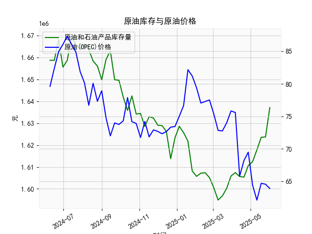

|            |   美国:库存量:原油和石油产品(包括战略石油储备) |   全球:现货均价:一揽子原油(OPEC) |
|:-----------|-----------------------------------------------:|---------------------------------:|
| 2025-01-19 |                                    1.62179e+06 |                            82.18 |
| 2025-01-26 |                                    1.60816e+06 |                            81.21 |
| 2025-02-02 |                                    1.60571e+06 |                            79.4  |
| 2025-02-09 |                                    1.60717e+06 |                            77.04 |
| 2025-02-16 |                                    1.60736e+06 |                            77.29 |
| 2025-02-23 |                                    1.60515e+06 |                            77.52 |
| 2025-03-02 |                                    1.60055e+06 |                            75.38 |
| 2025-03-09 |                                    1.59487e+06 |                            72.83 |
| 2025-03-16 |                                    1.59678e+06 |                            72.75 |
| 2025-03-23 |                                    1.60025e+06 |                            74.01 |
| 2025-03-30 |                                    1.60589e+06 |                            75.83 |
| 2025-04-06 |                                    1.60741e+06 |                            75.59 |
| 2025-04-13 |                                    1.60563e+06 |                            65.79 |
| 2025-04-20 |                                    1.60536e+06 |                            68.19 |
| 2025-04-27 |                                    1.61065e+06 |                            69.48 |
| 2025-05-04 |                                    1.6124e+06  |                            64.41 |
| 2025-05-11 |                                    1.6178e+06  |                            62.1  |
| 2025-05-18 |                                    1.62357e+06 |                            64.68 |
| 2025-05-25 |                                    1.62372e+06 |                            64.54 |
| 2025-06-01 |                                    1.63716e+06 |                            63.89 |

### 1. 原油库存与原油价格的相关性及影响逻辑

原油库存（例如美国原油和石油产品库存）和原油价格之间通常存在负相关性，这意味着库存水平上升时，价格往往下降，反之亦然。这种关系主要源于供需基本原理，但并非绝对，受多种因素影响。以下是详细解释及影响逻辑：

- **负相关性基础**：
  - **库存增加导致价格下降**：当原油库存上升时，表示市场供应过剩。供应增加而需求相对稳定时，买家压力减小，卖家可能降低价格以推动销售。例如，如果美国战略石油储备或其他商业库存积压，全球市场可能会预期供应充足，从而压低油价。
  - **库存减少导致价格上升**：反之，如果库存下降，表明供应短缺或需求强劲，市场可能会预期未来短缺，从而推高价格。这往往发生在季节性需求高峰（如夏季驾车季节）或地缘政治事件（如中东冲突）时。

- **影响逻辑**：
  - **供需动态**：原油价格本质上由全球供需平衡决定。库存是供应的“缓冲池”。如果库存高企，生产国（如OPEC成员）可能增加出口，导致价格下跌；如果库存低，需求国（如美国）可能竞相采购，推动价格上涨。
  - **其他影响因素**：
    - **需求变化**：经济复苏或衰退会影响需求。例如，经济增长时需求上升，库存下降，价格上涨；经济放缓时需求疲软，库存积累，价格下跌。
    - **地缘政治和政策**：OPEC+的减产协议或美国战略储备释放会直接影响库存和价格。例如，2024年地缘紧张可能导致短期价格波动。
    - **季节性和外部事件**：夏季旅游需求可能降低库存和提高价格，而冬季或疫情可能增加库存并压低价格。
    - **滞后效应**：库存变化往往是滞后的指标，因为数据是周频的，价格可能提前反应预期。因此，库存数据公布后，市场可能会快速调整价格。
  - **相关性强度**：从历史数据看，相关性并非完美（如本数据所示，库存上升但价格不总是同步下降），因为价格还受期货市场、汇率和宏观经济影响。总体上，短期内相关性较强，长期则需结合全球事件分析。

总之，原油库存是价格的重要领先指标，但投资者应综合考虑其他因素，如OPEC价格数据，以避免单因素决策。

### 2. 根据数据分析判断近期投资机会

基于提供的数据，我将焦点放在最近一个月（约4周）的美国原油库存和全球OPEC现货均价变化上。数据是周频的，因此我假设“今日”指最新数据点（2025年6月1日），而“昨日”指前一周（2025年5月25日）。库存数据有52项，价格数据有50项，我将使用可匹配的部分进行分析。以下是关键分析和投资机会判断：

#### 近期数据摘要
- **时间范围**：最近一个月对应数据从约2025年5月4日到2025年6月1日（基于列表顺序）。
- **美国原油库存数据（单位：千桶）**：
  - 最近一周（2025年6月1日）：1637159
  - 上周（2025年5月25日）：1623724
  - 前两周（2025年5月18日）：1623569
  - 前三周（2025年5月11日）：1617795
  - 前四周（2025年5月4日）：1612398
  - **变化趋势**：库存从1612398（5月4日）逐步上升至1637159（6月1日），总体增加约24761千桶。今日相对于昨日（6月1日 vs. 5月25日），库存上升约13435千桶（约0.83%的增幅），表明供应略有增加。

- **全球OPEC现货均价数据（单位：美元/桶）**：
  - 最近一周（对应约2025年5月25日或6月1日）：63.89（假设与库存数据对齐的最后一个可用点）
  - 上周（对应约2025年5月18日）：64.54
  - 前两周（2025年5月11日）：64.68
  - 前三周（2025年5月4日）：62.10
  - 前四周（2025年4月27日）：69.48
  - **变化趋势**：价格从69.48（5月4日）波动下行至63.89（6月1日），总体下降约5.59美元/桶（约8.04%的跌幅）。今日相对于昨日（63.89 vs. 64.54），价格下降约0.65美元/桶（约1.01%的跌幅），显示短期供应压力或需求疲软。

- **相关性观察**：库存上升与价格下降基本符合负相关逻辑。最近一个月，库存持续增加，而价格总体走低，这可能反映出全球供应过剩或需求放缓（如经济不确定性影响）。

#### 投资机会判断
基于上述变化，我从以下角度分析可能的投资机会，主要聚焦原油相关资产（如原油期货、ETF或股票，如USO或相关能源股）。机会评估考虑短期趋势、风险和潜在反转：

- **潜在买入机会**：
  - **价格短期超卖**：今日价格（63.89美元/桶）较昨日下降，但已接近历史低点（本数据中最低为62.10）。如果库存增长放缓或全球需求回升（如夏季驾车季临近），价格可能反弹。这为短期买入机会，例如：
    - **建议**：在63-65美元/桶区间考虑买入原油ETF（如USO），目标价位设为68美元/桶（基于近期均值75美元）。理由：今日价格下跌可能过度反应库存数据，预计地缘事件（如OPEC+政策调整）可能推动反弹。
    - **风险**：如果库存继续上升（e.g., 下一周超过1640000），价格进一步下跌，损失可能扩大。
  - **库存增长放缓信号**：最近四周库存增幅从前期稳定转为加速，但今日增幅（13435千桶）较上月平均（约15000千桶）无显著放大。如果未来一周库存稳定，这可能预示供应峰值已过，提供中期买入窗口。

- **潜在卖出机会**：
  - **库存上升主导**：库存连续四周上升，今日增幅显著，暗示供应过剩。这可能继续压低价格，因此持有者应考虑卖出以锁定利润或止损。例如：
    - **建议**：如果您持有原油资产，在价格稳定于64美元/桶时卖出，避开进一步下跌。理由：负相关性表明，库存上升可能导致价格在短期内跌至60美元/桶。
    - **风险**：卖出过早可能错失反弹，尤其若OPEC减产。

- **中性或观察机会**：
  - **近期波动有限**：价格和库存变化均在窄幅内（价格跌幅<1%，库存增幅<1%），表明市场暂无剧烈事件。投资者可观察下周数据（若有），尤其关注美国夏季需求是否提振库存下降。
  - **整体市场背景**：全球经济不确定性（如通胀或利率变化）可能放大负面影响，但OPEC价格数据显示价格已从71-82美元/桶的历史均值回落，潜在底部在62美元左右，提供逢低布局机会。

#### 总体建议
- **聚焦点**：短期投资机会主要基于今日价格下跌（相对昨日）和库存上升的组合，这可能预示回调风险。但如果价格企稳在63美元/桶以上，买入潜力大于卖出。
- **风险警示**：数据为周频，今日变化可能受延迟影响。建议结合实时市场（如WTI期货）和宏观新闻（如OPEC会议）监控。保守投资者宜小仓位测试，目标回报率设为5-10%。
- **行动步骤**：监控下周数据；若库存开始下降，优先买入；若价格跌破63美元，优先卖出避险。