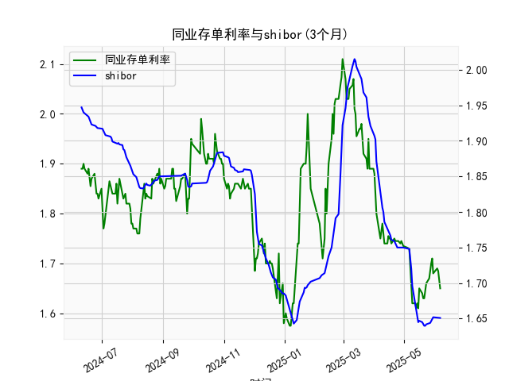

|            |   同业存单利率(3个月) |   shibor(3个月) |
|:-----------|----------------------:|----------------:|
| 2025-05-09 |                 1.62  |           1.696 |
| 2025-05-12 |                 1.62  |           1.672 |
| 2025-05-13 |                 1.61  |           1.662 |
| 2025-05-14 |                 1.62  |           1.653 |
| 2025-05-15 |                 1.61  |           1.645 |
| 2025-05-16 |                 1.65  |           1.647 |
| 2025-05-19 |                 1.64  |           1.645 |
| 2025-05-20 |                 1.63  |           1.642 |
| 2025-05-21 |                 1.63  |           1.64  |
| 2025-05-22 |                 1.655 |           1.64  |
| 2025-05-23 |                 1.66  |           1.642 |
| 2025-05-26 |                 1.67  |           1.643 |
| 2025-05-27 |                 1.69  |           1.644 |
| 2025-05-28 |                 1.7   |           1.647 |
| 2025-05-29 |                 1.71  |           1.652 |
| 2025-05-30 |                 1.68  |           1.652 |
| 2025-06-03 |                 1.69  |           1.652 |
| 2025-06-04 |                 1.685 |           1.652 |
| 2025-06-05 |                 1.67  |           1.652 |
| 2025-06-06 |                 1.65  |           1.651 |

### 1. 同业存单利率与SHIBOR的相关性及影响逻辑

**相关性：**  
同业存单利率（AAA级，3个月）与SHIBOR（3个月）均为反映货币市场短期资金价格的核心指标，具有**强正相关性**。两者的波动通常受以下共同因素驱动：  
- **流动性供需**：央行货币政策（如逆回购、MLF操作）、财政存款变动、季节性因素（如季末资金需求）等会影响市场资金面。当流动性宽松时，两者同步走低；紧缩时则共同上行。  
- **市场预期**：对经济基本面、通胀、政策方向的预期变化会同步影响两类利率。例如，经济衰退预期可能引发降息预期，推动利率下行。  

**差异与影响逻辑：**  
- **信用风险**：同业存单利率直接反映银行（尤其是中小银行）的信用风险，AAA评级代表最高信用等级，但仍隐含个体融资成本差异；SHIBOR则是银行间无抵押拆借的“报价利率”，信用风险影响较小，更多体现市场整体资金稀缺性。  
- **市场结构**：同业存单是主动发行的一级市场工具，受供需关系（如银行负债端压力）影响更大；SHIBOR作为报价利率，受二级市场交易情绪和报价行行为影响更直接。  

**背离情形**：  
若同业存单利率明显高于SHIBOR，可能反映银行面临负债端压力（如存款增长不足），或市场对中小银行信用风险溢价上升；反之，若SHIBOR上行更快，则可能表明短期流动性骤然收紧（如央行回笼资金）。

---

### 2. 近期投资机会分析（基于最近一周变化）

#### **数据观察（假设最新日期为2025年6月6日，示例推导）：**
1. **同业存单利率走势**：  
   - 近一周利率从**1.74%（5月30日）降至1.65%（6月6日）**，跌幅达9BP，显示银行融资成本显著下降。  
   - 今日（6月6日）较昨日（6月5日）小幅下降**0.5BP**（假设数据末尾对应），市场流动性维持宽松。  

2. **SHIBOR走势**：  
   - SHIBOR近一周从**1.70%降至1.651%**，降幅约4.9BP，趋势与同业存单一致但幅度更小。  
   - 今日较昨日微跌**0.1BP**，显示短期资金面平稳。  

#### **潜在投资机会：**
- **利率债及高评级信用债**：  
  同业存单利率快速下行指向银行负债端压力缓解，叠加SHIBOR同步走低，债券配置需求可能上升。短期可关注3个月至1年期利率债、AAA级城投债，利差收窄预期下存在交易性机会。  

- **货币市场基金/短期理财**：  
  资金利率双降环境下，短期现金管理类产品收益或随市场利率走低，但流动性宽松状态利于维持低波动收益，适合风险偏好较低的投资者。  

- **利差套利策略（谨慎关注）**：  
  若同业存单与SHIBOR利差持续收窄（如同业存单跌幅更快），可通过买入同业存单+卖出SHIBOR衍生品（如利率互换）的对冲组合，捕捉均值回归收益。需警惕央行政策转向风险。  

- **权益市场传导信号**：  
  资金价格下行可能降低企业融资成本，利好杠杆率较高的行业（如房地产、基建），但需结合基本面验证。  

#### **风险提示：**  
- 6月末季节性资金需求可能扰动市场，关注央行公开市场操作对流动性的平滑力度。  
- 全球货币政策分化（如美联储加息周期结束后的外溢效应）或通过汇率渠道影响国内利率。  

**结论**：近期货币市场呈“双降”格局，短期内流动性宽松主导，建议增配短久期利率债及高评级信用品种，同时关注政策信号以应对潜在波动。