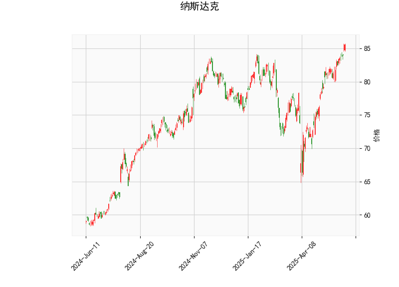

### 纳斯达克指数技术分析结果

#### 1. 技术指标分析
- **当前价（85.61）与布林轨道**：  
  当前价格位于布林带上轨（86.74）附近，接近短期阻力位，显示出市场处于相对高位。布林中轨（77.5）为中期支撑，下轨（68.26）为强支撑区。目前价格靠近上轨，需警惕回调风险，但若能突破上轨，可能加速上涨。

- **RSI（75.32）**：  
  处于超买区间（>70），暗示短期可能存在回调压力。但需结合趋势判断：如果指数处于强势上涨阶段，RSI超买可能持续较久。

- **MACD（2.04）与信号线（1.93）**：  
  MACD略高于信号线，柱状图（0.113）正值但幅度较小，表明上涨动能存在但较弱。需关注后续是否出现“死叉”（MACD下穿信号线），可能预示短期调整。

- **K线形态**：  
  - **CDLCLOSINGMARUBOZU**：光头光脚大阳线，反映短期强势买方主导。  
  - **CDLGAPSIDESIDEWHITE**：两侧缺口伴随阳线，通常表示多空双方胶着后的向上突破。  
  - **CDLLONGLINE**：长实体K线，进一步确认当前价格的趋势强度。  

#### 2. 近期投资机会与策略
##### 潜在机会
1. **短期回调机会**：  
   - **逻辑**：RSI超买+价格逼近布林带上轨，短期可能回踩中轨（77.5）。  
   - **策略**：轻仓做空，止损设于布林带上轨上方（如87.0），止盈目标77.5附近。  
   - **风险**：若指数持续突破上轨，趋势可能延续，需严格止损。

2. **趋势突破追涨**：  
   - **逻辑**：若价格站稳上轨（86.74）且MACD柱状图放大，可能开启新一轮上涨。  
   - **策略**：突破后回踩上轨时做多，止损设于中轨下方（如76.5），目标看向前高或更高阻力区。

3. **中线低吸布局**：  
   - **逻辑**：若回调至布林中轨（77.5）附近且RSI回落至50-60区域，可能提供中线买点。  
   - **策略**：分批建仓，配合MACD金叉确认后加仓，止损设于下轨（68.0）下方。

##### 风险提示
- **指标滞后性**：技术分析基于历史数据，需结合基本面（如美联储政策、科技股财报）综合判断。  
- **突发消息冲击**：宏观经济事件（如通胀数据、地缘冲突）可能干扰技术信号的有效性。  
- **仓位管理**：当前价格高位波动加剧，建议控制仓位（不超过总资金的5%-10%）。

##### 总结
- **短期**：警惕超买后的回调，可轻仓试空或观望。  
- **中期**：若站稳上轨或回踩中轨企稳，仍以逢低做多为主。  
- **关键位**：上方阻力86.74（布林上轨），下方支撑77.5（布林中轨）。