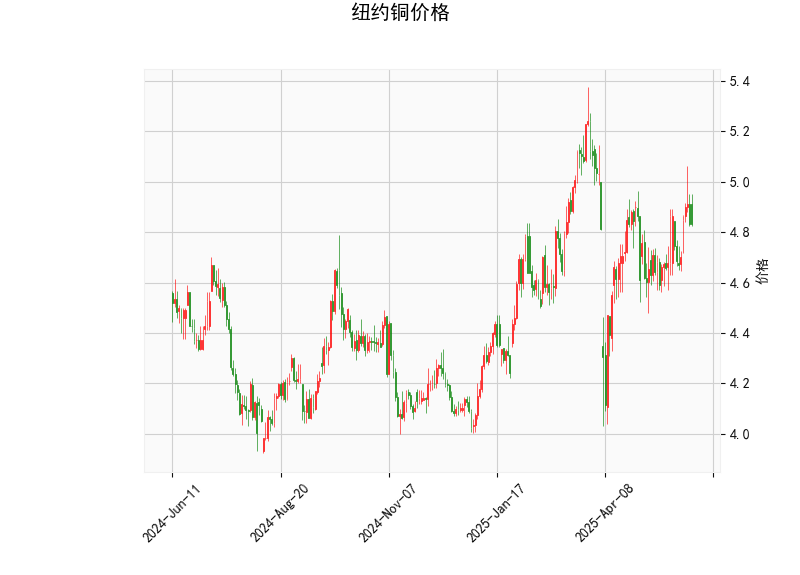

# 纽约铜价格技术分析与策略建议

## 一、技术指标分析

### 1. 关键价格位置
- **当前价4.8325**：高于布林线中轨（4.785），但低于上轨（5.2296），处于中性偏多区域。短期若站稳中轨上方，可能进一步向上测试上轨压力。
- **布林通道**（4.34~5.23）：价格处于通道中部，上下轨间距较大，显示波动性扩大。当前价与上轨距离约8%，具备潜在上行空间。

### 2. 动能指标
- **RSI 54.35**：位于50中轴上方但未进入超买区（>70），反映多头占优但未过热，适合偏多操作。
- **MACD金叉形成**：MACD线（0.0345）上穿信号线（0.0173），柱状图转正（0.0172），显示短期动能由空转多。但数值绝对值偏小，需验证趋势持续性。

### 3. K线形态
- **CDLCLOSINGMARUBOZU**：光头光脚大阳线形态，预示短期强势延续可能。
- **CDLMATCHINGLOW**：低位双平底形态，或暗示下跌动能衰竭，多空力量转换。

---

## 二、策略机会与风险管理

### 1. 趋势跟踪策略
- **多头策略**：
  - **入场**：价格站稳4.83（当前价）或回调至布林中轨4.785不破，可轻仓试多。
  - **目标**：布林上轨5.23附近（潜在回报约8%）。
  - **止损**：跌破布林中轨或前低确认转弱（例如4.73），风险约2-3%。
- **优势**：MACD金叉+RSI偏多+布林开口的共振信号。

### 2. 套利策略
- **跨期套利**（需配合合约数据）：
  - 若近远月合约价差突破历史区间，可做多贴水/做空升水合约。
- **波动率套利**：
  - 若布林通道继续收窄（当前已开始扩张），可布局跨式期权组合。

### 3. 风险提示
- **宏观敏感度**：铜价受美元指数、中国经济数据影响显著，需关注本周美联储议息会议及中国PMI数据。
- **假突破风险**：MACD金叉强度较弱，若反弹未能突破4.85阻力位，可能重回震荡区间（4.34-4.78）。

---

**短期关注点**：验证MACD动能持续性，突破4.85后量能是否放大。建议仓位控制在10%以内，搭配追踪止损保护盈利。