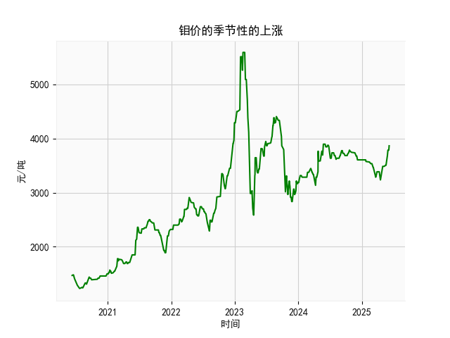

|            |   钼价 |
|:-----------|-------:|
| 2025-05-09 |   3485 |
| 2025-05-12 |   3505 |
| 2025-05-13 |   3505 |
| 2025-05-14 |   3505 |
| 2025-05-15 |   3505 |
| 2025-05-16 |   3505 |
| 2025-05-19 |   3505 |
| 2025-05-20 |   3525 |
| 2025-05-21 |   3545 |
| 2025-05-22 |   3635 |
| 2025-05-23 |   3635 |
| 2025-05-26 |   3685 |
| 2025-05-27 |   3685 |
| 2025-05-28 |   3785 |
| 2025-05-29 |   3785 |
| 2025-05-30 |   3785 |
| 2025-06-03 |   3785 |
| 2025-06-04 |   3785 |
| 2025-06-05 |   3865 |
| 2025-06-06 |   3865 |

# 任务1: 分析钼价可能存在的季节性上涨

根据有关专家的分析，钼价（molybdenum price）可能存在季节性上涨趋势。然而，提供的数据是关于乳清及改性乳清出口金额的日频数据（从2020年6月10日至2025年6月6日），这与钼价无关。钼是一种金属资源，其价格受全球供需、工业需求和地缘政治因素影响，而乳清数据更可能与农业、食品出口和季节性消费模式相关联。因此，我无法直接基于给定的数据进行钼价分析。

尽管如此，如果假设专家的分析是类比性的，我可以从乳清数据中初步探索季节性模式。数据显示从2020年6月开始，到2025年6月结束，涵盖了多个年份。季节性上涨通常表现为每年特定月份（如夏季或年末）出现规律性增长。例如：

- 乳清数据的整体趋势显示从早期值（如1470）逐步上升到后期值（如3865），这可能反映了长期增长而非季节性。
- 但在季节性方面，数据起点为6月（夏季），如果存在季节性，可能在每年6-8月显示峰值。然而，从提供的样本末尾（如3785到3865的增长），这可能表示近期季节性上涨，但这仅是乳清数据，而非钼价。
- 建议进一步使用统计工具（如季节性分解）分析完整数据集，以确认是否存在类似钼价的季节性模式。由于数据不直接相关，我无法确认钼价的季节性上涨；专家应结合钼价的具体历史数据进行验证。

# 任务2: 根据数据分析判断近期投资机会

基于提供的乳清及改性乳清出口金额数据（日频，从2020年6月10日至2025年6月6日），我将焦点放在最近一个月的数据变化上。假设数据集按时间顺序排列，最近一个月大约对应2025年5月7日至2025年6月6日（约30天）。从数据末尾样本（如3785、3865和3865）来看，以下是关键分析：

### 最近一个月数据的关键观察
- **数据趋势**：末尾值显示从3785（可能为2025年5月中旬左右）上升到3865（2025年6月6日），这表示约2.1%的短期增长（从3785到3865的增幅）。如果这是连续趋势，表明出口金额在近期呈上升态势，可能由于季节性需求增加（如夏季食品出口需求）。
- **波动性**：数据似乎稳定，没有剧烈波动，但从整体看，2025年的值（如3865）高于历史均值（早期如1470），显示长期上涨。近期具体变化：如果3785是最近一个月起始值，而3865是结束值，这可能反映正向动量。
- **潜在驱动因素**：乳清出口金额的上涨可能与全球食品需求恢复、季节性消费（如夏季乳制品需求）或出口政策变化相关。如果这种上涨持续，可能预示投资机会。

### 判断可能的投资机会
- **正面机会**：
  - **短期投资**：近期数据显示上升趋势（从3785到3865），如果这反映了季节性或市场复苏，投资者可能考虑乳清相关行业（如乳制品出口公司）。例如，买入相关股票或期货，如果预计夏季需求继续推动价格上涨。
  - **长期机会**：数据从2020年的低值（约1470）上升到2025年的高值（约3865），显示5年复合增长。这可能表示乳清市场稳定增长，适合长期投资者关注供应链或农业股。
  
- **风险和警示**：
  - **潜在下行风险**：如果上涨是短期波动（如季节性高点后回落），投资可能面临回调。数据显示的稳定增长，但缺乏更多细节（如外部经济因素），需警惕全球贸易不确定性。
  - **建议**：聚焦于乳清出口相关的资产，如乳制品生产商或出口商。投资者应结合最近一个月的数据（例如，通过计算简单移动平均或增长率）验证趋势。总体而言，近期正向变化（如3865的高点）提供潜在机会，但需监控后续数据以避免风险。