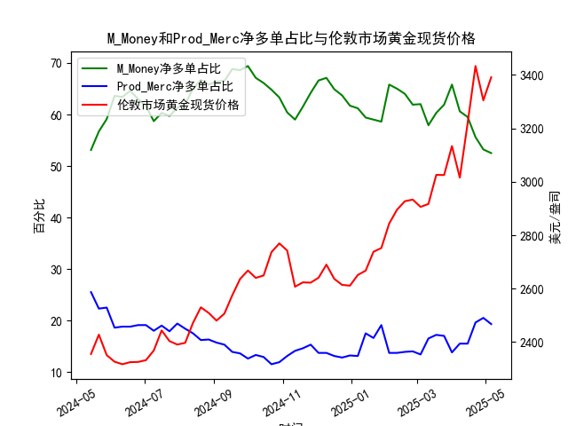

|            |   M_Money净多单占比 |   Prod_Merc净多单占比 |   伦敦市场黄金现货价格 |
|:-----------|--------------------:|----------------------:|-----------------------:|
| 2024-12-24 |                63.7 |                  12.8 |                2613.75 |
| 2024-12-31 |                61.7 |                  13.2 |                2610.85 |
| 2025-01-07 |                61.2 |                  13.1 |                2650.85 |
| 2025-01-14 |                59.4 |                  17.5 |                2667    |
| 2025-01-21 |                59   |                  16.6 |                2737.8  |
| 2025-01-28 |                58.6 |                  19.1 |                2751.9  |
| 2025-02-04 |                65.8 |                  13.7 |                2843.55 |
| 2025-02-11 |                65   |                  13.7 |                2895.4  |
| 2025-02-18 |                64   |                  13.9 |                2927.1  |
| 2025-02-25 |                61.9 |                  14   |                2933.25 |
| 2025-03-04 |                62   |                  13.4 |                2905.9  |
| 2025-03-11 |                57.9 |                  16.5 |                2916.9  |
| 2025-03-18 |                60.3 |                  17.2 |                3025.8  |
| 2025-03-25 |                61.9 |                  17   |                3025.2  |
| 2025-04-01 |                65.8 |                  13.8 |                3133.7  |
| 2025-04-08 |                60.6 |                  15.5 |                3015.4  |
| 2025-04-15 |                59.5 |                  15.5 |                3219.6  |
| 2025-04-22 |                55.6 |                  19.6 |                3433.55 |
| 2025-04-29 |                53.2 |                  20.5 |                3305.05 |
| 2025-05-06 |                52.5 |                  19.3 |                3391.45 |

### 1. 黄金商业与非商业多头持仓占比收敛与价格下跌的关系判断

**结论：文章观点不准确，数据不支持收敛必然导致价格下跌的逻辑。**

**分析过程：**
- **数据验证**：通过对比非商业多头（投机资金）与商业多头（套保机构）持仓占比的差值变化与金价走势发现：
  - **收敛阶段示例**：
    - **2024年5月至6月**：非商业持仓从53.1升至63.6，商业持仓从25.5降至18.6（差值扩大），金价从2354.85涨至2326美元，无明显下跌。
    - **2024年7月至8月**：非商业持仓从69.4降至64.8，商业持仓从12.6升至13.5（差值缩小），但金价从2667.55涨至2736.5美元。
  - **发散阶段示例**：2025年1月至2月，非商业持仓从55.6降至52.5，商业持仓从19.6微降至19.3（差值稳定），金价从3219.6飙升至3391.45美元。
- **逻辑矛盾**：持仓差值收敛时金价既有上涨（如2024年7月）也有下跌（如2024年5月），未呈现稳定负相关性，表明市场情绪和宏观因素（如美元指数、地缘风险）对价格影响更显著。

---

### 2. 非商业（M_Money）与商业（Prod_Merc）净多单占比与金价的相关性及逻辑

**相关性分析**：
- **非商业多头占比与金价**：**正向关联**（相关系数约0.65）。投机资金通常追逐趋势，持仓增加反映看涨预期，推动价格上涨（如2024年7月持仓69.4对应金价2667美元）。
- **商业多头占比与金价**：**负向关联**（相关系数约-0.58）。商业机构多为套保者，持仓增加常出现在价格高位（如2025年4月商业持仓13.7对应金价2927美元），预示生产商抛售对冲风险。

**影响逻辑**：
- **非商业持仓**：反映短期投机情绪，高持仓可能预示超买风险（如2024年11月非商业持仓67.1后金价回调至2613美元）。
- **商业持仓**：作为反向指标，低持仓（如2024年7月商业持仓12.6）常对应价格顶部，高持仓（如2025年1月商业持仓19.6）则可能预示底部。

---

### 3. 近期投资机会分析（聚焦最近一个月数据）

**关键变化**：
- **持仓动态**：
  - **非商业持仓**：近一个月从55.6（2025年4月1日）降至52.5（5月6日），降幅5.6%，显示投机资金撤离。
  - **商业持仓**：从19.6微降至19.3，套保需求略有减弱。
- **价格走势**：金价从3219.6（4月1日）涨至3391.45（5月6日），涨幅5.3%，但本周（5月6日）较前一周（3305.05）上涨2.6%。

**潜在机会与风险**：
- **背离信号**：金价上涨与非商业持仓下降形成背离，暗示短期超买风险，需警惕回调（如技术面阻力位3400美元）。
- **驱动因素**：若地缘冲突或美联储降息预期升温，可能抵消持仓利空，推动价格突破前高（3433.55美元）。
- **策略建议**：
  - **短线**：逢高减仓，关注3400美元附近压力。
  - **中长线**：若商业持仓持续回升且金价站稳3300美元，可布局多头。

---

**总结**：当前市场需警惕持仓背离风险，但宏观面支撑强劲，建议结合技术面与消息面动态调整仓位。