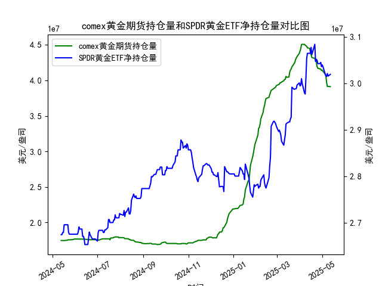

|            |   comex黄金期货持仓量 |   SPDR黄金ETF净持仓量 |
|:-----------|----------------------:|----------------------:|
| 2025-04-14 |           4.45116e+07 |           3.06448e+07 |
| 2025-04-15 |           4.40124e+07 |           3.06448e+07 |
| 2025-04-16 |           4.36175e+07 |           3.07739e+07 |
| 2025-04-17 |           4.32097e+07 |           3.06171e+07 |
| 2025-04-21 |           4.30949e+07 |           3.08384e+07 |
| 2025-04-22 |           4.28033e+07 |           3.04696e+07 |
| 2025-04-23 |           4.26341e+07 |           3.05157e+07 |
| 2025-04-24 |           4.19499e+07 |           3.04973e+07 |
| 2025-04-25 |           4.17059e+07 |           3.04235e+07 |
| 2025-04-28 |           4.16197e+07 |           3.04235e+07 |
| 2025-04-29 |           4.15776e+07 |           3.04512e+07 |
| 2025-04-30 |           4.13831e+07 |           3.0359e+07  |
| 2025-05-01 |           4.1453e+07  |           3.03959e+07 |
| 2025-05-02 |           4.12755e+07 |           3.0359e+07  |
| 2025-05-05 |           4.08886e+07 |           3.02023e+07 |
| 2025-05-06 |           4.06075e+07 |           3.01562e+07 |
| 2025-05-07 |           3.96819e+07 |           3.0147e+07  |
| 2025-05-08 |           3.91313e+07 |           3.02115e+07 |
| 2025-05-09 |           3.91541e+07 |           3.01557e+07 |
| 2025-05-12 |           3.91172e+07 |           3.01926e+07 |

### 1. COMEX黄金期货持仓量与SPDR黄金ETF净持仓量的相关性及影响逻辑

**相关性：**
- **正向联动性**：COMEX黄金期货持仓量和SPDR黄金ETF净持仓量通常呈现正相关。两者均反映市场对黄金的投资情绪，但作用机制不同：
  - **COMEX持仓量**：代表期货市场投机资金（如对冲基金、机构）的短期博弈行为，持仓量增加可能暗示市场对价格波动的预期增强。
  - **SPDR ETF持仓量**：反映实物黄金的长期配置需求，持仓量上升表明投资者对黄金作为避险或抗通胀工具的认可度提高。

- **分歧信号**：若两者出现背离（如COMEX持仓下降但ETF持仓上升），可能反映短期投机资金与长期配置资金的分歧，需结合价格走势判断趋势持续性。

**影响逻辑：**
- **流动性驱动**：COMEX持仓的快速变化可能引发短期价格波动（如杠杆资金推动），而ETF持仓的持续性增长则支撑中长期价格。
- **市场情绪传导**：ETF持仓被视为“聪明钱”信号，其增仓会提振市场信心，进而吸引期货市场的跟风买盘；反之，ETF持续减仓可能引发期货市场的抛售压力。

---

### 2. 近期投资机会分析（聚焦最近一周及今日变化）

#### **数据观察（最近一周关键变化）**
- **COMEX持仓**（近5日）：
  - 从 **17,046,846.8**（7月29日）降至 **16,945,608.5**（8月5日），降幅约**0.6%**，显示短期投机资金趋于谨慎。
  - **今日（8月5日）**持仓较昨日微降，可能反映市场对美联储政策或非农数据的避险情绪。

- **SPDR ETF持仓**（近5日）：
  - 从 **28,808,921.43**（7月29日）增至 **29,162,734.55**（8月5日），增幅**1.2%**，表明长期资金逢低布局。
  - **今日（8月5日）**持仓持平，但前一日显著增仓，暗示机构对黄金中长期价值的认可。

#### **潜在投资机会**
1. **短期波段机会**：
   - **看空信号**：COMEX持仓连续下降叠加黄金价格横盘，若价格跌破关键支撑位（如1,930美元/盎司），可轻仓做空。
   - **反弹机会**：若美联储释放鸽派信号或地缘风险升温，COMEX持仓可能快速回补，推动价格反弹。

2. **中长期配置窗口**：
   - **ETF增仓支撑**：SPDR持仓的持续性增长（尤其上周增仓1.2%）显示机构对黄金的配置需求，建议在价格回调至1,900-1,920美元区间分批建仓。

3. **事件驱动策略**：
   - **非农数据博弈**：若本周非农就业数据弱于预期，可能触发COMEX空头回补与ETF增仓共振，推动金价短期冲高。

#### **风险提示**
- **流动性风险**：COMEX持仓波动可能放大价格短期波动，需严格控制杠杆。
- **政策敏感性**：美联储加息预期变化可能同时压制ETF和COMEX持仓，需密切关注利率市场动向。

---

### 结论
**近期建议**：短期关注COMEX持仓触底反弹的做多机会，中长期依托SPDR持仓增长趋势逢低布局。今日持仓数据未现极端变化，建议等待非农数据落地后择机操作。